<div id="ark_installing_console_azure" class="registered_link"></div>

The EDB Postgres Ark image is available on Azure Marketplace; installation and configuration is a simple process. To enable the Ark console on Azure, you must:

Create an [Azure user account with sufficient privileges](#provide_access_azure) to access the Ark Administrator's console.\`  Create an [Azure network security group](#azure_security_group) .

Create an [Azure storage account](#azure_storage_account).  Launch a [VM Image](#azure_launch_ark_console) that contains the Ark console.

Configure the [Ark console](#azure_configure_ark_console).  Register an [Ark Administrative user](#azure_register_user).

<div id="provide_access_azure" class="registered_link"></div>

## Providing Administrative Access to an Azure User

To provide sufficient privileges for an Azure user account to access the Ark administrative console, navigate to the `Azure Resource groups` panel, highlight the name of the resource group in which your instance will reside, and select `Access control (IAM)` from the `Resources` panel; then, click the `+Add` button to access the `Add permissions` panel.

On the `Add permissions` panel, use the drop-down listbox in the `Role` field to select `Owner`; use the drop-down listbox in the `Select` field to select the user(s) that should have administrative access to the Ark console. When you've made your selections, click `Save`.

To limit the scale of the access to the resource group in which the image resides, use the `Resources – Access control (IAM)` panel to specify a value of `This resource` in the `scale` field for the specified user(s).

For more information about delegating Azure permissions, please [see the Azure documentation](https://docs.microsoft.com/en-us/azure/active-directory/role-based-access-control-configure).

<div id="azure_security_group" class="registered_link"></div>

## Creating a Security Group

Before connecting to the Ark console, you must create a security group that will allow connections from your web browser, and between the Ark console and your instance. To create a security group, navigate to the Microsoft Azure `Network security groups` page, and click the `Add` button. When the `Create network security group` panel opens:

-   Use the `Name` field to provide a name for the security group.
-   Use the drop-down listbox in the `Subscription` field to select a subscription plan.
-   Use the `Resource` group field to provide a name for the associated resource group, or highlight the Use existing radio button and use the drop-down listbox in the Resource group field to select an existing resource group.
-   Use the `Location` drop-down listbox to specify a location.

When you've finished, click `Create` to create a network security group.

After creating the network security group, you must provide the inbound rules that will allow the Ark console to manage your instance. On the Network security groups page, click the name of the security group that you wish to modify; click `Inbound security rules` (in the `SETTINGS` section of the details panel) to modify the inbound rules for the group.

To add a new rule, click the `Add` button, and provide details about the rule; after providing rule details, click `OK`. The Azure console will notify you that it is creating the new rule. When defining the security group, include the rules listed below:

| Rule Type               | Direction | Port                         | Remote              | CIDR Address                            |
| ----------------------- | --------- | ---------------------------- | ------------------- | --------------------------------------- |
| All ICMP SSH HTTP HTTPS | Ingress   |                              | CIDR CIDR CIDR CIDR | 0.0.0.0/0 0.0.0.0/0 0.0.0.0/0 0.0.0.0/0 |
| Custom TCP              | Ingress   | 6666                         | CIDR                | 0.0.0.0/0                               |
| Custom TCP              | Ingress   | port range from 7800 to 7999 | CIDR                | 0.0.0.0/0                               |
| Custom TCP              | Ingress   | 5432                         | CIDR                | 0.0.0.0/0                               |

The CIDR addresses specified in the rules for SSH, HTTP, and HTTPS can be customized to restrict access to a limited set of users. The CIDR addresses specified for port `6666` and ports `7800 through 7999` must specify a value of `0.0.0.0/0`.

The rule that opens ports `7800` through `7999` provides enough ports for 200 cluster connections; you can extend the upper limit of the port range if more than 200 clusters are required.

<div id="azure_storage_account" class="registered_link"></div>

## Creating a Storage Account

Before launching the Ark console, you should create an Azure storage account in which the Ark console will store console backups. You should not modify the storage account after the console is launched.

To add an Azure storage account, navigate to the Azure `All resources` page, and click the `Add` button. In the `MARKETPLACE` edit box enter `Storage account`, and hit return. Highlight the `Storage account – blob, file, table, queue` entry.


Fig. 6.38: Defining a storage account

Click the `Create` button located on the bottom of the `Storage account-blob, file, table, queue` panel to open the `Create storage account` panel. Use fields on the `Create storage account` panel to define the storage account.

When you've defined your storage account, click `Create`; the Azure dashboard will keep you informed as the storage account is deployed, and send you a notification when the account creation is finished.

For detailed information about defining a storage account, please consult the [Azure documentation](https://docs.microsoft.com/en-us/azure/storage/).

<div id="azure_launch_ark_console" class="registered_link"></div>

## Launching the Ark Console Instance

The EDB Postgres Ark image is available on the Microsoft Azure Marketplace. To create an Ark virtual machine, log in to the Microsoft Azure management console, and click the green plus sign in the upper-left hand corner to navigate to the Azure Marketplace.


Fig. 6.39: Selecting an image

When the Azure Marketplace opens, enter EDB Postgres Ark in the search box. Select the EDB Postgres Ark (published by EnterpriseDB Corp.) icon from the search results, and click Create to continue.

The Azure console will open to a dialog that allows you to configure the virtual machine that will host your console deployment. Please note that your virtual machine requirements may vary from the description that follows; the description is intended to provide guidelines about the minimum requirements for a console host for an Ark deployment. Please consult the Azure documentation for detailed information about additional configuration options for your virtual environment.


Fig. 6.40: Creating a virtual machine

Use fields on the `Basics` panel to provide general information about the new virtual machine:

-   If applicable, use the `Subscription` drop-down listbox to select the name of an Azure subscription.
-   Use the `Resource group` drop-down listbox to select the resource group in which the VM will be created.
-   Provide a name for the VM in the `Virtual Machine Name` field.
-   If applicable, use the `Region` drop-down listbox to select the region in which the VM will reside.
-   Use the `Image` drop-down listbox to select the image that will be used for the VM.
-   Use the `Change size` link (in the `Size` field) to open the Select a VM size panel and select the machine configuration.


Fig. 6.41: Selecting a machine size

Highlight a configuration type, and click the `Select` button (in the lower-left corner of the panel) to continue.

-   Select the radio button next to the `Authentication type` you wish to use for the Administrator account; we highly recommend using SSH authentication.
-   Provide an operating system user name in the `User name` field; the default operating system user name for Ark images is centos.
-   If you have elected to enable SSH public key authentication, provide the key in the `SSH public key` field.

Use fields on the `Networking` panel to specify your network configuration preferences. When configuring an Azure virtual machine to use the Ark console, you should:

-   Select the `Advanced` radio button in the `Network security group` field.
-   Use the `Network security group` drop-down listbox to select the security group that you wish to use for the virtual machine.

Use fields on the `Guest config` panel to provide an extension that sets the Ark console deployment password. Create a file on your local system named `startup-password.sh` that contains the following text:

```
| #!/bin/sh
| rm -f /usr/share/tomcat/startup-password.txt
| echo "console_password" > /usr/share/tomcat/startup-password.txt
| chown tomcat:tomcat /usr/share/tomcat/startup-password.txt
| chmod 600 /usr/share/tomcat/startup-password.txt

Where `console_password` is replaced with the password you will provide when prompted for a password by the Ark setup dialog.
```

To provide the location of the script to the virtual machine, click the `Select an Extension to install` link, then `Custom Script for Linux`. Then, click the `Create` button; use the fields on the `Install extension` panel to identify the script:

-   Use the `Script files` browser to locate and upload the script file.
-   Enter the command that will invoke your script in the `Command` field; for example, `sh startup-password.sh`.

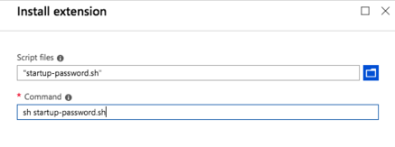

Fig. 6.42: Installing an extension

Click `OK` to continue and return to the Settings panel; when you've finished updating the settings with your preferences, click OK to continue. Then, click the Review + Create button to validate your virtual machine definition.


Fig. 6.43: Validating the machine definition

Azure will confirm that your machine definition is valid; then, you can click the `Create` button to create your virtual machine.

You can monitor the virtual machine's deployment from the `Azure Operations` page, the `Resource group activity log`, or the `Virtual machine Overview` page.


Fig. 6.44: The virtual machine details page

While the deployment finishes, you can register your application in the Azure Active Directory. You will need the Public IP address or DNS name of your server for the registration. To copy the IP address, click the copy icon to the right of the public IP address on the `VM details` panel.

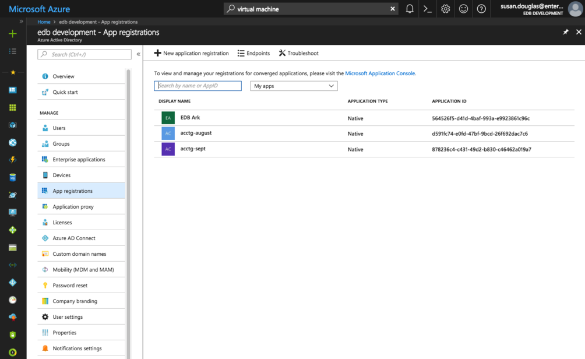

Fig. 6.45: The New application registration page

After copying the public IP address of your server, select `App registrations` from the Azure Active Directory page. Click the New application registration button located on the App registrations detail panel.


Fig. 6.46: The Create panel

Use fields on the `Create` panel to provide information about your application:

-   Provide the application name in the `Name` field.
-   Use the drop-down listbox in the `Application type` field to select the Application type; select `Native` for the Ark console application.
-   Provide the public IP address of the virtual machine that is hosting the console in the `Redirect URI` field.

Click `Create` to register your application.

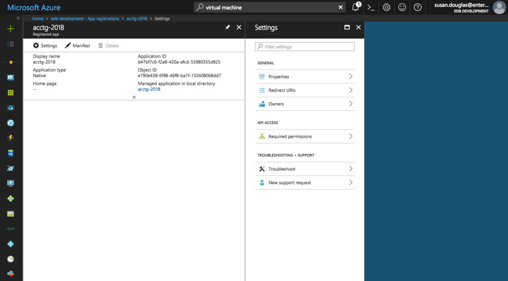

Fig. 6.47: Accessing the Required permissions page

After creating the virtual machine and registering the application, you must adjust the required permissions, allowing the `Windows Azure Service Management API` to connect to your application. This will give the Ark server permission to control Azure services via the Service Management API.

Please note that you must be an Azure Global Administrator to grant permissions required by Ark. Click the `Settings` icon, and then navigate to the `Required permissions` page for the application, and select `+Add`.


Fig. 6.48: Selecting an API

Click `Select an API`, and then highlight Windows Azure Service Management API.

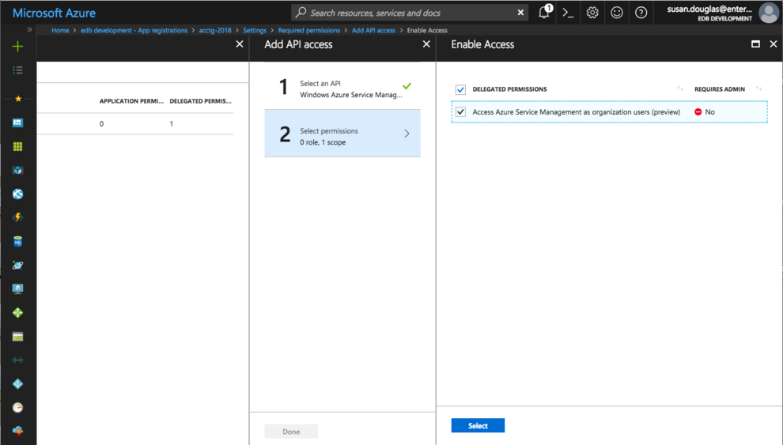

Fig. 6.49: Specifying API permissions

Click `Select permissions`, and then `Access Azure Service Management`; then, click `Select`.


Fig. 6.50: Confirming that the permissions are added

Then, click `Grant Permissions`.


Fig. 6.51: Granting permissions for the applications

When prompted, click `Yes` to confirm that you wish to grant access permissions.

Repeat the process, adding permissions for `Microsoft Graph`. When adding permissions for Microsoft Graph, select a scale of `Read all users` full profiles.

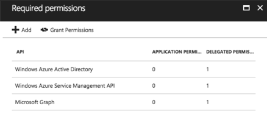

Fig. 6.52: Sufficient resource permissions

When you're finished granting permissions, the `Required permissions` list should include:

-   Wizard Azure Active Directory
-   Windows Azure Service Management API
-   Microsoft Graph

<div id="azure_configure_ark_console" class="registered_link"></div>

## Configuring the Ark Console

To access the Ark setup dialog and configure the console, open a browser window and navigate to the IP address assigned to the console.

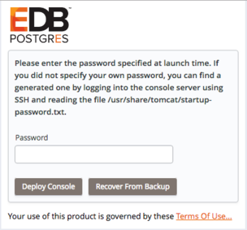

Fig. 6.53: Logging in to the instance

When prompted, provide the console password. If you did not assign a password in a script identified as an extension (when creating the Azure virtual machine), a password will be created randomly, and stored in:

`/usr/share/tomcat/startup-password.txt`

To retrieve a system assigned password, ssh into the console host and invoke the following command:

`$ more /usr/share/tomcat/startup-password.txt h020zdigm95xxqmjonrs`

The Ark console setup dialog opens.

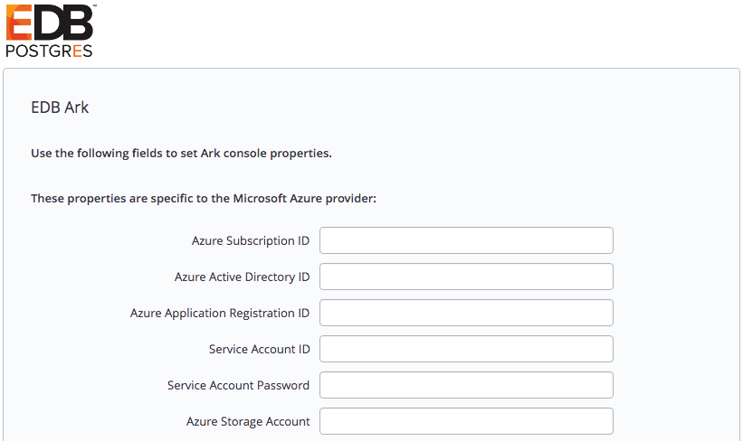

Fig. 6.54: The platform specific property fields

Use fields in the first portion of the setup dialog to provide platform specific information and configuration details for the Ark console.

-   Use the `Azure Subscription ID` field to specify the subscription ID for the Azure account that hosts the Ark console. You can locate the subscription ID on the Azure Subscriptions page.
-   Use the `Azure Active Directory ID` field to specify the directory ID associated with the Azure account that hosts the Ark console. To locate the directory ID, navigate to the Azure Active Directory and select Properties.
-   Use the `Azure Application Registration ID` field to specify the application ID associated with the Azure account that hosts the Ark console. To locate the application ID, select Enterprise applications or App registrations from the Azure Active Directory menu; use the application ID associated with the registration created for the Ark console.
-   Use the `Service Account ID` field to specify the name of the Azure service account. The service account must be an owner of the resource group in which the Ark server is deployed.
-   Use the `Service Account Password` field to specify the password associated with the service account.
-   Use the `Azure Storage Account` field to specify the name of the Azure block storage account you wish to use with this Ark server.

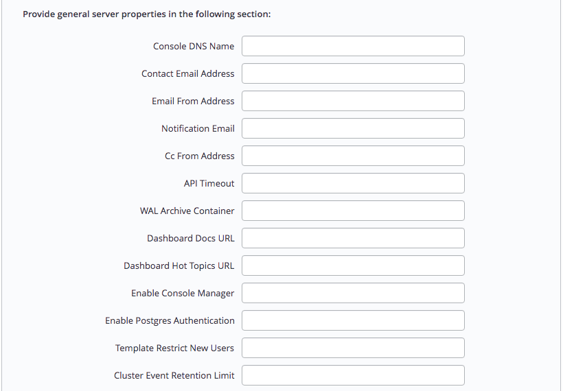

Fig. 6.55: The general server property fields

The fields in the `General` properties section set values that control Ark behaviors:

-   Use the `Console DNS Name` field to specify a custom DNS name for the console. The property does not assign the DNS name to the console, but any notification emails that refer to the console will refer to the console by the specified name. If you do not provide a custom DNS name, the IP address of the console will be used in notifications.
-   Use the `Contact Email Address` field to specify the address that will be included in the body of cluster status notification emails.
-   Use the `Email From Address` field to specify the return email address specified on cluster status notification emails.
-   Use the `Notification Email` field to specify the email address to which email notifications about the status of the Ark console will be sent.
-   Set the `CC From Address` field to true to instruct Ark to send a copy of the email to the `Email From Address` anytime a notification email is sent.
-   Use the `API Timeout` field to specify the number of minutes that an authorization token will be valid for use within the API.
-   Use the `WAL Archive Container` field to specify the name of the storage container where WAL archives (used for point-in-time recovery) are stored. You must provide a value for this property; once set, this property must not be modified.
-   Use the `Dashboard Docs URL` field to specify the location of the content that will be displayed on the Dashboard tab of the Ark console. If your cluster resides on a network with Internet access, set the parameter to DEFAULT to display content (documentation) from EnterpriseDB; to display alternate content, provide the URL of the content. To display no content in the lower half of the `Dashboard` tab, leave the field blank.
-   Use the `Dashboard Hot Topics URL` field to specify the location of the content that will be displayed on the Dashboard tab of the Ark console. If your cluster resides on a network with Internet access, set the parameter to DEFAULT to display content (alerts) from EnterpriseDB; to display alternate content, provide the URL of the content. To display no content across the middle section of the `Dashboard` tab, leave the field blank.
-   Use the `Enable Console Manager` field to indicate if the console should display console manager functionality. When set to `true`, the console will display the manager; when `false`, the manager will not be displayed.
-   Set `Enable Postgres Authentication` to `true` to instruct Ark to enforce the authentication method configured on the backing Postgres server. Supported authentication methods include password, LDAP, RADIUS, PAM, and BSD. If set to `false`, Ark will use the default authentication method (`password`).
-   Use the `Template Restrict New Users` field to configure the Ark console to make any new user a Template Only user by default. You can later modify the user definition in the User Administration table to specify that a user is not a template only user.
-   Use the `Cluster Event Retention Limit` field to specify how long the console will keep events for deleted clusters. The default value is `14` days.


Fig. 6.56: The PEM server property fields

Use fields in the next section to provide connection details for a PEM server host; this will allow Ark to register and unregister PEM agents and clusters.

-   Use the `PEM Server Mode` drop-down listbox to select a deployment mode:

    Select `DISABLE` to indicate that clusters deployed on the host should not be registered with the PEM server.

    Select `LOCAL` to indicate that you would like to use the PEM server that resides on your local host. If you select `LOCAL`, the PEM deployment will use default values assigned by the installer.

-   The IP address of the PEM server host will be the IP address of the Ark host.

-   The PEM Server Port will monitor port `5432`.

-   The PEM server database user will be named `postgres`.

-   The password associated with the PEM server will be the same password as the Ark console.

    Select `REMOTE` to indicate that you would like to use a PEM server that resides on another host, and provide connection information on the Ark console deployment dialog. If you select `REMOTE`, whenever a new cluster node is created on this console, it will be registered for monitoring by the PEM server.

-   Provide the IP address of the PEM server host in the `PEM Server IP Address` field.

-   Specify the port monitored for connections by the PEM server in the `PEM Server DB Port` field.

-   Specify the port on the PEM server host used for PEM API connection attempts by the Ark server in the `PEM Server API Port` field. Not valid if the PEM server mode is `DISABLED` or `LOCAL`.

-   Provide the name that should be used when authenticating with the PEM server in the `PEM Server Username` field.

-   Provide the password associated with the PEM server user in the `PEM Server Password` field.

-   Use the `PEM Sync Mode` drop-down listbox to `ENABLE` or `DISABLE` synchronization between the Ark server and the PEM server.

-   Use the `PEM Synchronization Interval` field to specify the number of minutes between attempts to synchronize the Ark console with the PEM server.

<div id="saml" class="registered_link"></div>


Fig. 6.57: Provide information about the service provider

If you specify `true` in the `SAML auth enabled` field, the Ark console will display the properties required to use SAML authentication when connecting to the Ark console. Use fields on the deployment dialog to specify SAML authentication properties. Use fields in the next section to provide information about the service provider:

-   Use the `SP Entity ID` field to provide a URI that specifies the identifier of the service provider.
-   Use the `SP Consumer Service URL` field to specify the URL from which the response from the identity provider will be returned.
-   Use the `SP Consumer Service Binding` field to specify the SAML protocol binding to be used when returning the response message from the identity provider.
-   Use the `SP Logout Service URL` field to specify the URL to which the service provider will specify information about where and how the `Logout Response` message MUST be returned to the requester, in this case our service provider.
-   Use the `SP Logout Service Binding` field to specify the SAML protocol binding to be used when returning the `LogoutResponse` or sending the `LogoutRequest` message.
-   Use the `SP Name ID Format` field to specify the constraints on the name identifier that will be used to represent the requested subject.
-   Use the `SP Certificate` field to specify certificate information; this is usually `x509cert`. The private key of the service files are provided by files placed in the `certs` folder.
-   Use the `SP Private Key` field to specify the location of the service providers private key; this must be in `PKCS#8` format.


Fig. 6.58: Provide information about the identity provider

Use fields in the next section to provide information about the identity provider:

-   Use the `IDP Entity ID` field to specify the identifier of the identity provider (this must be a URI).
-   Use the `IDP Sign On URL` field to specify the URL target of the identity provider (where the service provider will send the Authentication Request Message).
-   Use the `IDP Sign On Service Binding` field to specify the SAML protocol binding to be used when returning the response message. This version of Ark only supports the HTTP-Redirect binding.
-   Use the `IDP Logout Service URL` field to specify the URL Location of the identity provider to which the service provider will send a single logout Request.
-   Use the `IDP Logout Service Response URL` field to specify the URL Location of the identity provider to which the service provider will send a single logout response.
-   Use the `IDP Single Logout Service Binding` field to specify the SAML protocol binding to be used when returning the response message.
-   Use the `IDP Certificate` field to specify the Public x509 certificate of the identity provider.

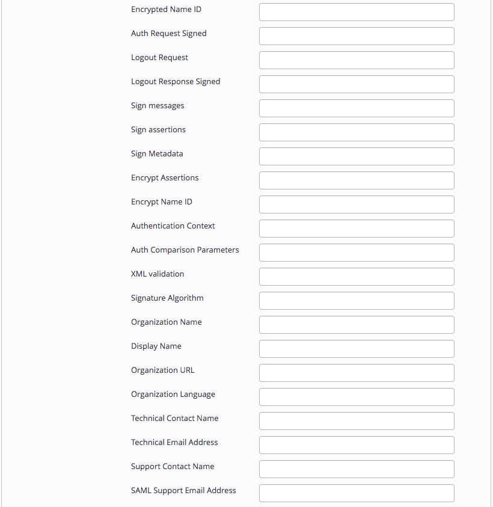

Fig. 6.59: Provide information about your SAML preferences

Use fields in the next section to provide your SAML preferences:

-   Use the `Encrypted Name ID` field to indicate that the name identifier of the `samlp:logoutRequest` sent by this service provider will be encrypted; specify `true` or `false`.
-   Use the `Auth Request Signed` field to indicate if the `samlp:AuthnRequest` messages sent by this service provider will be signed; specify `true` or `false`.
-   Use the `Logout Request` field to indicate if the `samlp:logoutRequest` messages sent by the service provider will be signed; specify `true` or `false`.
-   Use the `Logout Response Signed` field to indicate if the `samlp:logoutResponse` messages sent by the service provider will be signed; specify `true` or `false`.
-   Use the `Sign messages` field to sign the metadata. If you leave the field empty, the metadata will not be signed. If you wish to provide a signature, provide a comma separated `keyFileName`, `certFileName` pair.
-   Use the `Sign assertions` field to indicate a requirement for the `samlp:Response`, `samlp:LogoutRequest`, and `samlp:LogoutResponse` elements received by the service provider to be signed; specify `true` or `false`.
-   Use the `Sign Metadata` field to indicate that the metadata of this service provider must be signed; specify `true` or `false`.
-   Use the `Encrypt Assertions` field to indicate that the assertions received by this service provider must be encrypted; specify `true` or `false`.
-   Use the `Encrypt Name ID` field to indicate that the name identifier received by this service provider must be encrypted; specify `true` or `false`.
-   Use the `Authentication Context` field to specify that `Set Empty` and `no AuthContext` will be sent in the `AuthNRequest`. You can set multiple values in a comma-delimited list.
-   Use the `Auth Comparison Parameters` field to specify that the `authn` comparison parameter to be set; this field defaults to `exact`.
-   Use the `XML validation` field to indicate if the service provider will validate all received xmls; specify `true` or `false`.
-   Use the `Signature Algorithm` field to specify the algorithm that the toolkit will use for the signing process. Specify one of the following:
    -   `http://www.w3.org/2000/09/xmldsig#rsa-sha1`
    -   `http://www.w3.org/2000/09/xmldsig#dsa-sha1`
    -   `http://www.w3.org/2001/04/xmldsig-more#rsa-sha256`
    -   `http://www.w3.org/2001/04/xmldsig-more#rsa-sha384`
    -   `http://www.w3.org/2001/04/xmldsig-more#rsa-sha512`


Fig. 6.60: Provide information about your organization

Use fields in the next section to provide information about your organization:

-   Use the `Organization Name` field to specify the name of the organization for which authentication is being provided.
-   Use the `Display Name` field to specify the display name of the organization.
-   Use the `Organization URL` field to specify the URL of the organization.
-   Use the `Organization Language` field to specify the primary language used by the organization.
-   Use the `Technical Contact Name` field to specify the name of a technical contact.
-   Use the `Technical Email Address` field to specify a contact email address for the technical contact.
-   Use the `Support Contact Name` field to specify the name of a support contact.
-   Use the `SAML Support Email Address` field to specify the email address of the SAML support contact.


Fig. 6.61: The console backup storage fields

Use fields in the next section to provide information about the location of the console backup storage in the next section of the setup dialog; please note that you must provide values in these fields to use the Ark console recovery functionality:

-   Use the `Storage Bucket` field to specify the name of the container that will be used to store files for point-in-time recovery. This location may not change after the initial deployment of the Ark console.

    -   A container name must be at least 3 and no more than 63 characters in length.
    -   A container name may contain lowercase letters, numbers, and the dash character (-).
    -   A container name must start with a lowercase letter or number.

    For more information, please [consult the Azure documentation](https://docs.microsoft.com/en-us/rest/api/storageservices/naming-and-referencing-containers--blobs--and-metadata).

-   Use the `Console Backup Folder` field to specify a folder in which the backups will be stored.

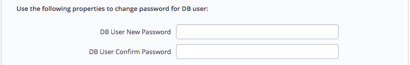

Fig. 6.62: The password fields

Use the password properties fields to modify the password for the database user:

-   Use the `DB User New Password` field to modify the database password.
-   Use the `DB User Confirm Password` field to confirm the new password.

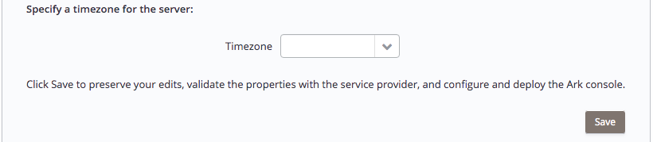

Fig. 6.63: The timezone field

Use the last field to specify a timezone for the server:

-   Use the drop-down listbox in the `Timezone` field to select the timezone that will be displayed by the Ark console.

When you've completed the dialog, click the `Save` button to validate and save your preferences; when prompted, click the `Restart` button to restart the console.

<div id="azure_register_user" class="registered_link"></div>

## Connecting to the Administrative Console on an Azure Host

When you navigate to the URL of the installed Ark console that uses Azure to host clusters, the console will display a login dialog.


Fig. 6.64: The Login dialog

Enter the name of an administrative user in the User Name field, and the associated password in the `Password` field, and click `Login` to connect to the Ark console. If the user name and password provided are members of a role with administrative privileges, the Ark console will include the `DBA` tab and the `Admin` tab.


Fig. 6.65: The Dashboard of the EDB Ark Administrator’s console

After connecting to the Ark console, you should:

-   Update the `User` tab, providing a `Notification Email`. For more information about the User tab, see the `EDB Ark Getting Started Guide`, available on the Ark `Dashboard`.
-   Use the [Admin tab](../08_ark_admin_tab/#ark_using_admin_tab) to create the server images and database engines that will be used by non-administrative users.
