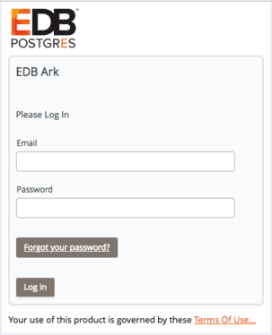
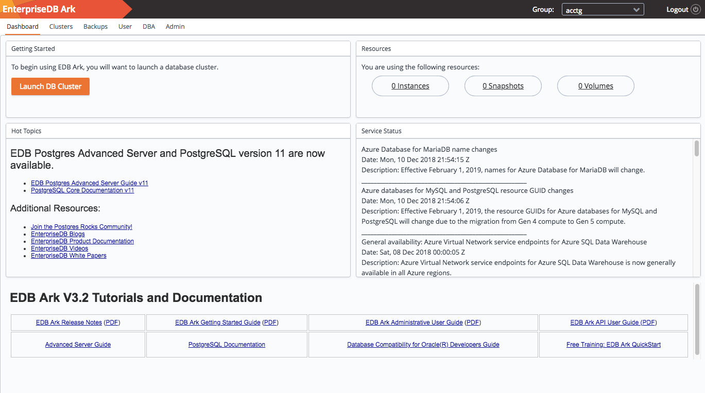

Administrative users have access through the Ark console to features that allow them to register server images and create database engine definitions that will be available for use by the non-administrative EDB Ark user. An administrator also has access to statistical information and console log files that are not available to the non-administrative user.

For information about functionality that is exposed to both administrators and non-administrative users, please see the *EDB Ark Getting Started Guide*.

When you navigate to the URL of the Ark console, the console will display a login dialog.

Fig. 7.1: The Login dialog

Enter the name of an administrative user in the *User Name* field, and the associated password in the *Password* field, and click Login to connect to the Ark console. The console opens as shown below.

Fig. 7.2: The EDB Ark Administrator’s console
