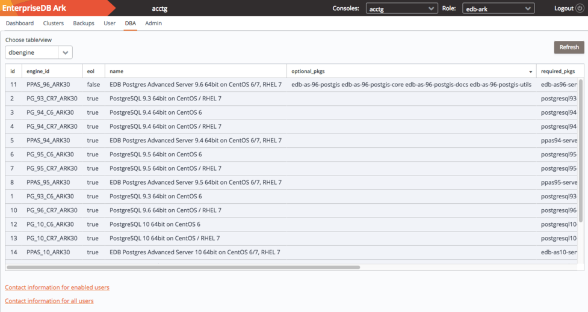
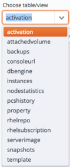
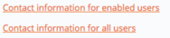

The DBA tab displays views that contain information about current clusters and cluster creation history. The tab is accessible only to administrative users.

Fig. 9.1: The Ark DBA tab

Use the `Choose table/view` drop down listbox to select a view.

Fig. 9.2: The table/view listbox

When the view opens, click a column heading to sort the view by the contents of the column; click a second time to reverse the sort order. Use the `Refresh` button to update the contents of the view.

## Accessing User Information

Use the user information links in the lower-left corner of the DBA tab to download a comma-delimited list of users and user information.

Fig. 9.3: The Contact information links

The file contains the information provided on the `User` tab of the Ark console by each user:

-   The user identifier.
-   The default email address of the user.
-   The first name of the user.
-   The last name of the user.
-   The status of the user account (`TRUE` if enabled, `FALSE` if disabled).
-   The company name with which the user is associated.

Select a link to download user information:

-   Click `Contact information` for enabled users to download a file that contains only those users that are currently enabled.
-   Click `Contact information` for all users to download a file that contains user information of all users (enabled and disabled).

ark_dba_tables

