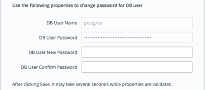
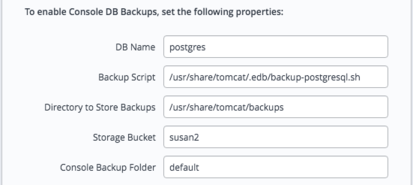

<div id="ark_console_management" class="registered_link"></div>

The sections that follow provide information about managing the EDB Ark application server.

## Starting, Stopping or Restarting the Ark Console

Apache Tomcat is an opensource project that deploys Java servlets on behalf of the Ark console. To start, stop, or restart the application server, use ssh to connect to the host of the Ark console database. Then, use sudo to assume sufficient privileges to restart the console:

`sudo su -`

Then, use systemctl to start, stop, or restart the server.

To start the server:

`systemctl start tomcat`

To stop the server:

`systemctl stop tomcat`

To restart the server (if it is already running):

`systemctl restart tomcat`

## Changing Console Passwords

A fresh installation of the Ark console includes a PostgreSQL installation that is used to manage the console; the management database is named postgres. By default, the database superuser has the following connection credentials:

name: `postgres` password: `0f42d1934a1a19f3d25d6288f2a3272c6143fc5d`

You should change the password on the PostgreSQL server to a unique password (known only to trusted users). You can set the password when you deploy the console or modify the password later on the `Edit Installation Properties` dialog. To open the `Edit Installation Properties` dialog, navigate to the `Admin` tab of the Ark console and click the `Edit Installation Properties` button.



Fig. 10.1: Changing console passwords

Fields near the bottom of the dialog allow you to modify the password:

-   Use the `DB User New Password` field to modify the database password.
-   Use the `DB User Confirm Password` field to confirm the new password.

After providing a new password and confirming the password, click the `Save` button. The console will inform you that it needs to restart the server to complete the password change. When prompted, click the `Restart` button. When the restart is complete, you will be required to log in to the server again.

**Please note:** if you modify the password of the Ark console, the password of the PEM server that resides on the Ark console will change as well. When using the PEM web interface to connect to the PEM server, use the password assigned to the Ark console.

## Customizing the Console

The majority of the console layout is defined in source files and cannot be changed without compilation, but you can modify several aspects of the user interface, including:

-   Background images
-   Background colors
-   Fonts
-   Font colors

To change the colors, fonts, or images displayed by the console, you can use ssh to connect to the console host; once connected, use your choice of editor to modify the files that control the onscreen display.

**Modifying the Console Display**

To modify the console display, use ssh to connect to the host of the Ark console: After connecting to the console host, you can use your choice of editor to modify the files that control the look and feel of the console host.

**Please Note: We recommend that you make a backup of any file that you plan to modify before changing the file.**

**The css File**

The css rules for the EDB Ark user console are stored in the `styles.css` file. The file is located at:

`/usr/share/tomcat/webapps/PPCDConsole/WEB‑INF/classes/VAADIN/themes/pcsconsole/styles.css`

Please refer to comments within the file for detailed information about modifying individual components within the console display.

Some modifications to the styles.css file will be visible when you reload the page in your browser; if a change is not immediately visible, restart the server to apply the changes. If a change is not visible after restarting the server, you may need to clear your browser cache.

**The images Directory**

To modify the images that are displayed by the console user interface, replace the `.png` files in the `images` directory with the images you wish to display. The `images` directory is located at:

`/usr/share/tomcat/webapps/PPCDConsole/VAADIN/themes/pcsconsole/images`

Please note that the logo displayed on the login screen is defined in the `i18n.properties` file; for more information about modifying the logo image, please refer to comments in that file.

**The html Template File**

The `loginscreen.html` template file defines the page layout for the login screen and the terms of use URL (referenced on the login screen). The file is located at:

`/usr/share/tomcat/webapps/PPCDConsole/WEB-INF/classes/com/enterprisedb/pcs/ui/loginscreen.html`

**The properties File**

Use the `i18n.properties` file to modify text and external URLs displayed in the Ark console. The `i18n.properties` file is located at:

`/usr/share/tomcat/webapps/PPCDConsole/WEB-INF/classes/i18n.properties`

Comments within the `i18n.properties` files identify the onscreen information controlled by each entry in the file. You must restart the server to apply any modifications to the properties file.

## Managing Console Logs

By default, Ark console log files are written to `/var/log/edb-ark/ark.log`. Log files are rotated on a daily basis, and stored for 30 days.

You can use the `ark.server.level` property to manage the level of detail saved in the Ark console log files. The `ark.server.level` property resides in:

`/usr/share/tomcat/webapps/PPCDConsole/WEB-INF/classes`

To modify the value, connect to the Ark console, and use your choice of editor to modify the property value. The valid values are:

| Property Value | Information Logged                                                                               |
| -------------- | ------------------------------------------------------------------------------------------------ |
| SEVERE         | Includes the least amount of information in the log files (i.e., exceptions and ERROR messages). |
| WARNING        | Includes WARNING messages.                                                                       |
| INFO           | Includes informational messages about server activity.                                           |
| CONFIG         | Includes messages about configuration changes.                                                   |
| FINE           | This is the default; provides detailed information about server activity.                        |
| FINER          | Includes a higher level of detail about server activity.                                         |
| FINEST         | Provides the highest level of detail about server activity.                                      |

After modifying the properties file, restart the server to make the changes take effect:

`sudo systemctl restart tomcat`

## Upgrading the Console

The steps that follow provide detailed instructions about upgrading the Ark console. Before upgrading the console, you must ensure that no users are connected to the console, and that there are no cluster operations (backup, cloning, etc) in progress; you may wish to alert users to the pending upgrade with a wall message.

Use the `Show logged in users` button on the Admin tab to confirm that no users are connected to the console, and check the server log (located in `/var/log/edb-ark/ark.log`) to confirm that all server activities have completed. Then:

1.  Use ssh to connect to the node on which the Ark console resides, and assume root privileges:

    `sudo su -`

2.  With your choice of editor, modify the repository configuration file (located in `/etc/yum.repos.d`), enabling the `edb-ark` repository URL.

<!-- end list -->

```text
[edb-ark]
name=EnterpriseDB EDB Ark
baseurl=http://<username>:<username>@yum.enterprisedb.com/edb-ark/redhat/rhel-\\$releasever-\\$basearch
enabled=0
gpgcheck=0
gpgkey=file:///etc/pki/rpm-gpg/ENTERPRISEDB-GPG-KEY
```

To enable the repository, replace the `<username>` and `<username>` placeholders with your user name and password, and set enabled to `1`.

3.  Use the `yum list edb-ark` command to review a list of available updates.

    `yum list edb-ark`

4.  If any updates are available, use yum to install the updates:

    `yum update package_ name`

    Where `package_name` specifies the name of the package that you wish to update.

5.  When the downloads complete, navigate into the `/usr/share/tomcat/` directory:

    `cd /usr/share/tomcat`

6.  Invoke the EDB Ark post-installation script to upgrade the console:

    `./postInstall.sh`

    The installation script will prompt you to confirm that the console is not in use, and that you wish to continue with the installation.

<!-- end list -->

```text
[root@ip-172-31-15-135 yum.repos.d]# /usr/share/tomcat/postInstall.sh
Script will upgrade the application! Is the EDB-ARK console in a steady state (no logged in users, no activity in the console)?
Are you sure you want to continue? <y/N> y
Updating EDB-ARK Application...
Stopping httpd and tomcat services...
Deploying the latest application in tomcat
Starting httpd and tomcat services...
Done!
```

When the `yum update` completes, navigate to the Ark URL in your browser, and enter the account password. You will be taken to the Ark deployment dialog where you will be required to provide the `Service Account ID` and `Service Account Password`; provide any missing values, select a `Time Zone`, and restart the Ark server. Ark will open to the `Login` dialog.

## Updating a PEM Installation

If you are using a local installation of PEM to monitor an Ark console, you may want to update your version of PEM to a more recent version. To update your PEM installation:

1.  Ensure that the `edb-ark.repo` file is enabled and contains your connection credentials:

    Use ssh to connect to the Ark console host, and navigate to the `/etc/yum.repos.d` directory. Then, use your choice of editor to update the `edb-ark.repo` file.

<!-- end list -->

```bash
[edb-ark]
name=EnterpriseDB EDB-ARK $releasever - $basearch
baseurl=https://<username>:<password>@yum.enterprisedb.com/edb-ark/redhat/rhel-$releasever-$basearch
enabled=0
gpgcheck=1
gpgkey=file:///etc/pki/rpm-gpg/ENTERPRISEDB-GPG-KEY
[edb-tools]
name=EnterpriseDB Tools $releasever - $basearch
baseurl=https://<username>:<password>@yum.enterprisedb.com/tools/redhat/rhel-$releasever-$basearch
enabled=0
gpgcheck=1
gpgkey=file:///etc/pki/rpm-gpg/ENTERPRISEDB-GPG-KEY
[edb-dependencies]
name=EnterpriseDB Dependencies $releasever-$basearchbaseurl=https://<username>:<password>@yum.enterprisedb.com/dependencies/redhat/rhel-$releasever-$basearch
enabled=0
gpgcheck=1
gpgkey=file:///etc/pki/rpm-gpg/ENTERPRISEDB-GPG-KEY
```

Modify the repository details, replacing each `<username>` and `<password>` placeholder with your credentials for the EnterpriseDB repository, and setting enabled to `1`. To request credentials for the repository, please visit the [EnterpriseDB website](https://www.enterprisedb.com/advanced-downloads).

2.  Assume superuser privileges.

    `sudo su`

3.  Use yum to update the PEM agent and PEM server version installed on your Ark console host:

    `yum install edb-pem-python-idna.noarch`

    `yum update edb-pem edb-pem-server`

4.  When the installation completes, configure the updated PEM server:

    `/usr/edb/pem/bin/configure-pem-server.sh -dbi /usr/pgsql-10 -d /var/lib/pgsql/10/data/ -ho 127.0.0.1 -p 5432 -su postgres -sp <ark_console_password> -t 1 -ci 0.0.0.0/0 -ds postgresql-10 -acp ~/.pem/`

    Where `<ark_console_password>` is the password of the Ark console.

    For more information about using PEM, please see the [PEM user guides](/pem/latest/).

## Recovering From a Console Failure

User and instance information used by the Ark console is stored in tables in a Postgres database. If the console application should fail, the information will persist in the console database, and will be available when the console application restarts.

If the system hosting the application database fails, then all information about the console database and registered users will be lost unless you have retained a backup.

The Ark console is configured to take automatic backups of the console database hourly, and after the registration of each new user. If you do not wish to use the Ark backup script to implement backups, you should maintain regular backups of your console database.

Please note: the Ark recovery utility only supports recovering the console from a backup that is the same version as the current console version.

## Modifying Backup Properties with the EDB Ark Console

You can use the `Installation Properties` dialog to modify console backup properties; to modify the properties, navigate to the Admin tab, and click the Edit Installation Properties button.



When the `Edit Installation Properties` dialog opens, you can modify details about the console backup storage:

-   Use the `Backup Script` field to specify the name and location of the backup script provided with EDB Ark. If you choose to provide your own backup script, use the parameter to specify the name and location.

-   Use the `DB Name` field to specify the name of the console database; the default is `postgres`.

-   Use the `Directory to Store Backups` field to specify a directory to which backups will be written. Please note that you must create the directory specified.

    The backup directory specified should not reside on the console VM's root disk; your backup would be lost in the event of a VM failure. You should consider mounting an external volume to the console VM, and writing console database backups to that volume.

-   Use the `DB User Name` field to specify the name of the console database user; the default is postgres.

-   Use the `DB User Password` field to specify the password associated with the console database user; the default password is:

    `0f42d1934a1a19f3d25d6288f2a3272c6143fc5d`

-   Use the `Storage Bucket` field to specify the name of the swift storage container that will be used to store files for point-in-time recovery. This location should not change after the initial deployment of the Ark console.

-   Use the `Console Backup Folder` field to specify a folder in which the backups will be stored.

-   Use the `Storage Tenant` field to provide the name of the tenant in which the backup will be stored.

## Using the Recover Option

If the console cannot locate a registered user, and your console is configured to support console backups, the Ark console login dialog will request the password specified during setup and display the `Deploy Console` or `Recover from Backup` options when you navigate to the console address.


Fig. 10.2: The connection dialog

To initiate a console recovery, provide the console password specified when you deployed the console instance (in the Amazon management console), and click the Recover from Backup button. The console properties dialog opens, prompting you for information about console backups.

Use the dialog to provide details about the console, and the location of a backup to recover. When you're finished, click the Recover button to start the recovery process. A popup will open, prompting you for the name of the backup folder that you wish to use for the recovery.

Use the `Folder name` drop-down listbox to select the backup you wish to use for the recovery, and click `Finish` to start the recovery process. If your system is monitored by a local PEM server, the backup will attempt to restore both the Ark and PEM servers.

## Manually Recovering from Console Backups

If you wish to manually save backups, you can use the Postgres [pg_dump](http://www.enterprisedb.com/docs/en/9.6/pg/app-pgdump.html) or [pg_dumpall](http://www.enterprisedb.com/docs/en/9.6/pg/app-pg-dumpall.html) command to archive the console database. Then, you can then use the [pg_restore](http://www.enterprisedb.com/docs/en/9.6/pg/app-pgrestore.html) command to restore the console database if necessary.

**Recovering the Console with a Backup Script**

The backup script provided with the Ark console uses pg_dump to create a plain-text SQL script file that contains the commands required to rebuild the console database to the state in which the backup was taken. After using ssh to connect to the host of the console, you can use the following command to invoke the psql command line tool and restore the console:

```
/usr/bin/psql –h localhost –p 5432 –d postgres –U postgres -f <(echo truncate sequence\\;; cat ``recovery_file``
```

Where `recovery_file` specifies the path and name of the backup file you wish to restore.

While restoring a console instance, you should shut down the application server so that the console application isn't actively using the database. When the restoration is complete, restart the application server.
