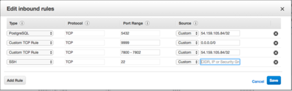

Each cluster has an associated security group that specifies the addresses from which the cluster will accept connections. By default, the security group exposes only port `9999` (the load balancing port) to the outside world, while allowing inter-cluster communication, and console-to-cluster communication between the servers in the cluster.

You can modify the security group, strategically exposing other ports for client connection. For example, you may wish to open port `22` to allow ssh connections to a server, or port `5444` to allow connections to the listener port of the Advanced Server database server that resides on a replica node.

EDB Ark assigns the same security group to every member of a cluster. By default, the security group contains rules that specify that any cluster member may connect to any other member's ICMP port, TCP port or UDP port. These rules do not permit connections from hosts on the public Internet. You *must not* alter these security rules.

Additional rules open TCP ports `7800-7802` to the cluster manager, allowing the cluster manager to perform maintenance and administrative tasks. Please note that the rules governing connections from the cluster manager *must* remain open to allow:

-   intra-cluster communications
-   communication with the console or cluster manager
-   maintenance and administrative functionality

The rule for TCP port `9999` uses a CIDR mask (`0.0.0.0/0`) to specify that port `9999` is open for connections from any IP address. You can customize this rule, selectively restricting the IP addresses from which computers are allowed to connect to a given port within the cluster.

Please note that EDB Ark provides a secure environment for all communications within the cluster, and between the cluster and the the console or cluster manager by employing SSH authentication and SSL encryption.

## Modifying a Security Group for an Amazon AWS Hosted Console

Security groups for Ark clusters that reside on an AWS host are managed through the Amazon management console; Amazon administrative privileges are required to review or modify the security group entries.

To manage a security group for a cluster, connect to the AWS management console, and locate the cluster on the Instances dashboard. Highlight the cluster name, and scroll through the columns to the right. Click the name of the security group (in the Security Groups column) to review detailed information about the rules that are currently defined for the cluster.

To modify a security group and add a rule that allows connections from an outside client (such as ssh), navigate to the Inbound tab, and click the Edit button. When the Edit inbound rules dialog opens, click the Add Rule button to add a new line to the list of rules.

Fig. 11.1: Editing the Inbound Rules

Specify the rule type, the protocol type, the port (or port range) on which inbound connections will be accepted, and the CIDR-formatted address from which you will be connecting.

Consult the core documentation for more information about specifying a [CIDR address](http://www.postgresql.org/docs/10/static/datatype-net-types.html).

When you've defined the rule, click Save to add the entry to the inbound rules list.

Please consult the [Amazon documentation](http://docs.aws.amazon.com/AmazonVPC/latest/UserGuide/VPC_SecurityGroups.html) for detailed information about managing the security group for a virtual private cloud.

## Using ssh to Access a Server

EDB Ark creates an ssh key when you create a new cluster; each cluster has a unique key. Before connecting to a Postgres instance that resides on the cloud via an ssh encrypted connection, you must download the ssh key, and adjust the privileges on the key file.

To download your private key, navigate to the Clusters tab, and click the Download SSH Key icon. The Accessing Your Cluster Instance popup opens.

Fig. 11.2: Accessing your Cluster Instance

The popup displays the tenant name, the cluster name, the name that you should use when connecting to the cluster, and the IP address to which you should connect.

Before using the private key, you must modify the permissions on the keyfile. Use the following command to restrict file permissions:

`chmod 0600 <ssh_key_file>.pem`

Where \\&lt;ssh_key_file>.pem specifies the complete path and name of the EDB Ark ssh private key file.

After modifying the key file permissions, you can use ssh to connect to the cluster. Include the complete path to the key file when invoking the command provided on the Accessing Your Cluster Instance popup.

Please note: Postgres Server applications must be invoked by the Postgres cluster owner (identified when creating an EDB Ark cluster as the Master User). If you are using a PostgreSQL server, the default user name is postgres; if you are using Advanced Server, the default user name is enterprisedb. To change your identity after connecting via ssh, use the su command:

`# sudo su database_user_name`

## Using iptables Rules

If you are using iptables rules to manage security on the host of the Ark console, please note that you must not modify the iptables rules provided by EDB Ark.

If you are using iptables on the host of the Ark console, do not modify the following rules:

`iptables -A PREROUTING -t nat -i eth0 -p tcp --dport 80 –j REDIRECT --to-port 8080`

`iptables -A PREROUTING -t nat -i eth0 -p tcp --dport 443 –j REDIRECT --to-port 8181`

`iptables -I INPUT 1 -p tcp --dport 8181 -j ACCEPT`

`iptables -I INPUT 1 -p tcp --dport 8080 -j ACCEPT`

These rules:

-   redirect http and https traffic on ports `80` and `443` to the default ports (`8080` and `8181`).
-   allow inbound traffic on `8080` and `8181`.
-   save the configuration (to preserve the behaviors when the system reboots).

If you are using iptables on an Advanced Server cluster, do not modify the following rules:

`iptables -I INPUT 1 -p tcp --dport 7800:7802 -j ACCEPT`

`iptables -I INPUT 1 -p tcp --dport 5444 -j ACCEPT`

`iptables –I INPUT 1 –p tcp --dport 9999 –j ACCEPT`

If you are using iptables on a PostgreSQL cluster, do not modify the following rules:

`iptables -I INPUT 1 -p tcp --dport 7800:7802 -j ACCEPT`

`iptables -I INPUT 1 -p tcp --dport 5432 -j ACCEPT`

`iptables –I INPUT 1 –p tcp --dport 9999 –j ACCEPT`

The rules:

-   allow inbound traffic from the Ark console on ports `7800` and `7802`.
-   allow inbound traffic on the database listener ports.
-   save the configuration (to preserve the behaviors when the system reboots).
-   allow inbound traffic on the load balancer port.

## Post-Installation Recommendations

**SE Linux**

During the installation process, SE Linux is disabled on the console host. Please note that SE Linux must remain disabled for the Ark console and clusters to function properly.

**Create a Secondary User Account**

The Ark console installation process creates an administrative user (named `centos` on CentOS hosts, or `cloud-user` on RHEL hosts) with ssh access to the console host. After installing the Ark console, you should use ssh to connect to the console host, and create a secondary user account that can be used to login and gain `root` privileges in the event that the installer-created user should lose ssh access for any reason.
