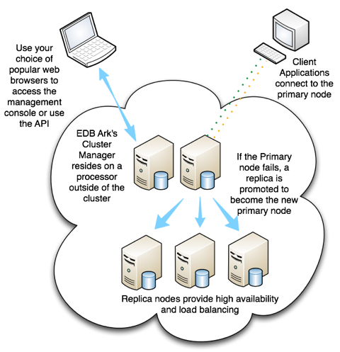
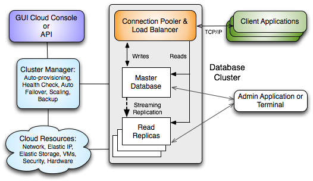
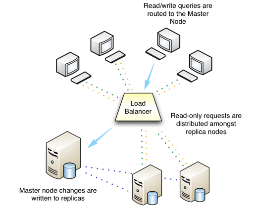
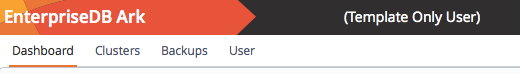
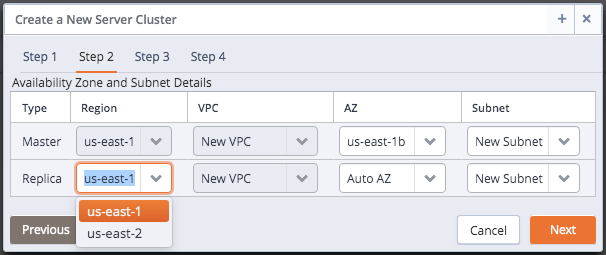

EDB Ark simplifies the process of provisioning robust Postgres deployments, while taking advantage of the benefits of cloud computing. When used with Advanced Server, EDB Ark also provides a platform with compatibility with the Oracle database, offering dramatic cost savings and competitive advantages.

A cloud is a collection of virtual machines; each virtual machine runs a separate copy of an operating system and an installation of Postgres.

Fig. 2.1: Using EDB Ark in a Private Cloud.

You can specify different combinations of CPU speed, RAM, and disk space to suit your needs when provisioning an EDB Ark cluster. EDB Ark makes it easy to scale up to a more capable cluster, or scale down as your requirements change.

EDB Ark solves common challenges faced by businesses that need more agility, velocity, and thrift in deploying and using relational, ACID-compliant databases:

-   **Develop / Test / Deploy.** Quickly create and delete Postgres databases with standard configurations to support software development and testing activities, then deploy applications to the database or cluster – all at a pace dramatically quicker than physical provisioning.
-   **Workload Portability.** The same Postgres database trusted in the datacenter also runs in a cloud cluster with scalability and high-availability.
-   **Enterprise-class power.** Postgres was designed to solve critical business challenges requiring reliable, high-performance, ACID-compliant database processing. As the only open source database meeting those requirements, it offers an extremely attractive alternative to more expensive options.

EDB Ark includes the following functionality:

-   **Scale computing resources up and out.** EDB Ark automatically scales up storage capacity, and provides a simple button to scale your server class up when data processing loads and usage characteristics require a change in the underlying virtual machine resources.
-   **Automatic Connection Pooling and Load Balancing.** EDB Ark maintains a cluster of database nodes, automatically scaling out replicas based on increasing user demand. The integrated connection pooling manager increases database read performance by distributing requests across all cluster members.
-   **Self-Healing Failover.** EDB Ark automatically replaces downed database nodes, preserving the continuity and performance of the cluster. Users can choose to replace the master with a new master (preserving all committed transactions) or with a promoted replica (for faster recovery time).
-   **Automatic Online backup.** EDB Ark uses user-directed rotating backups to protect your data from loss due to mishaps
-   **Supports data encryption.** EDB Ark offers SSL data encryption that protects data at rest, and is transparent to connecting clients.
-   **Cost-saving Compatibility with the Oracle Database.** Using a database that is compatible with Oracle is a reliable, fast and cost-effective way to support Oracle applications in public and private clouds.
-   **Web-based interface.** EDB Ark provides easy to use point-and-click cluster lifecycle management from start to finish from your favorite web browser.
-   **Database Cloning.** EDB Ark allows you to quickly and easily create developer 'sandboxes' based on real production data, saving System Administrators setup, configuration and data load time.
-   **Professional Postgres Support.** EnterpriseDB provides support from Postgres experts who work with top Postgres open source developers.
-   **JSON Compatible API Support.** EDB Ark supports a JSON-compatible API.

## Architecture Overview

The Ark console is designed to help you easily create and manage high-availability database clusters from a web browser.

!!! Note
    Traditionally, the expression *cluster* refers to a single instance of Postgres managing multiple databases; an EDB Ark database server cluster is a collection of high-availability Postgres server instances that reside in a cloud or on a traditional network.

When you create a new cluster (a group of replicated database servers), EDB Ark initializes one or more Postgres instances (virtual machines) according to your specifications. EDB Ark uses Postgres streaming replication to synchronize replicas in the cluster, and pgpool-II to implement load balancing and connection pooling among all active instances. The following figure provides a general overview of the EDB Ark architecture.

Fig. 2.2: An overview of the EDB Ark architecture

The master node of the cluster contains a host operating system with a running instance of Postgres, along with the load balancer. Database modifications are automatically routed to the master node; any modifications to the master node are subsequently propagated to each replica using Postgres streaming replication.

EDB Ark installs Postgres on each replica node in a read-only hot-standby role that automatically duplicates all data found on the master node, and all changes made to that data. In hot-standby mode, the data is available to service user queries providing read scalability to the cluster. In addition, any schema changes made to the master are also replicated to the replica nodes, making development and deployment of application changes easy and seamless without interruption to normal operations.

Fig. 2.3: EDB Ark performs automatic load balancing

Replicas provide balanced user support as needed - if any instance in the cluster goes offline, the cluster's load is re-balanced among the remaining servers while the instance is automatically replaced.

When used in the default healing configuration, in the event of a failure of the master node, an existing replica is used to replace the failed master node. While the replica nodes are standing by, they are read-only resources, load balancing client queries without a risk of compromising data integrity.

EDB Ark automatically archives data at regular intervals; you can specify a convenient backup window and how many backups to retain when creating a database cluster. EDB Ark also offers backup on demand -simply click the Backup icon to save a copy of the instance. Automatic backups are retained according to your specifications; on-demand backups are retained until you delete them. Each backup is a complete copy of the cluster; you can use a backup to restore a cluster.

EDB Ark makes it easy to scale a database cluster:

-   To increase read performance, you can add read replicas to the cluster (manually or automatically).
-   To handle expanding data requirements you can increase the amount of storage available (manually or automatically).
-   To increase the RAM or CPU processing power of the cluster's underlying virtual machine, you can manually scale a cluster into a more appropriate server class.

## Using Ark as a Template Only User

Some features of the Ark console are not available to a *Template* *Only* user. A Template Only user:

-   must specify a template when deploying, scaling, or restoring a cluster.
-   is restricted to the scaling policies defined in the template.
-   cannot modify a manually-defined cluster created by another user.
-   can only scale clusters to a server class that exists in a template that is available to the current tenant.
-   may only delete backups of template created clusters.
-   may not delete last backup of a template created cluster if the cluster had been deleted.

If you are a Template Only user, the Ark console displays a note in the upper-left header when you log in.

Fig. 2.4: Template Only User

For Template Only users, the Ark dialogs used to create a cluster, clone a cluster, or to restore a backup offer a subset of the fields presented on the dialogs viewed by a user that is not a Template Only user.

For detailed information about using a template to:

-   create a cluster, see [Using a Template to Create a Cluster](05_creating_a_cluster/#template_create_cluster) .
-   restore from backup, see [Using a Template to Restore from Backup](07_manage_backup_recovery/#template_restore) .
-   clone a cluster, see [Using a Template to Clone a Cluster](05_creating_a_cluster/#template_clone_cluster) .

Please note: a user that is not restricted to template usage may override template policy when modifying a cluster created with a template.

## Using a Federated Console

An Administrative user can create a federation of consoles; once federated, a user can create or clone clusters or add resources in any region in which one of the federated consoles resides. Standby nodes that reside in other regions will reflect the state of the master node.

Standby nodes that reside in a different region than the master console will be used for load balancing. Failover to nodes that reside on a different region than the master node is not supported. If a master node fails and you do not have a standby node in the same region as the master node, Ark will create a replacement node in the same region as the original master.

If a console is a member of a federation, any other member of the federation will be able to create resources in the region in which the console resides. All of the resources that reside on federated consoles will be visible on the `Clusters` tab of all of the consoles within the federation.

When connected to a federated console, you can:

-   Create a cluster with nodes that reside in multiple regions; the console from which you create the cluster will be responsible for managing the master node.
-   Initiate a cluster backup on any cluster within the federation. If the cluster master is managed by the console where the backup was initiated, then the backup will run locally; if the cluster is not managed by the console where the backup was requested, then a backup request will be made to the managing console and the backup will run remotely.
-   Delete a node or cluster regardless of the region in which the node or cluster resides.
-   Initiate a clone operation regardless of the region in which the node resides; the clone operation will be able to create one or more nodes in any region of the federation.
-   Initiate a yum update on any node or cluster of the federation (remote or local).
-   Add resources and replicas in any region of a federated console during a manual scaling operation.
-   Perform multi-region machine scaling. If the cluster contains nodes running in different regions, then the console that manages the master node will coordinate machine scaling in the foreign regions. A new master node is created first on the new machine type, the old master is removed, and then each replica node is replaced.

On a federated console, dialogs that allow you to create and manage clusters or nodes (create, scale, clone, or delete) will make the regions, VPCs, availability zones, and subnets of other federation members available for selection.

Fig. 2.5: Selecting a region

For example, you might have two federated consoles; one that resides in `us-east-1` and one that resides in `us-east-2`. After federating the consoles (sharing the URL and token of each console within the federation with the other console), you will be allowed to select the `Region` in which replica nodes are created or cloned.
