

If your Ark console resides on an Amazon host, the console configuration will determine the user registration process. An administrative user can enable or disable self-registration. If you are an administrative user and need information about enabling or disabling self-registration, please refer to the EDB Ark Administrative User's Guide. If you are a non-administrative user connecting to the Ark console on an Amazon host with self-registration enabled, see Using Self-Registration on an Amazon Hosted Console.

When you navigate to the URL of an installed Ark console, the console will display a login dialog.

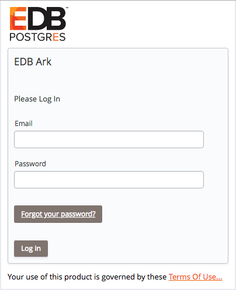

Fig. 3.1: The Login dialog.

Enter your user name in the `Email` field, and the associated password in the `Password` field, and click `Log In` to connect to the Ark console.

Fig. 3.2: The Ark console.

## Using Self-Registration on an Amazon Hosted Console

If self-registration is enabled, on your first visit to the Ark console, you should create an Amazon role and register an Ark console user.

As part of the registration process for the Ark console, you must create an Amazon IAM role and perform a *handshake* between the Ark console and the Amazon management console. The handshake associates the external ID provided by the Ark console with the Amazon role, and the `Role Arn` provided by the Amazon console with the Ark user.

Please note that each time you refresh the Ark `New User` dialog, the external ID displayed on the registration dialog will change; you must have access to both the Ark console and the Amazon management console while registering an Ark user.

To start the registration process, connect to the Amazon management console, and navigate to the `Identity and Access Management` dashboard.

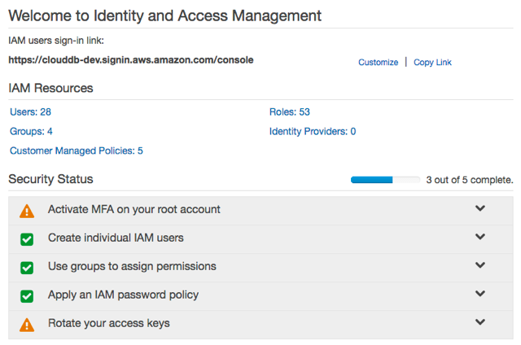

Fig. 3.3: The Amazon IAM Dashboard.

Navigate to the `Roles` dashboard, and click the `Create New Role` button.

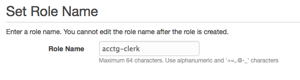

Fig. 3.4: Provide a role name

When the `Set Role Name` dialog opens, specify a name for the new role and click `Next Step` to specify a role type.

Fig. 3.5: Specify that the role allows EC2 instances to call AWS services

On the `Select Role Type` dialog, select the `AWS Service Roles` radio button, and then the `Select` button to the right of `Amazon EC2` to continue to the `Attach Policy` dialog.

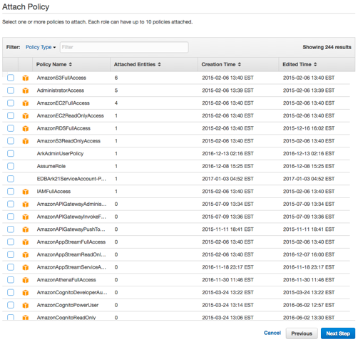

Fig. 3.6: The Attach Policy dialog

When the `Attach Policy` dialog opens, do not specify a policy; instead, click `Next Step` to continue to the `Review` dialog.

Fig. 3.7: Review the role information

When the `Review` dialog opens, review the information displayed, and then click `Create Role` to instruct the AWS management console to create the described role.

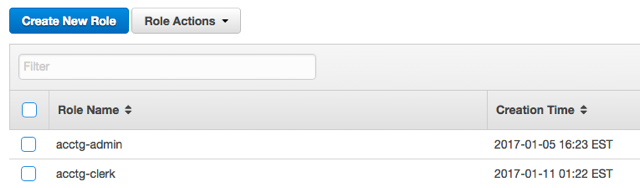

Fig. 3.8: The new role is displayed on the Roles page.

The role will be displayed in the role list on the `Amazon IAM Roles` page. The `Summary` tab will display a `Role ARN`, but the ARN will not be enabled until the security policy and trust policy are updated.

After completing the `Create Role` wizard, you must modify the inline policy and trust relationship (defined by the security policy) to allow Ark to use the role. Highlight the role name; then navigate to the `Permissions` tab and open the `Inline Policies` menu. Select `Click here` to add a new policy.

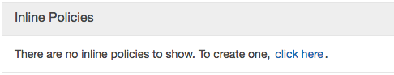

Fig. 3.9: The Inline Policies menu

When the `Set Permissions` dialog opens, select the `Custom Policy` radio button, and then click the `Select` button.

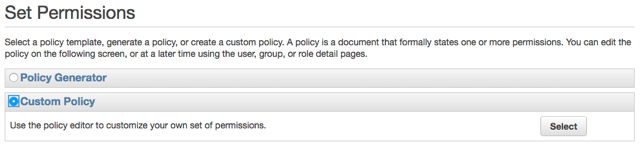

Fig. 3.10: Add a Custom Policy.

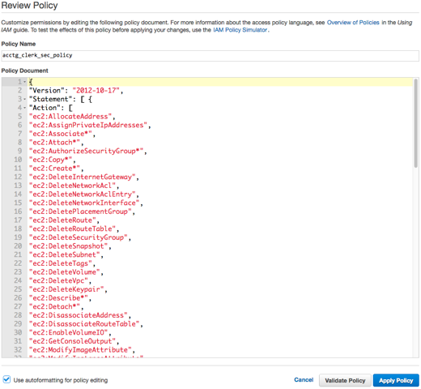

Fig. 3.11: Provide the policy name and contents

Use the fields on the `Set Permissions` dialog to define the security policy:

-   Provide a name for the security policy in the `Policy Name` field.
-   Copy the security policy text into the `Policy Document` field. The security policy required by Ark is available in [AWS
    Resources](15_aws_policies/#aws_policies) .

After providing security policy information, click `Apply Policy` to return to the `Role` information page. Then, select the `Edit Trust Relationship` button (located in the `Trust Relationships` section) to display the `Policy Document`.

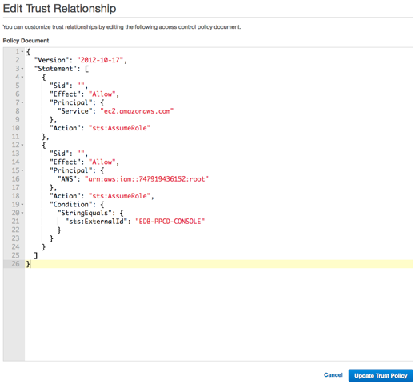

Fig. 3.12: The Policy Document

Replace the displayed content of the policy document with the content of the file available in [AWS Resources](15_aws_policies/#aws_policies) .

`EDB-PPCD-CONSOLE` is a placeholder within the trust policy. You must replace the placeholder with the `External ID` provided on the `Step 2` tab of the Ark console `New User Registration` dialog.

To retrieve the `External ID`, open another browser window and navigate to the `Log In` page of your Ark console. Click the `Register` button to open the `New User Registration` dialog.

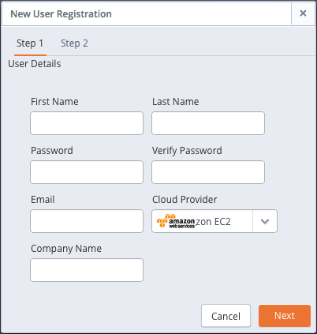

Fig. 3.13: The New User Registration dialog.

Enter user information in the `User Details` box located on the `Step 1` tab:

-   Enter your first and last names in the `First Name` and `Last Name` fields.
-   Enter a password that will be associated with the user account, and confirm the password in the `Password` and `Verify Password` fields.
-   Provide an email address in the `Email` field; please note that the email address is used as the Login identity for the user.
-   Use the drop-down listbox in the `Cloud Provider` field to select the host on which the cloud will reside.
-   Enter the name of the company with which you are associated in the `Company Name` field.

When you've completed `Step 1`, click `Next` to access the `Step 2` tab.

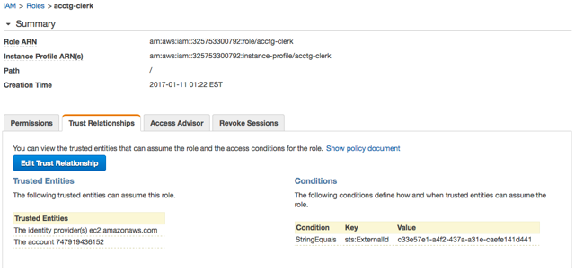

Fig. 3.14: The Summary tab of the Role detail panel.

The `Step 2` tab of the `New User Registration` dialog will display a random `External ID` number. Copy the `External ID` from the `Step 2` dialog into the trust policy, replacing `EDB-PPCD-CONSOLE`. Please note that you must enclose the `External ID` in double-quotes ("). Click the `Update Trust Policy` button to save your edits and exit the dialog.

Your Amazon IAM role ARN is displayed on the `IAM Roles` detail panel of the Amazon management console. Highlight a role name to display the assigned value on the `Summary` page.

Fig. 3.15: Registering a user on an Amazon EC2 cloud.

Enter your Amazon IAM role ARN in the `Role Arn` field on the `Step 2` dialog, and click `Finish` to complete the registration. Select `Cancel` to exit without completing the registration.

After completing the registration, you can use the `Login/Register` dialog to access the Ark console.

Fig. 3.16: The Login/Register dialog.

Enter the registered email address in the `Username` field, and the associated password in the `Password` field, and click `Log In` to connect to the Ark console.
