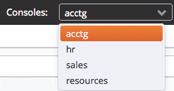

The `Dashboard` tab provides an overview of the EDB Ark service status, resources, useful information links and a quick-start `Launch DB Cluster` button.

Fig. 4.1: The Dashboard tab.

To launch a cluster from the `Dashboard` tab, use the `Tenant` drop-down listbox to select the tenant in which the cluster will be created. Then, use the `Launch DB Cluster` button located in the `Getting Started` panel to open the `Create New Cluster` dialog and define the cluster attributes. For more information about defining a cluster, see [Creating a Server Cluster](../05_creating_a_cluster/#creating_a_cluster) .

The `Resources` panel contains a table that displays the resource usage (instances, snapshots, and volumes) for each role.

The `Hot Topics` panel provides a link to the EDB Ark website.

Use the links in the `EDB Ark Tutorials and Documentation` section to access EDB Ark and Postgres documentation.

## Using the Console Switcher Feature

The console switcher provides convenient access to a list of user-defined console names and their associated addresses. When you select a name from the `Consoles` drop-down listbox, the Ark console opens a browser tab and navigates to the address associated with the shortcut name.

Fig. 4.2: The Consoles drop-down

An Ark administrative user can use management features located on the Admin tab of the administrative console to add consoles to the list, or remove consoles from the list. For more information about populating the console switcher, please see the *EDB Ark Administrative User's Guide*.
