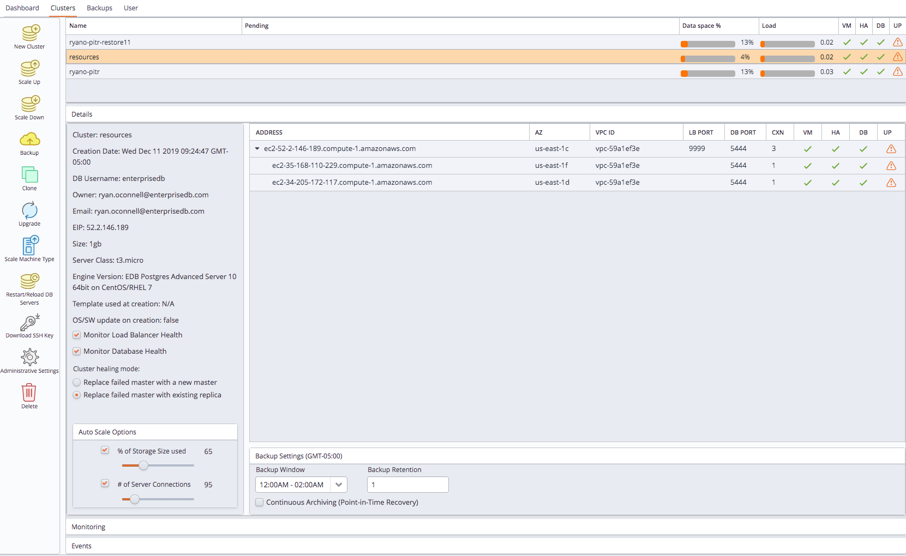
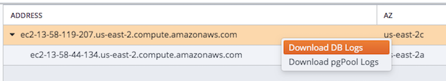
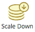
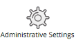
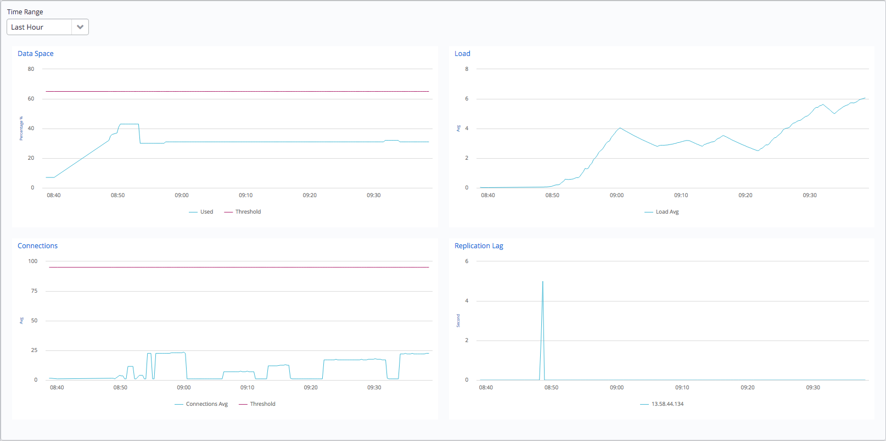

Use the `Clusters` tab to create, monitor and manage active clusters that reside in the cluster.

Fig. 4.3: The Clusters tab

Indicators in the columns to the right of a cluster name display the current health of the cluster. Click on a column name to sort the contents of the column; click a second time to reverse the sort-order.

-   The `VM` column displays the state of the virtual machine on which the cluster resides.
-   The `HA` column displays the state of the high-availability cluster.
-   The `DB` column displays the state of the database server.
-   The `UP` column displays the current status of the packages installed on the cluster. Periodically, the cluster manager performs a check to see if the packages are up to date.

Status indicators provide quick visual feedback about each feature:

|                                                  |                                                                             |
| ------------------------------------------------ | --------------------------------------------------------------------------- |
|  | A green checkmark indicates that an object is healthy.                      |
|     | A yellow alert symbol calls attention to an object that requires attention. |
|        | A red error symbol signifies that an object is not available.               |
|      | A busy-indicator signals that the cluster is processing a request.          |
|    | A question mark indicates that the state of the resource is unknown.        |

Management options are on the node's context menu; right-click the node name to access the menu. The menu is context-sensitive; when applicable, select from:

-   `Download DB Logs` to download database server logs.
-   `Download pgPool Logs` to download pgPool (load balancing) logs.
-   `Promote` to [promote](../08_automatic_failover/#manual_promotion) the selected standby node to master.

If you choose to download a log file archive, the archive name is in the following form:

`<address>-<log_type>-<date>.tar.gz`

Where:

*address* is the address of the selected node.

*log_type* is the type of log file (server type or pgPool).

*date* is the date that the archive was generated.

Use the icons along the left side of the `Clusters` tab to create new clusters or manage existing clusters:

Status indicators provide quick visual feedback about each feature:

|                                                |                                                                                                                                                                                                                                                                                                                                                                                                                                                                                                                                                                                                                                         |
| ---------------------------------------------- | --------------------------------------------------------------------------------------------------------------------------------------------------------------------------------------------------------------------------------------------------------------------------------------------------------------------------------------------------------------------------------------------------------------------------------------------------------------------------------------------------------------------------------------------------------------------------------------------------------------------------------------- |
|     | Use the `Add Cluster` icon to create a new Postgres cluster.                                                                                                                                                                                                                                                                                                                                                                                                                                                                                                                                                                            |
|      | Select the `Scale Up` icon to manually add one or more replicas to the current cluster, or add additional storage to the current cluster servers.                                                                                                                                                                                                                                                                                                                                                                                                                                                                                       |
|         | Use the `Scale Down` icon to remove one or more specified replicas from the cluster.                                                                                                                                                                                                                                                                                                                                                                                                                                                                                                                                                    |
|             | Select the `Backup` icon to take a backup of the highlighted cluster (a single backup of the cluster data, and a backup of the cluster configuration files).                                                                                                                                                                                                                                                                                                                                                                                                                                                                            |
|             | Select the `Clone` icon to create an exact duplicate of the master node of the selected database. When you clone a database, only the master node is recreated in the new cluster.                                                                                                                                                                                                                                                                                                                                                                                                                                                      |
|           | Use the `Upgrade` icon to perform a yum update (keeping the same server version) or perform an upgrade to a later server version. After the update, the cluster nodes will be rebooted (initiating any kernel updates required). Please note that a software update can take some time to complete.                                                                                                                                                                                                                                                                                                                                     |
|     | Use the `Scale Machine Type` icon to change the size of the virtual machine for the selected cluster. EDB Ark will copy the cluster into a new cluster of a different server class (RAM and CPU), and optionally re-assign the IP address of the existing cluster to the new cluster.                                                                                                                                                                                                                                                                                                                                                   |
|           | Use the `Download SSH Key` icon to download the SSH key associated with the selected cluster. Each cluster has a unique key that you can use to access nodes in that cluster. Before downloading the SSH key, you should disable pop-up blocker software from restricting pop-ups from the URL/s used by the Ark console or Ark clusters.                                                                                                                                                                                                                                                                                               |
|  | Use the `Restart/Reload DB Servers` icon to reload one or more nodes of a selected cluster. Select the instance you wish to restart or reload on the `Restart/Reload DB Servers` dialog and specify if you would like to `Restart` or `Reload` the server before clicking `Confirm` to initiate the action.                                                                                                                                                                                                                                                                                                                             |
|    | Use the `Cluster Administrative Settings` icon to access a popup dialog that allows you to view or modify the ownership and notification email address of a cluster.                                                                                                                                                                                                                                                                                                                                                                                                                                                                    |
|            | Use the `Delete Cluster` icon to delete the currently selected cluster. A popup dialog will ask you to confirm you wish to terminate the cluster; once terminated, a cluster may only be restored from a backup. By default, the box next to `Release elastic IP address` is checked. Deselect this option if you wish to retain the IP address for re-use with other clusters. If you release the IP address, it will be made available for use by other clusters. When you terminate an active cluster, backups are not deleted. Backups (including user data) are retained until they are selected and deleted from the Backups tab. |

-   Select the [Details bar](#details_panel) to view information about the state of the selected cluster.
-   Select the [Monitoring bar](#monitoring_panel) to view usage statistics for the selected cluster.
-   Select the [Events bar](#events_panel) to review event logs describing activities on the selected cluster.

## The Details Panel

Click the `Details` navigation bar to open the `Details` panel.

Fig. 4.4: The Details panel on the Clusters tab.

The left pane of the `Details` panel displays information about the currently selected cluster:

-   The name of the cluster
-   The date and time that the cluster was created
-   The name of the database superuser for the cluster
-   The name of the cluster owner
-   The email address to which notifications about the cluster will be sent
-   The elastic IP address of the master node of the cluster
-   The cluster size
-   If the cluster is encrypted
-   If applicable, the IOPS value for the cluster
-   The region in which the cluster resides
-   The virtual network or VPC ID in which the cluster resides
-   The cluster's hardware type or Server Class
-   The engine type and version that resides on the server
-   If a template was used, the template name
-   If the cluster is configured to update when provisioned

You can use controls on the `Details` panel to specify:

-   If load balancer health should be monitored
-   If database health should be monitored
-   Failover preferences for the cluster
-   Auto-scaling thresholds for the cluster
-   Backup preferences for the cluster
-   If continuous archiving should be enabled for the cluster

When you modify the settings on the `Details` panel, EDB Ark displays a `New value saved` notice, confirming that the change has been saved.

Please note: If a template was used to specify the configuration details for the cluster, the template may prohibit access to auto-scaling or manual scaling functionality.

**Monitoring Load Balancer Health**

By default, EDB Ark monitors the health of the load balancer to ensure that service is not interrupted. If the load balancer (pgpool) should fail while monitoring is enabled, PgPool will be automatically restarted. If the load balancer cannot be automatically restarted, EDB Ark will display a warning sign in the DB column next to the cluster name, and send a notification email to the cluster user.

Deselect the `Monitor Load Balancer Health` checkbox to indicate that you do not wish for load balancer health to be monitored and automatically restarted if an interruption in service is detected.

**Monitoring Database Health**

By default, the `Monitor Database Health` checkbox is checked, indicating that EDB Ark is monitoring the health of the database to ensure that service is not interrupted. If the state of the database server changes to any state other than running while Monitor Database Health is checked, Ark will attempt to restart the database.

If the database restart fails, Ark will restore the configuration files to their original settings and attempt a restart. If the server fails to restart after restoring the configuration, Ark will failover to a new instance.

Uncheck the `Monitor Database Health` checkbox to instruct Ark to not automatically restart the database if the database stops.

**Selecting a Cluster Healing Mode**

Use the `Cluster healing mode` radio buttons to specify the type of failover that should be employed:

-   Select the `Replace failed master` with a new master radio button to specify that the cluster manager should create a new master to replace a failed master node.

    When replacing a failed master node with a new master node, the data volumes from the failed instance are attached to the new master node, preserving data integrity, while the replicas continue serving client queries.

-   Select the `Replace failed master with existing replica` radio button to specify that the cluster manager should promote a replica node to be the new master node for the cluster.

    When replacing a failed master node with an existing replica, a replica node is marked for promotion to master node, while the other replica nodes are re-configured to replicate data from the new master node. Since replica nodes use asynchronous replication, any data that was committed to the old master node, but not pushed to the replica prior to the node failure will be lost.

Please note that replacing a failed master node with a new master node can take a bit longer than promoting a replica node to the role of master, but it does have the advantage of guaranteeing that no committed data will be lost. If recovery time for your cluster is more important than preserving any non-replicated transactions, then select Replace failed master with existing replica as the healing mode.

**Adjusting Auto-Scaling Thresholds**

Use the `Auto-Scaling Thresholds` controls on the `Details` panel to adjust the threshold at which EDB Ark automatically scales up cluster resources. For more information about using the controls, see [Adjusting the Automatic Scaling Thresholds](../10_automatic_scaling/#automatic_scaling) .

**Modifying Backup Settings**

Use the fields in the `Backup Settings` box to change your backup preferences for the selected cluster:

-   Use the `Backup Window` drop-down listbox to select an optimal time to process cluster backups; specify a time when the number of clients accessing the database is minimal.

-   Use the `Backup Retention` field to specify the number of backups that should be stored for the selected cluster.

-   Select the checkbox next to `Continuous Archiving (Point-in-Time Recovery)` to enable point-in-time recovery for a cluster. When enabled, a base backup is automatically performed that can to be used to restore to a specific point in time. All subsequent automatic scheduled backups will also support point-in-time recovery. Note that if you deselect this option, the cluster (and subsequent automatic backups) will be re-configured to not include support for point-in-time recovery.

    When point-in-time recovery is enabled, the value specified in the `Backup Retention` field determines the duration of the point-in-time recovery backup window. For example, if you specify a value of 7, the backup window will be `7` calendar days long. When the backup retention threshold is reached, the oldest base backup is removed, as well as any WAL files required to perform a recovery with that backup.

**Reviewing Cluster Connection and Status Information**

The `DNSNAME` table (located on the right side of the `Details` panel) contains a status overview and connection information for the selected cluster. If you have created replicas, the secondary server nodes are listed below the master node in the tree control; expand the tree control to view the status of the replication nodes.

Status indicators provide quick visual feedback about each feature:

|                                                   |                                                                             |
| ------------------------------------------------- | --------------------------------------------------------------------------- |
|  | A green checkmark indicates that an object is healthy.                      |
|     | A yellow alert symbol calls attention to an object that requires attention. |
|        | A red error symbol signifies that an object is not available.               |
|      | A busy-indicator signals that the cluster is processing a request.          |
|    | A question mark indicates that the state of the resource is unknown.        |

Use the drop-down tab in the upper-right corner of the `DNSNAME` pane to select the columns that will be displayed in the panel:

-   The `AZ` column displays the Availability Zone in which the cluster resides.

-   The `VPC ID` column displays the identifier of the VPC on which the cluster resides.

-   The `LBPORT` column displays the port number to which a client application should connect to utilize load balancing.

-   The `DBPORT` column displays the default listener port for the Advanced Server or PostgreSQL server.

-   The `CXN` column displays the current number of connections to the node.

-   The `VM` column displays the state of the virtual machine on which the cluster resides.

-   The `HA` column displays the state of the high-availability cluster.

-   The `DB` column displays the state of the database server.

-   The `UP` column displays the current status of the packages installed on the cluster. Periodically, the cluster manager performs a check to see if the packages are up to date. If an update becomes available, the `UP` column will display a yellow alert symbol if the update is non-critical, or a red error symbol if the update is a critical (security) alert.

    If alerted to an out-of-date package, you can use the `Upgrade` icon to invoke a yum update to update the package on all of the nodes on your cluster.

### The Monitoring Panel

The `Monitoring` panel displays graphs that allow you to review statistical usage information about the amount of storage and the CPU load for the selected cluster.

Fig. 4.5: The Monitoring panel displays usage information

Use the `Time Range` drop-down listbox to modify the time period that the charted information on the Monitoring panel spans.

The graphs on the `Monitoring` panel display resource usage information:

-   The `Data Space` chart displays the amount of allocated data space used by the selected cluster. The red line denotes the threshold specified by the `Data Space Threshold` slider on the `Details` panel (the threshold at which the cluster will be scaled-up). The blue line indicates the amount of the data space that is currently in use.
-   The `Connections` chart displays a graph of the number of connections to the cluster during the selected time range. The red line denotes the threshold specified by the Connections slider on the Details panel.
-   The `Load` chart displays the processing load placed on the CPU by connecting clients. The value displayed is the actual load average as read from the program, `/proc/loadavg`. The chart shows the number of jobs in the run queue or waiting for disk I/O, averaged over 15 minute periods.
-   The `Replication Lag` chart displays the replication lag (in seconds) for the cluster. Each replica node is displayed as a separate colored line on the chart; the key at the bottom of the chart identifies the IP address of the node.

## The Events Panel

The `Events` panel displays an event log containing a history of selected events for the connected user.

Fig. 4.6: The Events panel displays server activity.

Highlight a cluster name to display only events for that cluster; if you do not select a cluster, the `Events` panel will display the collected events for the connected user.

-   Click a column heading to sort the logged activity by the selected column; click again to reverse the sort order.
-   Use a mouse to select multiple rows from the event log for copy and paste operations.
