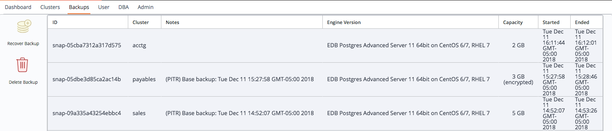
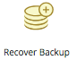

Use the `Backups` tab to manage cluster backups; the tab displays a list of the available backups.

Fig. 4.7: The Backups tab of the Ark console

A backup captures and stores the status and condition of a cluster at a specific point-in-time. Click a column heading to sort the column contents; click again to reverse the sort order.

If the comment in the `NOTES` column for a specific cluster includes `PITR`, point in time recovery is enabled on the cluster. When point in time recovery is enabled, the backup can be used to restore your cluster to a state at any given time since the backup was taken.

Use the icons on the left side of the `Backups` tab to restore or delete backups:

|                                             |                                                                                                                                                                                                                                                                                                                                                       |
| ------------------------------------------- | ----------------------------------------------------------------------------------------------------------------------------------------------------------------------------------------------------------------------------------------------------------------------------------------------------------------------------------------------------- |
|  | Highlight a backup in the list, and click the `Recover Backup` icon to open a dialog that allows you to restore a cluster from the selected backup. Specify a name for the cluster, and click the `Recover` button to continue. A popup confirms that the cluster is being restored; navigate to the Clusters tab to monitor the restoration process. |
|   | Highlight one or more backups in the list and click the `Delete Backup` icon to delete the selected backups. A popup will ask you to confirm that you wish to delete the selected backups before the backups are actually deleted.                                                                                                                    |
