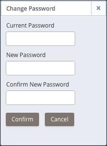

Fields on the `User` tab allow you to view or modify information about the current user.

Fig. 4.8: The User tab of the Ark console.

To change the `First Name`, `Last Name`, or `Company Name` of the registered user, modify the corresponding fields and click the `Apply Changes` button. A popup will confirm that the changes have been applied.

The `Notification Email` field on the `User` tab displays the default email address that will be used for cluster notifications unless an alternate address is provided. You can optionally:

-   provide an alternate email address when a cluster is created (on the `Create a new Server Cluster` dialog).
-   modify a cluster’s notification email address on the `Administrative Settings` dialog.

To change the default notification email address, enter a new address in the `Notification Email` field, and click the `Apply Changes` button. A popup dialog will open, prompting you to enter your password to confirm the change of address. Enter your password, and click `Confirm` to modify the address, or click `Cancel` to exit the popup without applying the change.

If you elect to change the notification email address, EDB Ark will send a confirmation email to both the old notification address and the new notification address.

## Updating a Password on Amazon AWS

If your Ark console is deployed on Amazon AWS, the `User` tab displays the Amazon Role ARN associated with your Ark user account, and provides an option that allows you to modify your password. To modify your password, click the `Change Password` button.

Fig. 4.9: The Change Password dialog.

To modify your password:

-   Provide your current password in the `Current Password` field.
-   Enter the new password in the `New Password` field.
-   Confirm the new password in the `Confirm New Password` field.

Click the `Confirm` button to change the password to the new value; click `Cancel` to exit the dialog without modifying the password.

When you change your password, a popup will confirm that the password has been changed and Ark will send an email to the notification email address associated with the account.
