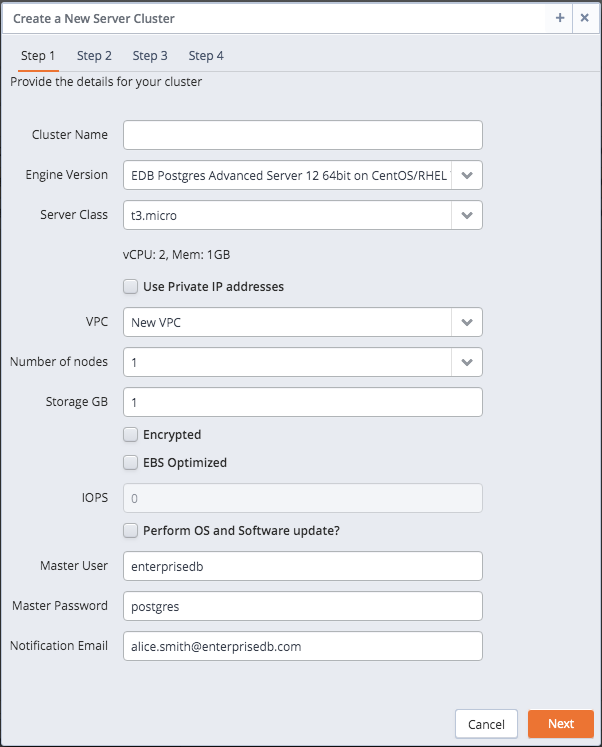
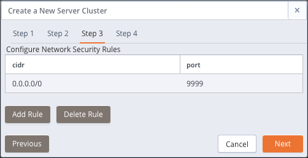
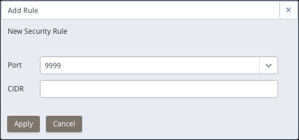
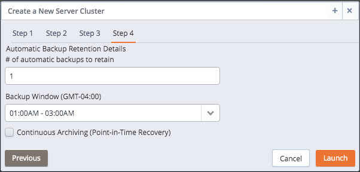
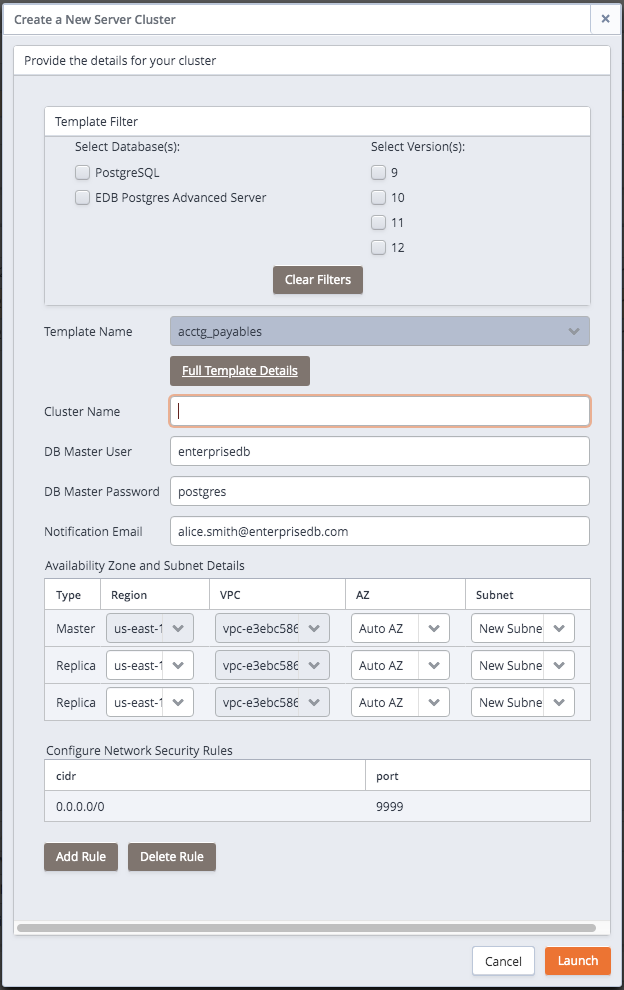
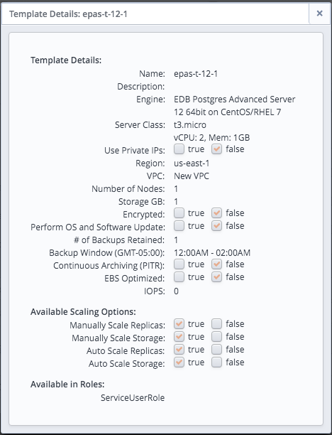
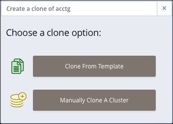
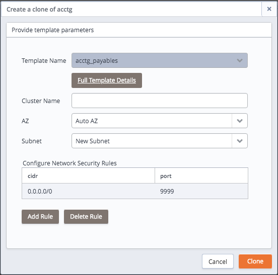
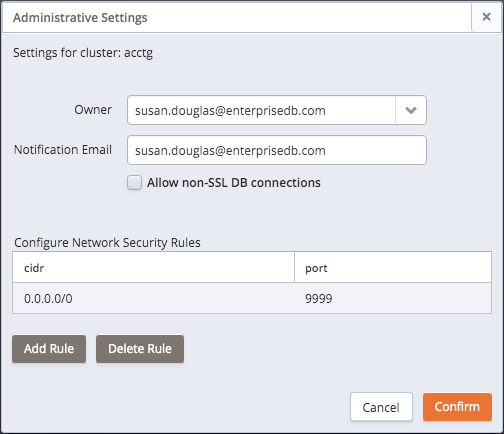
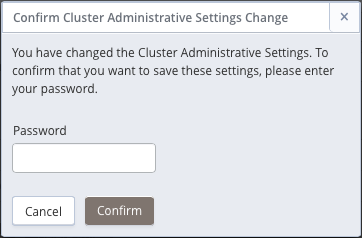

To create a server cluster, you can:

-   Use the `Launch DB Cluster` button (located on the `Dashboard` tab) to open the `Create a new Server Cluster` dialog and define a new cluster.
-   Click the `New Server` button (located on the `Clusters` tab) to open the `Create a new Server Cluster` dialog and define a new cluster.

If you are not a *Template Only* user (a user required to use a template when defining a cluster), the `Create a New Server Cluster` dialog will prompt you to select a deployment option.

Fig. 5.1: Specify your server launch preferences.

If you are a Template Only user or select the `Launch From Template` option on the deployment method selection dialog, a dialog opens that allows you to use a pre-defined template for the cluster configuration; for detailed information about using a template to create a cluster, see [Using a Template to Create a Cluster](#template_create_cluster) .

If you select `Manually Define A Cluster`, a dialog opens that allows you to specify detailed information about the cluster configuration. For information about manually defining a cluster, see [Manually Creating a Cluster](#manually_create_cluster) .

You can also use an existing cluster or a backup as a starting point for a new cluster:

-   For information about cloning a new server cluster from an existing cluster, see [Cloning a Server Cluster](#clone_server_cluster) .
-   For information about restoring a backup to create a new cluster, see [Restoring a Cluster from Backup](07_manage_backup_recovery/#restore_create_cluster) .

## Manually Creating a Cluster

Before you can connect to Postgres from a client application, you must create a server cluster. Use the `Launch DB Instance` button (located in the upper left panel of the `Dashboard` tab) or click the `Add Server` button on the `Clusters` tab to open the `Create a New Server Cluster` dialog.

Please note: not all fields and tabs documented in the following sections are applicable for all console host types.

Fig. 5.2: Specify information about the new cluster on the Step 1 tab.

Use fields on the `Create a New Server Cluster` dialog to specify information about the new cluster:

-   Specify a name for the new server cluster in the `Cluster Name` field. Ark uses the name specified in the `Cluster Name` field to identify the cluster when performing management functions.

-   Use the drop-down listbox in the `Engine Version` field to select the version of the Postgres engine that you wish to use.

-   Use the drop-down listbox in the `Server Class` field to specify the size of each cluster node. The server class determines the size and type (compute power and RAM) of each node within the cluster. When you select a server class, the attributes of the selected class are displayed below the server class field.

    You can adjust the amount of storage used by the cluster, or number of replicas in the cluster as your resource demands change. For example, you can start with a m1.small instance, and later, easily upgrade to a more capable c1.medium instance as your performance requirements dictate.

-   If your cluster resides on an Amazon host, you can check the box to the left of Use `Private IP` addresses to display addresses that are in your private network in the `VPC` field.

-   If your cluster resides on an Amazon host, use the drop-down listbox in the `VPC` field to specify the identity of the network in which the cluster should reside.

-   Use the drop-down listbox in the Number of nodes field to specify the number of server nodes that you wish to create. The name specified in the `Cluster Name` field will apply to the master node; each additional node will act as a replication server for the master node.

-   Use the `Storage GB` field to specify the initial size of the data space (in Gigabytes).

-   Check the box next to `Encrypted` to indicate that the cluster should be encrypted. EDB Ark uses the aes-xts-plain (512-bit) cipher suite to provide an encryption environment that is both secure and transparent to connecting clients. When encryption is enabled, everything residing on the cluster is encrypted except for the root filesystem.

-   If your cluster resides on an AWS host, check the box next to `EBS Optimized` to specify that your cluster should use an Amazon EBS-optimized instance and provisioned IOPS to guarantee a level of I/O performance.

    The `IOPS` field is enabled for those clusters that will reside on an EBS-optimized instance. If applicable, use the field to specify the level of I/O performance that will be maintained for the cluster by automatic scaling. The maximum value is 30 times the size of your cluster; for example, if you have a 4 Gigabyte cluster, you can specify a maximum value of 120.

-   Check the box next to `Perform OS and Software update?` to instruct EDB Ark to perform a yum update whenever the cluster is provisioned; this option is disabled for clusters that use statically provisioned servers. The yum update command updates all of the outdated packages that reside on the cluster. The update will occur when a cluster is scaled up, scaled down, or during a failover.

    When you check the box next to `Perform OS and Software update ?`, EDB Ark will warn you that enabling this functionality can significantly slow down cluster operations. Updating packages may slow down cluster maintenance operations; an update can easily take 10 minutes or more, and will initiate a reboot of the node. This setting is persistent; if you enable software updates for a cluster, you cannot directly disable software updates for that cluster at a later time.

-   Enter the name of the database superuser in the `Master User` field.

-   Enter the password associated with the database superuser in the `Master Password` field.

-   Use the `Notification Email` field to provide the email address that will receive notices about changes to the cluster status.

If applicable on your host system, click the `Next` button to continue to the `Step 2` tab.

Fig. 5.3: The Step 2 tab.

Use the fields on the `Step 2` tab to specify additional database information for each node of the cluster; the `Type` column identifies if a node is a `Master` or `Replica` node:

-   Use the `Region` drop-down listbox to the right of each node to select the region in which the node will reside.
-   Use the `VPC` drop-down listbox to select the VPC in which the node will be created.
-   Use the `AZ` drop-down listbox to select the Availability Zone in which the node will be created.
-   Use the `Subnet` drop-down listbox to the right of each node to select the subnet that the node will use. Please note that if you manually specify a subnet, you must select a subnet that resides on your private network.

Click the `Next` button to continue to the `Step 3` tab.

Fig. 5.4: Specify cluster security rules on the Step 3 tab.

Use the fields on the `Step 3` tab to define security rules that allow access to the cluster. By default, the load balancer port is open to any IP address for client connections; you may choose to delete the rule, and specify a more restrictive IP range.

To delete a rule from the list, highlight the entry and click the `Delete Rule` button; you will be prompted to confirm that you wish to delete the entry before the server removes the rule.

Click the `Add Rule` button to open the `Add Rule` dialog and provide access to a port.

Fig. 5.5: Adding a security rule.

On the `Add Rule` dialog:

-   Use the `Port` drop-down listbox to select the port that can be accessed from the specified CIDR. A non-administrative user can allow access to ports:

    `9999` - for client connections and load balancing.

    `5432` or `5444` - the cluster specific database listener port.

    An administrative user can use the `Add Rule` dialog to add a rule that allows SSH access to Port `22`.

-   Use the `CIDR` field to specify the address (or address range) that will be allowed access to the server through the selected port.

When you're finished, click `Apply` to create the security rule.

Then, click `Next` to continue to the `Step 4` tab.

Fig. 5.6: Specify backup information on the Step 4 tab.

Use the fields on the `Step 4` tab to specify additional database information:

-   Use the `# of automatic backups to retain` field to specify the number of server backups stored. When the specified number of server backups is reached, EDB Ark will delete the oldest backup to make room for a new backup.

    When point-in-time recovery (PITR) is enabled, the value specified in the # of automatic backups to retain setting determines the duration of the PITR backup window. For example, if you specify a value of 7, the PITR backup window will be 7 calendar days long.

-   Use the `Backup Window` field to specify a time that it is convenient to backup the server (you may wish to schedule backups to occur when the CPU load is the lightest).

-   Check the box next to `Continuous Archiving (Point-in-Time Recovery)` to enable point-in-time recovery for the cluster. When enabled, a base backup is automatically performed that can to be used to restore to a specific point in time. All subsequent automatic scheduled backups will also support point-in-time recovery. Note that if you deselect this option, the cluster (and subsequent automatic backups) will be re-configured to not include support for point-in-time recovery.

    **Please Note:**

    If your cluster resides on an Amazon host that is running CentOS 6.x, point-in-time recovery support is limited to the following regions:

    `ap-northeast-1`

    `ap-southeast-1`

    `ap-southeast-2`

    `eu-west-1`

    `sa-east-1`

    `us-standard (us-east-1)`

    `us-west-1`

    `us-west-2`

Use the `Previous` button or select a tab to return to a tab to review or update information; when you have completed the `Create a New Server` dialog, click Launch to create the database cluster.

A popup dialog confirms that EDB Ark is creating a new cluster; click the `X` in the upper-right corner of the popup to close the popup.

Fig. 5.7: A popup confirms that the new cluster is being created.

Navigate to the `Clusters` tab of the Ark console to monitor the creation of the cluster.

### Using a Template to Create a Cluster

If you select the `Launch From Template` option when deploying a cluster or are a *Template only* user, a dialog that offers limited options will open when you deploy a cluster.

Fig. 5.8: Creating a cluster from a template.

Use fields on the `Create a New Server Cluster` dialog to define your cluster:

-   Use the `Template Filter` panel to filter the list of templates that will be made available in the `Template Name` drop-down listbox. Select:
    -   The database or databases from which you would like to choose.
    -   The version or versions from which you would like to choose.
-   Use the `Template Name` drop-down listbox to select the template that you wish to use to configure your cluster. To review template configuration details, select the `Full Template Details` link; the `Template Details` dialog opens.

Fig. 5.9: Reviewing Template details

After selecting the template that you wish to use, use the fields on the dialog to finish defining your cluster:

-   Use the `Cluster Name` field to specify a name for the new cluster.
-   Use the `DB Master User` field to specify the name of the database superuser.
-   Use the `DB Master Password` field to specify the password associated with the database superuser.
-   Use the `Notification Email` field to provide the email address that will receive notices about changes to the cluster status.
-   Use fields in the `Availability Zone and Subnet Details` section to specify the regions in which the cluster nodes will be deployed:
    -   Use the `Region` drop-down listbox to select the region in which the node will be deployed.
    -   Use the `VPC` drop-down listbox to select the vpc on which the node will be deployed.
    -   Use the `AZ` drop-down listbox to select the availability zone in which the node will reside.
    -   Use the `Subnet` drop-down listbox to select the subnet that the node will use.
-   If applicable, highlight a rule, and use the `Add Rule` or `Delete Rule` button to define security rules that allow access to the cluster. By default, the load balancer port is open to any IP address for client connections; you may choose to delete the rule, and specify a more restrictive IP range.
    -   To delete a rule from the list, highlight the entry and click the `Delete Rule` button; you will be prompted to confirm that you wish to delete the entry before the server removes the rule.
    -   Click the `Add Rule` button to open the `Add Rule` dialog and provide access to a port. On the `Add Rule` dialog:
        -   Use the `Port` drop-down listbox to select the port that can be accessed from the specified CIDR.
        -   Use the `CIDR` field to specify the address (or address range) that will be allowed access to the server through the selected port.

After completing the `Launch From Template` dialog, click the `Launch` button to provision a cluster that conforms to the cluster configuration.

## Cloning a Server Cluster

With a few simple steps, you can create a developer sandbox that contains a duplicate of the original master node. To clone a cluster,

navigate to the `Clusters` tab and highlight the name of the cluster you wish to clone; then, click the `Clone` icon from the left margin. If you are not a Template Only user, a dialog will open that allows you to select your deployment method.

Fig. 5.10: Selecting a Cloning option

If you are a Template Only user or select the `Clone From Template` option on the deployment method selection dialog, a dialog opens that allows you to use a pre-defined template for the cluster configuration; for detailed information about using a template to clone a cluster, see [Using a Template to Create a Cluster](#template_create_cluster) .

If you select `Manually Clone A Backup`, the dialog shown below opens.

Fig. 5.11: Creating a clone of a database.

When the `Create clone...` dialog opens, provide values in the requested fields:

-   Provide a name for the new cluster in the `Cluster Name` field.
-   The clone will be created in the `Clone Region` listed below the cluster name.
-   Check the box next to `Encryption` if you would like the clone to be created in an encrypted cluster.
-   Check the box next to `Perform OS and Software update?` if you would like the server to perform a software update each time the clone is provisioned. Please note: this option is disabled if the database engine is statically provisioned.
-   If applicable, check the box next to `Use Private IP addresses` to create the clone your private network.
-   If your cluster resides on an Amazon host, use the `VPC` drop-down list box to specify a network name.
-   Use the `Availability Zone` drop-down listbox to specify the availability zone in which the new cluster will be created.
-   Use the `Subnet` drop-down listbox to select a subnet that will be used by the new cluster.
-   Use the `Server Class` drop-down listbox to specify the initial size of the new cluster. The attributes of the selected server class will be listed below the `Server Class` field.
-   If your cluster resides on an AWS host, check the box next to `EBS Optimized` to specify that your cluster should use an Amazon EBS-optimized instance and provisioned IOPS to guarantee a level of I/O performance.
-   The `IOPS` field is enabled for those clusters that will reside on an EBS-optimized instance. If applicable, use the field to specify the level of I/O performance that will be maintained for the cluster by automatic scaling.
-   Check the box next to `Continuous Archiving (Point-in-Time Recovery)` to enable point-in-time recovery on the clone.
-   Use the buttons in the `Configure Network Security Rules` section to define security rules for the clone.
    -   To delete a rule from the list, highlight the entry and click the `Delete Rule` button; you will be prompted to confirm that you wish to delete the entry before the server removes the rule.
    -   Click the `Add Rule` button to open the `Add Rule` dialog and provide access to a port. On the `Add Rule` dialog:
        -   Use the `Port` drop-down listbox to select the port that can be accessed from the specified CIDR.
        -   Use the `CIDR` field to specify the address (or address range) that will be allowed access to the server through the selected port.

When you've completed the dialog, click the `Clone` button to create the sandbox.

When you clone a database, only the master node is recreated in the new cluster; for information about manually adding replica servers to the new cluster, see [Manual Scaling](09_manual_scaling/#manual_scaling).

### Using a Template to Clone a Cluster

A clone deployed with a template will be an exact duplicate of the original master node, but will adhere to the cluster deployment rules described in the template by the system administrator. If you are a Template Only user, you will be required to use a template when cloning a cluster. A non-Template Only user may find it easier (especially when cloning a number of clusters) to use a template to define the properties that are common to multiple deployments.

Fig. 5.12: Creating a clone of a database.

When the `Create clone...` dialog opens, provide values in the requested fields:

-   Use the `Template Name` drop-down listbox to select a template that will be used for the new cluster; to review the cluster details associated with the template, click the Full Template Details link.
-   Provide a name for the clone in the `Cluster Name` field.
-   If applicable, use the `Availability Zone` drop-down listbox to specify the availability zone in which the new cluster will be created.
-   If applicable, use the `Subnet` drop-down listbox to select a subnet that will be used by the new cluster.

Use the fields in the `Configure Network Security Rules` section to define security rules that allow access to the cluster. By default, the load balancer port is open to any IP address for client connections; you may choose to delete the rule, and specify a more restrictive IP range.

To delete a rule from the list, highlight the rule and click the `Delete Rule` button; you will be prompted to confirm that you wish to delete the entry before the server removes the rule.

Click the `Add Rule` button to open the `Add Rule` dialog and provide access to a port.

Fig. 5.13: Adding a security rule.

On the `Add Rule` dialog:

-   Use the `Port` drop-down listbox to select the port that can be accessed from the specified CIDR. A non-administrative user can allow access to ports:

    `9999` - for client connections and load balancing.

    `5432` or `5444` - the cluster specific database listener port.

    An administrative user can use the `Add Rule` dialog to add a rule that allows SSH access to Port `22`.

-   Use the `CIDR` field to specify the address (or address range) that will be allowed access to the server through the selected port.

When you're finished, click `Apply` to create the security rule.

After providing the details for the cluster, click the `Clone` button to create the clone of the cluster; select `Cancel` to exit the dialog without creating a cluster.

## Modifying a Cluster’s Administrative Settings

Fields on the `Administrative Settings` dialog display the current owner and the email address to which notification emails about the state of the cluster are sent. To modify the owner of a cluster or the email address associated with a cluster, highlight the name of a cluster on the `Clusters` tab, and click the `Administrative Settings` icon. The dialog shown below opens.

Fig. 5.14: The Administrative Settings dialog

Use the fields on the dialog to modify the administrative settings for the cluster:

-   Use the drop-down listbox in the `Owner` field to select a new cluster owner. Please note that only those users with permissions to access the tenant on which the cluster resides are included in the list.
-   Use the `Notification Email` field to specify the address to which you wish notices about the state of the cluster to be sent.
-   Check the box next to `Allow non-SSL DB connections` to specify that the database can accept connections from a source that is not authenticated via SSL; this will adjust the settings in the `pg_hba.conf` file.

Use the fields in the `Configure Network Security Rules` section to define security rules that allow access to the cluster. By default, the load balancer port is open to any IP address for client connections; you may choose to delete the rule, and specify a more restrictive IP range.

To delete a rule from the list, highlight the rule and click the `Delete Rule` button; you will be prompted to confirm that you wish to delete the entry before the server removes the rule.

Click the `Add Rule` button to open the `Add Rule` dialog and provide access to a port.

Fig. 5.15: Adding a security rule.

On the `Add Rule` dialog:

-   Use the `Port` drop-down listbox to select the port that can be accessed from the specified CIDR. A non-administrative user can allow access to ports:

    `9999` - for client connections and load balancing.

    `5432` or `5444` - the cluster specific database listener port.

    An administrative user can use the `Add Rule` dialog to add a rule that allows SSH access to Port `22`.

-   Use the CIDR field to specify the address (or address range) that will be allowed access to the server through the selected port.

    When you're finished, click `Apply` to create the security rule.

After modifying the configuration details for the cluster, click the `Confirm` button; a dialog will open, prompting you to provide the password associated with the connected session.

Fig. 5.16: Provide a password to confirm changes.

Provide a password in the `Password` field and click `Confirm` to save your changes and exit, or `Cancel` to exit without saving the changes.
