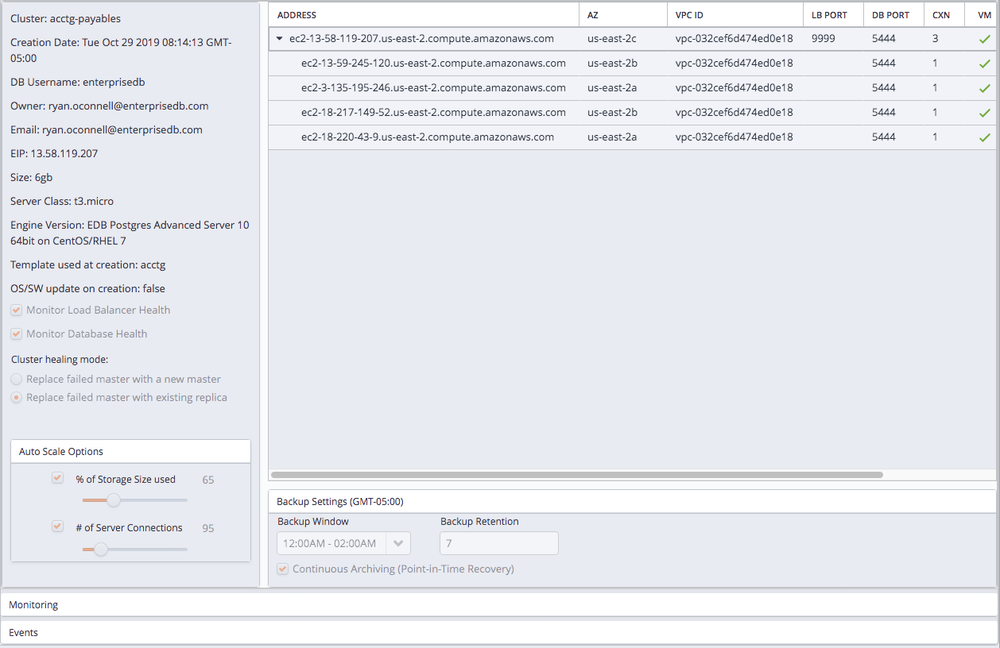
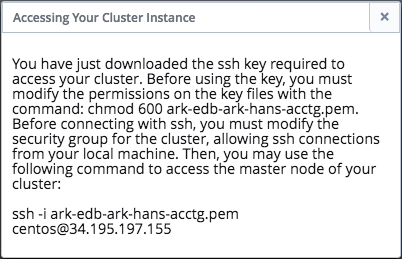
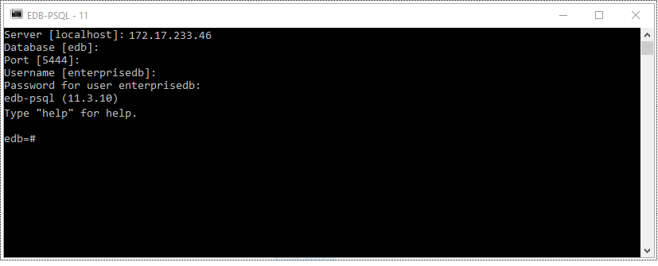
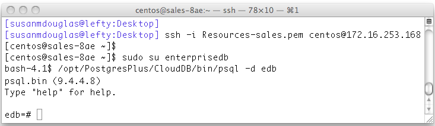

<div id="connecting_to_cluster" class="registered_link"></div>

To connect to an Ark cluster, provide the IP address and port of the server, and the credentials associated with the role defined when the server cluster was created.



Fig. 6.1: The Details panel on the Clusters tab.

If you have defined a cluster with two or more servers, client applications should always connect to the load balancing port of the master server (the first DNS name listed on the `Details` panel). This will ensure that read requests are distributed efficiently across the cluster replicas to maximize performance, while write requests are directed only to the cluster master. Replica server nodes are listed below the master node in the tree view.

-   The `DNSNAME` column displays the address of the node; a connecting client should use this address when connecting to a specific server.

-   The `LB PORT` column displays the port number to which a client application should connect to utilize load balancing.

    Since only the master node of a multi-server cluster operates in read/write mode, all write queries will be directed to the master node, while any read-only queries may be directed to a replica node.

-   The `DB PORT` column displays the default listener port for the Advanced Server or PostgreSQL server. To connect directly to the database listener port, modify the cluster's security group to allow connections from your client.

Use the authentication information (`Master User` and `Master Password`) provided on the `Create a New Server Cluster` dialog to establish the initial connection to the cluster as the database superuser. Please note that connecting with this identity grants you superuser privileges on the server; you should not share this connection information with un-trusted users.

After connecting as the database superuser, you should create lesser-privileged user roles with which non-administrative users will connect.

<div id="page_id" class="registered_link"></div>

## Using ssh to Access a Server

Before you can connect to a cluster node with ssh, an administrator must modify the security group of the cluster node to which you are connecting to permit ssh connections. If the console is federated (and the node resides in a remote region), you must modify the security group on the remote console to allow ssh connections. You can modify the security group via the Administrative Settings dialog on the Ark console or at the AWS console.

EDB Ark creates an ssh key when you create a new cluster; each cluster has a unique key. Before connecting to an Ark instance, you must download the ssh key, and adjust the privileges on the key file.

To download your private key, navigate to the `Clusters` tab, and click the `Download SSH Key` icon. The `Accessing Your Cluster Instance` popup opens as shown below.



Fig. 6.2: Accessing Your Cluster Instance.

The popup displays the tenant name, the cluster name, the name that you should use when connecting to the cluster, and the IP address to which you should connect.

Before using the private key, you must modify the permissions on the keyfile. Use the following command to restrict file permissions:

`chmod 0600 <ssh_key_file.pem>`

Where `ssh_key_file.pem` specifies the complete path and name of the EDB Ark ssh private key file.

After modifying the key file permissions, you can use ssh to connect to the cluster. Include the complete path to the key file when invoking the command provided on the `Accessing Your Cluster Instance` popup.

After connecting via ssh, you can:

-   Stop, start, or restart the Postgres server.
-   Download and install Postgres extensions.
-   Use the PostgreSQL Client Applications.
-   Invoke PostgreSQL Server Applications.

Please note: Postgres Server applications must be invoked by the Postgres cluster owner (identified when creating an EDB Ark cluster as the Master User). If you are using a PostgreSQL server, the default user name is `postgres`; if you are using Advanced Server, the default user name is `enterprisedb`. To change your identity after connecting via ssh, use the `su` command:

`# sudo su <database_user_name>`

<div id="connecting_psql" class="registered_link"></div>

## Connecting to EDB Ark with the psql Client

After connecting to a server hosted on EDB Ark with the psql client, you can invoke SQL commands or use meta-commands to:

-   Execute queries
-   Insert, update, and delete data
-   Create and manage database objects (tables, indexes, views, etc.)
-   Create user roles and manage privileges
-   Review object and role attributes
-   Invoke scripts containing complex (or simple) commands

By default, an EDB Ark cluster is only open to connections via port `9999` on the master node. Port `9999` is a good choice if you are connecting for the purpose of querying the database, but if you are modifying database objects, or performing administrative functions, you should connect directly to the server's listener port.

Please note: some administrative functions, if executed over port `9999`, may be directed to the incorrect node of a multi-node cluster where they may not have the intended effect, or may return an invalid value.

The listener port number is displayed in the `DBPORT` column of the `Details` panel of the `Clusters` tab.

Before connecting to the server's listener port, an Ark administrator must modify the security group to allow connections from the host of your client application.

**Connecting with psql From a Local Workstation**

After installing Advanced Server or PostgreSQL on a local workstation, you can use psql to perform administrative tasks on an EDB Ark cluster.

To open the psql client on an Advanced Server Windows workstation, navigate through the operating system menu to the `EDB Postgres` menu and select `EDB-PSQL`.

To open a psql client on a PostgreSQL workstation, navigate through the operating system menu to the `PostgreSQL` menu, and select `SQL Shell (psql)`.

If you have used a package to install Advanced Server or PostgreSQL, you will find the executable in the `bin` directory under your installation. You can invoke the executable at the command line; for example, to start the client on an Advanced Server host, use the command:

`/usr/edb/as11/bin/psql -d edb -U enterprisedb`



Fig. 6.3: The psql command line utility.

Provide connection information for the server to which you are connecting:

-   When prompted for a Server, enter the IP address or DNS name of the EDB Ark server. The IP address is displayed in the `DNSNAME` column on the `Details` panel of the `Clusters` tab of the Ark console.
-   When prompted for a Database, enter the name of the database to which you wish to connect. By default, an Advanced Server cluster is created with a database named edb; a PostgreSQL cluster is created with a database named postgres.
-   When prompted for a `Port`, enter the port on which the server is listening. For database queries, you can use port `9999`; if you are modifying database objects or performing administrative functions, you should use the server's listener port (5444 for an Advanced Server cluster, 5432 for a PostgreSQL cluster).
-   When prompted for a `Username`, enter the role you wish to use when connecting to the server. The name of the database superuser is specified in the Master User field when defining an EDB Ark server cluster. By default, the Advanced Server database superuser is `enterprisedb`. The default superuser of a PostgreSQL database is `postgres`.
-   When prompted for a `Password`, enter the password associated with that role. The database superuser's password is specified in the Master Password field when defining an EDB Ark server cluster.

After connecting, the prompt will display the name of the database to which you are connected.

**Invoking psql on an EDB Ark Server**

To use a copy of the psql client that resides on the EDB Ark host, first connect to the cluster using ssh:

`ssh -i path <ssh_key> <root@host_name>`

After connecting to the host, assume the identity of the database superuser (or a user with sufficient privileges to invoke the client). On an Advanced Server host, use the command:

`sudo su enterprisedb`

On a PostgreSQL host, use the command:

`sudo su postgres`

Then, invoke the psql client. On an Advanced Server host, use the command:

`/usr/bin/edb-psql -d edb`

On a PostgreSQL host, use the command:

`/usr/bin/psql -d postgres`

Include the `-d` option to specify the name of the database to which you wish to connect. The session opens as shown below.



Fig. 6.4: A psql session on the EDB Ark host.

To exit the psql client, enter `\q`.

For information about using psql and the psql meta-commands, please see the Postgres documentation at:

<http://www.enterprisedb.com/docs/en/11/pg/app-psql.html>

<div id="iptables_rules" class="registered_link"></div>

## Using iptables Rules

EDB Ark uses iptables rules to manage security on the console and cluster nodes. Please note that you must *not* modify the iptables rules provided by EDB Ark.

If you are using iptables on the host of the Ark console, do not modify the following rules:

```text
iptables -A PREROUTING -t nat -i eth0 -p tcp --dport 80 –j REDIRECT --to-port 8080
iptables -A PREROUTING -t nat -i eth0 -p tcp --dport 443 –j REDIRECT --to-port 8181
iptables -I INPUT 1 -p tcp --dport 8181 -j ACCEPT
iptables -I INPUT 1 -p tcp --dport 8080 -j ACCEPT
```

These rules:

-   redirect http and https traffic on ports `80` and `443` to the default ports (`8080` and `8181`).
-   allow inbound traffic to the default administration port.
-   allow inbound traffic on `8080` and `8181`.
-   save the configuration (to preserve the behaviors when the system reboots).

If you are using iptables on an Advanced Server cluster, do not modify the following rules:

```text
iptables -I INPUT 1 -p tcp --dport 7800:7802 -j ACCEPT
iptables -I INPUT 1 -p tcp --dport 5444 -j ACCEPT
iptables -I INPUT 1 -p tcp --dport 9999 -j ACCEPT
```

If you are using iptables on a PostgreSQL cluster, do not modify the following rules:

```text
iptables -I INPUT 1 -p tcp --dport 7800:7802 -j ACCEPT
iptables -I INPUT 1 -p tcp --dport 5432 -j ACCEPT
iptables -I INPUT 1 -p tcp --dport 9999 -j ACCEPT
```

The rules:

-   allow inbound traffic from the Ark console on ports `7800` and `7802`.
-   allow inbound traffic on the database listener ports.
-   save the configuration (to preserve the behaviors when the system reboots).
