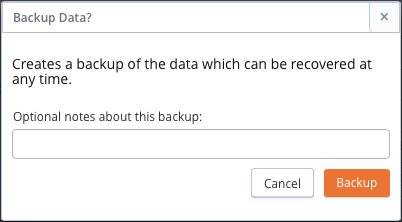
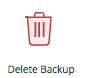
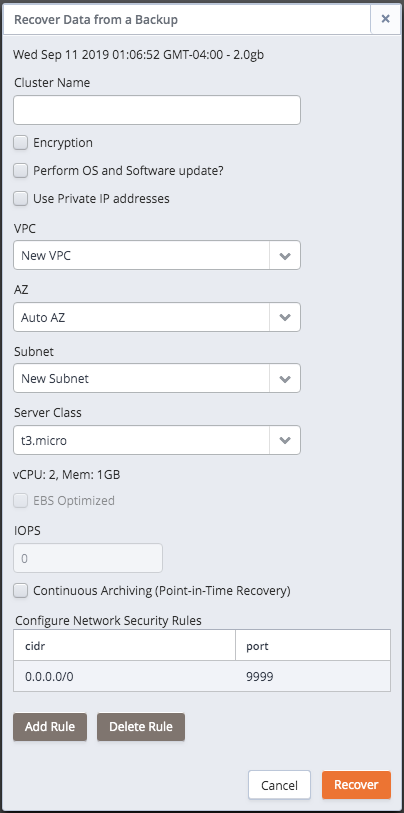
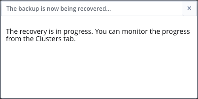
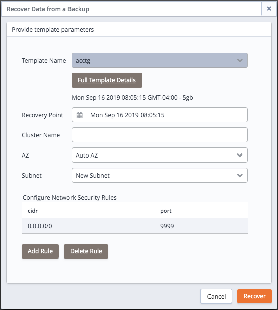

When you use the Ark console to take a backup, EDB Ark makes a copy of the contents of the PostgreSQL `PGDATA` directory. The `PGDATA` directory contains the data and the meta-data required to construct an exact copy of the Postgres data cluster (the data and the database objects that reside within that Postgres instance).

To capture a backup of a cluster, navigate to the `Clusters` tab, highlight a name in the cluster list, and click the `Backup` icon. The `Backup Data?` dialog opens as shown below:

Fig. 7.1: The Backup Data? dialog.

You can include a reference note about the backup that can be viewed on the Backups tab by adding a message to the `Optional notes` field on the `Backup Data?` dialog before clicking the `Backup` button.

When you click the `Backup` button, EDB Ark will perform the backup. While EDB Ark performs the backup, the `PENDING` column of the selected cluster on the `Clusters` tab will display the message: `Backup in progress`.

## Performing a Base Backup for Point-In-Time Recovery

When point-in-time recovery is enabled, a base backup is automatically performed that can to be used to restore to a specific point in time. All subsequent automatic scheduled backups will also support point-in-time recovery. Note that if you deselect this option, the cluster (and subsequent automatic backups) will be re-configured to not include support for point-in-time recovery.

When point-in-time recovery is enabled, the value specified in the `Backup Retention` field of the `Create cluster` dialog determines the duration of the point-in-time recovery backup window. For example, if you specify a value of `7`, the backup window will be 7 calendar days long. When the backup retention threshold is reached, the oldest base backup is removed, as well as any WAL files required to perform a recovery with that backup.

Please note that you cannot perform a base backup on a cluster while the database is in recovery and not accepting connections. If you attempt to perform a base backup during recovery, the backup will fail (the failure will be noted on the `Events` panel of the `Clusters` tab). You should instead wait until the database recovery is complete to enable point-in-time recovery for the cluster.

Point-in-time recovery is enabled on the [Details panel](04_using_ark_console/02_ark_clusters_tab/#details_panel) of the [Clusters tab](04_using_ark_console/02_ark_clusters_tab/#ark_clusters_tab) . If a base backup fails, you can trigger EDB Ark to perform a base backup by disabling point-in-time recovery, and then (after waiting a few minutes) re-enable point-in-time recovery.

## Reviewing Stored Backups

Navigate to the [Backups tab](04_using_ark_console/03_ark_backups_tab/#ark_backups_tab) to review a list of stored cluster backups.

Fig. 7.2: The Backups tab of the Ark console.

A backup captures and stores the status and condition of a cluster at a specific point-in-time.

-   The `ID` column contains a unique backup identifier.
-   The `CLUSTER` column displays the name of the cluster that was the target of the backup.
-   The `NOTES` column displays an informational note (provided by either the user or the system at the time of backup). Those messages that include (PITR) can be restored to a specific point-in-time within the backup window.
-   The `ENGINE VERSION` column contains a description of the Postgres version that the saved cluster is using.
-   The `CAPACITY` column contains the storage capacity of the cluster at the time that the backup was taken.
-   The `STARTED` column displays the date and time that the backup was initiated.
-   The `ENDED` column displays the data and time that the backup completed.

You can use the icons on the left side of the Backups tab to restore or delete the selected backup:

Status indicators provide quick visual feedback about each feature:

|                                          |                                                                                                                                                                                                                                  |
| ---------------------------------------- | -------------------------------------------------------------------------------------------------------------------------------------------------------------------------------------------------------------------------------- |
|  | Highlight a backup in the list, and click the Recover Backup icon to open a dialog that allows you to restore a cluster from the selected backup.                                                                                |
|   | Highlight one or more backups in the list and click the Delete Backup icon to delete the selected backups. A popup will ask you to confirm that you wish to delete the selected backups before the backups are actually deleted. |

## Restoring a Cluster from Backup

You can use a template or manually provide cluster properties when restoring a cluster from a backup. To restore a backup into a new cluster, navigate to the [Backups tab](04_using_ark_console/03_ark_backups_tab/#ark_backups_tab) and highlight the name of a backup. Then, click the `Recover Backup` icon (located in the left margin).

If you are not a Template Only user, a dialog will open that allows you to select the method by which you will specify cluster preferences.

Fig. 7.3: Selecting a Restore option.

If you are a Template Only user or select the `Restore From Template` option on the recovery method dialog, a dialog opens that allows you to use a pre-defined template for the cluster configuration; for detailed information about using a template to clone a cluster, see [Using a Template to Restore from Backup](#template_restore) .

If you select `Manually Restore A Backup`, the following dialog opens:

Fig. 7.4: The Recover Data from a Backup dialog.

When the `Recover Data from a Backup` dialog opens:

-   If applicable, use the calendar selector in the `Recovery Point` field to specify the recovery target (the date and time that the database was in the state in which you wish the new cluster to start). The Recovery Point field is only displayed for backups that were taken with point-in-time recovery implemented; you cannot perform a point-in-time recovery with a backup unless point-in-time recovery is enabled for the cluster when the backup was taken.

-   Specify a name for the new cluster in the `Cluster Name` field.

-   Check the box next to `Encryption` to specify that the new cluster should reside in an encrypted cluster. Please note that you can restore a non-encrypted backup into an encrypted cluster.

-   Check the box next to `Perform OS and Software` update to instruct EDB Ark to perform a yum update whenever the cluster is provisioned. Please note: this option is disabled if the database engine is statically provisioned.

-   If applicable, check the box to the left of `Use Private IP addresses` to restore the backup into a private IP address.

-   If your cluster resides on an Amazon host, use the `VPC` drop-down listbox to select a VPC on which the cluster will reside.

-   Use the `Availability Zone` drop-down listbox to the right of each node to select the availability zone in which the node will reside.

-   Use the `Subnet` drop-down listbox to the right of each node to select the subnet that the node will use.

-   Use the `Server Class` drop-down listbox to specify the server class of the new cluster.

-   If your cluster resides on an AWS host, check the box next to `EBS Optimized` to specify that your cluster should use an Amazon EBS-optimized instance and provisioned IOPS to guarantee a level of I/O performance;

    The `IOPS` field is enabled for those clusters that will reside on an EBS-optimized instance. If applicable, use the field to specify the level of I/O performance that will be maintained for the cluster by automatic scaling. The maximum value is 30 times the size of your cluster; for example, if you have a 4 Gigabyte cluster, you can specify a maximum value of 120.

    Note that you can increase the IOPS value of your cluster by recovering the cluster from a snapshot into a cluster with a higher value or cloning your database into a cluster with a higher IOPS value.

-   Check the box next to `Continuous Archiving (Point-In-Time Recovery)` to indicate that the new cluster should implement point-in-time recovery. Please note that to restore into a cluster with point-in-time recovery enabled, the backup from which you are restoring must have had point-in-time recovery implemented when the backup was taken. The checkbox will not be available if point-in-time recovery was not implemented when the backup was taken.

-   Use the `Add Rule` button to open a dialog that allows you to open a port for connections from a specified CIDR formatted address.On the Add Rule dialog:

    Use the `Port` drop-down listbox to select the port that can be accessed from the specified CIDR. A non-administrative user can allow access to ports:

    9999 - for client connections and load balancing.

    5432 or 5444 - the cluster specific database listener port.

    An administrative user can use the `Add Rule` dialog to add a rule that allows SSH access to Port `22`.

    Use the CIDR field to specify the address (or address range) that will be allowed access to the server through the selected port.

    When you're finished, click Apply to create the security rule and continue.

-   Highlight a rule and click the `Delete Rule` button to remove a security rule.

Click the `Recover` button to continue, or the `Cancel` button to exit without starting the recovery process. A popup confirms that the cluster is being restored; close the popup and navigate to the `Clusters` tab to monitor the restoration process.

Fig. 7.5: The recovery is in progress.

Please note: when you restore a backup, the server configuration will match the original configuration, but the server addresses will change.

Please note: when restoring a cluster from backup, you may need to modify parameters in the postgresql.conf file on the restored cluster to reflect the available memory of the new instance if the server class has changed from the original setting (the default value in the `Server Class` field). After modifying the server configuration, restart the server for the changes to take effect.

### Using a Template to Restore from Backup

If you are a Template Only user, you will be required to use a template when restoring a backup into a new cluster. A non-Template Only user may find it easier (especially when restoring a number of clusters) to use a template to define the properties that are common to multiple deployments.

Fig. 7.6: Using a template to restore from a backup.

If you are using a template when restoring a cluster from backup, use the dialog shown to provide the non-template details:

-   Use the `Template Name` drop-down listbox to select a template that will be used for the new cluster; to review the cluster details associated with the template, click the Full Template Details link.
-   If applicable, use the calendar selector to specify a point-in-time to which to recover.
-   Specify a name for the new cluster in the `Cluster Name` field.
-   Use the `AZ` drop-down listbox to the right of each node to select the availability zone in which the node will reside.
-   Use the `Subnet` drop-down listbox to the right of each node to select the subnet that the node will use.
-   Use the `Add Rule` button to open a dialog that allows you to open a port for connections from a specified CIDR formatted address.
-   Highlight a rule and click the `Delete Rule` button to remove a security rule.
