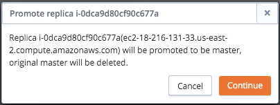
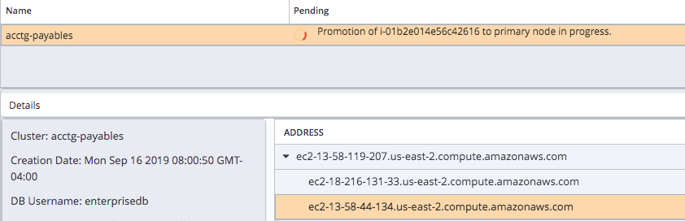

The EDB Ark cluster manager constantly monitors the state of each cluster. Each cluster is composed of a single master Postgres instance that operates in read-write mode (performing all writes to the database) and one or more replica Postgres instances. Replica nodes are read-only, automatically duplicating all data found on the master node, and all changes made to that data.

If a replica fails, EDB Ark automatically spins up a new replica instance and attaches it to the master database. The cluster continues operating during the replacement process, with the master servicing writes and reads, and the remaining replicas servicing reads. Overall read performance may degrade for a short period of time until the cluster is returned to full strength.

If a master failover occurs, the server will enforce one of two behaviors, specified by the Cluster healing mode radio buttons, located on the Details panel of the Clusters tab:

-   Select the `Replace failed master with a new master` radio button to specify that the cluster manager should create a new master to replace a failed master node.

    When replacing a failed master node with a new master node, the data volumes from the failed instance are attached to the new master node, preserving all transactions that were committed on the master.

-   Select the `Replace failed master with existing replica` radio button to specify that the cluster manager should promote a replica node to be the new master node for the cluster. Choose this option when speed of recovery is important, and your application can tolerate the loss of some transactions. This is the default behavior.

    When replacing a failed master node with an existing replica, a replica node is marked for promotion to master node, while the other replica nodes are re-configured to replicate data from the new master node. Since replica nodes use asynchronous replication, any data that was committed to the old master node, but not yet pushed to the replica prior to the node failure will be lost.

    If you opt to promote a replica to replace the master node, a replacement replica will also be added to the cluster during the failover process, returning the cluster to full strength. This self-healing property is at the heart of providing high availability to cluster users.

Please note that replacing a failed master node with a new master node can take a bit longer than promoting a replica node to the role of master, but it does have the advantage of guaranteeing that no committed data will be lost.

**Triggering a Failover**

By design, EDB Ark *does not* perform a failover when the Postgres server is stopped, because the server stop or restart may be intentional:

-   A user may intentionally restart the server when performing maintenance or tuning. For example, a server restart is required when updating server configuration parameters; this restart will not invoke failover.
-   If a user intentionally kills the postmaster process, the server will not failover; the postmaster process is responsible for restarting the server.
-   The Postgres server may intentionally perform a server restart. For example, when a backend server process crashes (or is intentionally killed by a user), the Postgres server automatically invokes a restart.

When a failover is complete, EDB Ark does not delete the original master instance of the database; you can use the preserved master instance to perform any post-mortem activities that may be required. If you do not wish to utilize the preserved instance, you should use the management console to delete the instance.

## Manually Promoting a Standby Node

You can use the `Promote` option on a cluster's context menu to manually promote a standby node to master node. When you promote the standby, the master node is deleted. You must initiate the promotion from a console that resides in the same region as the standby that is being promoted.

To promote a node to master, right-click on the cluster name in the `Details` panel, and select `Promote` from the context menu.

Fig. 8.1: The Promote option on a context menu

When you select the `Promote` option, the console will ask you to confirm that you wish to promote the standby to master and delete the original master node.

Fig. 8.2: Confirming that you wish to promote a standby

Click `Continue` to instruct Ark to perform the promotion. During the promotion, status messages will inform you of the state of the cluster.

Fig. 8.3: Status messages display the state of the cluster
