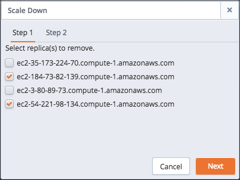
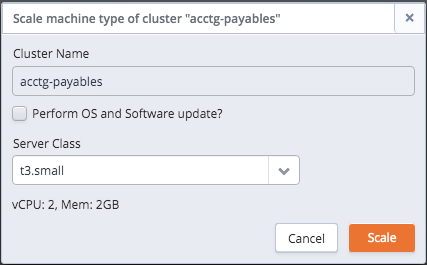

The Ark console makes it simple to add replicas and storage to an existing cluster, or to upgrade to a larger server class (i.e. vertical scaling).

-   Adding additional replicas to your database cluster increases the CPU power available to handle additional client requests or applications, increasing the number of client connections that can be serviced. When the scale up is complete, each additional replica automatically assumes a share of the read-only workload from incoming queries.
-   Adding additional storage to the cluster increases the amount of data that can be stored by the database servers. When you add additional storage to the cluster, each member of the cluster gets the additional storage amount.
-   Vertically scaling to a larger server class increases the processing capabilities of your cluster, allowing the server to process customer requests with greater speed.

You can also downsize a cluster by selectively removing a replica. You can machine scale to a smaller machine type to reduce resource usage (cpu/memory) and/or cost.

Please note: if you are a Template Only user, access to automatic scaling behaviors is determined by the configuration specified on the template used to deploy your cluster.

## Manually Adding Replicas and Storage

EDB Ark's `Scale Up` dialog makes it simple to manually add additional replicas to a cluster if you find that server resources are strained. The dialog also allows you to increase the amount of storage available to a cluster.

If you specify that EDB Ark should add both storage and replicas, EDB Ark will process the request for additional storage *before* adding replicas to the cluster. All of the nodes on the cluster will be of the newly specified storage size.

To add a replica or storage space to a cluster, navigate to the [Clusters tab](04_using_ark_console/02_ark_clusters_tab/#ark_clusters_tab) , highlight a cluster name, and select the `Scale Up` icon. The `Scale Up` dialog opens as shown below:

Fig. 9.1: The Scale Up dialog.

Use the drop-down listboxes on the `Step 1` tab to specify:

-   The number of replicas to add to the cluster.
-   The region in which each node of the cluster will be provisioned.
-   The VPC in which the node will be provisioned.
-   The AZ (availability zone) in which the node will be provisioned.
-   The subnet that will be used by each node of the cluster.
-   The amount of storage memory (in Gigabytes) that will be added to each server in the cluster.

When you've completed the dialog, click `Next` to continue to the `Step 2` tab:

Fig. 9.2: The Step 2 tab.

Use the `Previous` button to return to the `Step 1` tab to modify specified values. Use the `Scale Up` button to confirm that you wish to add the specified number of replication servers or the specified amount of memory to the cluster. Use the `Cancel button`, or simply close the dialog to exit without modifying the cluster.

When scaling begins, EDB Ark will confirm that replicas or memory are being added to the cluster.

## Manually Removing a Replica

EDB Ark's `Scale Down` dialog makes it simple to manually remove one or more unneeded replicas from a cluster.

To delete a replica, navigate to the [Clusters tab](04_using_ark_console/02_ark_clusters_tab/#ark_clusters_tab) , and click the `Scale Down` icon. The `Scale Down` dialog opens as shown below:

Fig. 9.3: The Scale Down dialog.

Check the box to the left of the name of a replica, and click `Next` to proceed to the `Step 2` tab of the dialog.

Fig. 9.4: The Step 2 tab

Click `Scale Down` to confirm that you wish to remove the replica, or Previous to return to the `Step 1` tab. Use the `Cancel` button, or simply close the dialog to exit without modifying the cluster.

## Manually Changing the Server Class

When your RAM processing needs, CPU power, or other circumstances warrant a larger virtual machine for your application, you can vertically scale to a larger server class. You can either:

-   Use the `Scale Machine Type` dialog to copy the cluster into a larger server class.

    When you use the `Scale Machine Type` dialog to move your cluster into a larger server class, you must provide a new name for the upgraded cluster. You can also use the dialog to specify that EDB Ark should re-assign the IP address of the cluster, so the upgrade will be transparent to connecting clients.

    Please note: you may wish to postpone the IP address reassignment to perform configuration tasks or test the new server size.

-   Use the `pg_dump` and `pg_restore` utilities to move the cluster into a larger server class.

    To move to a larger server class, use the pg_dump utility to make a backup of the cluster. After backing up the cluster, create a new instance with the larger server class, and use pg_restore to restore the cluster on the new instance. For information about using pg_dump and pg_restore, see [Moving an Existing Database into a New Cluster](13_database_management/#move_existing_database) .

You can also downsize a cluster by selectively removing a replica. You can machine scale to a smaller machine type to reduce resource usage (cpu/memory) and/or cost.

When you vertically scale your cluster with the `Scale Machine Type` dialog, EDB Ark will copy the existing cluster into a new cluster of a different server class, and optionally re-assign the IP address of the existing cluster to the new cluster. To open the `Scale Machine Type` dialog, navigate to the [Clusters tab](04_using_ark_console/02_ark_clusters_tab/#ark_clusters_tab) and select the `Scale Machine Type` icon.

Fig. 9.5: The Scale Machine Type dialog.

Use the fields on the `Scale Machine Type` dialog to specify details about the new cluster:

-   Check the box next to `Perform OS and Software update` to instruct EDB Ark to perform a yum update whenever the cluster is provisioned. Please note: this option is disabled if the database engine used to provision the cluster is statically provisioned.

-   Use the `Server Class` drop-down listbox to specify the size of the new cluster.

    Please note that if you are a Template Only user, the types listed in the `Server Class` drop-down listbox will be limited to those types that are included in template definitions for the current tenant.

    When you click the `Scale` button to start scaling the cluster, EDB Ark will confirm that the scaling is in progress.

    Before creating the new cluster, EDB Ark will perform a backup of the original cluster. During the process, status indicators in the `PENDING` column of the `Clusters` tab will keep you informed as EDB Ark backs up the original cluster, and initializes the new cluster.
