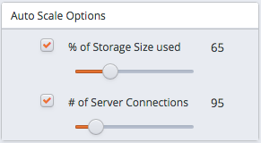

Adding additional replicas to your database cluster increases the number of client connections and queries that each cluster can handle, while maintaining a high-level of overall performance. Each additional replica automatically assumes a share of the read-only workload from incoming queries.

When auto-scaling in enabled, EDB Ark monitors the server storage and connection resources in use, and automatically adds additional resources when usage exceeds a user specified percent.

-   When the `% of Storage Size used` is reached, EDB Ark will automatically increase your data space by 50%.
-   When the `# of Server Connections` is reached, EDB Ark adds replica nodes.

Please note: if you are a Template Only user, access to automatic scaling behaviors is determined by the configuration specified on the template used to deploy your cluster.

## Adjusting the Automatic Scaling Thresholds

Use the `Auto Scale Options` controls to adjust the threshold at which EDB Ark automatically scales up cluster resources. The `Auto Scale Options` controls are located on the `Details` panel; to access the `Details` panel, navigate to the [Clusters tab](04_using_ark_console/02_ark_clusters_tab/#ark_clusters_tab), and highlight the name of a cluster.

Fig. 10.1: The Auto Scale Options controls.

Adjust the `Auto Scale Options` sliders to increase or decrease the thresholds at which automatic scaling is invoked. When you modify the values, EDB Ark will display a `New Value Saved` notice, alerting you that your changes have been saved.
