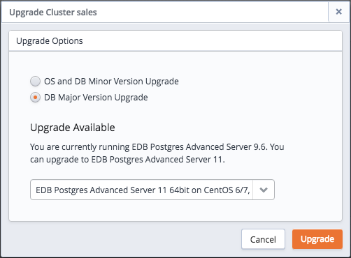

This section details some of the tasks that are performed outside of the Ark console's graphical interface:

-   Moving an existing database into an EDB Ark cluster
-   Manually modifying configuration parameters on a cluster
-   Stopping and starting the server

## Moving an Existing Database into a New Cluster

You can use the Postgres `pg_dump` utility to migrate an existing Postgres database (schema, data, and associated database objects) into an EDB Ark cluster.

`pg_dump` creates an archive that contains the commands needed to re-create and populate your existing database. After moving the archive to the master node of the Ark cluster, use pg_restore to uncompress and play the SQL commands contained in the archive. The following section will walk you through the process of moving a database to EDB Ark using pg_dump.

You can also use the `pg_dumpall` utility to move an entire *Postgres* cluster (data, schema information, and roles) to EDB Ark; for detailed information about using pg_dumpall, please see the Postgres documentation at:

<http://www.postgresql.org/docs/11/static/app-pg-dumpall.html>

The following example assumes that you have provisioned an EDB Ark cluster and opened a port for SSH connections.

**Step One – Navigate into the directory that contains pg_dump**

Open a terminal window on the system that contains your Postgres source database, assume the identity of the Postgres superuser, and navigate into the bin directory that resides under your Postgres installation directory.

On Advanced Server the path to the `bin` directory is:

`/usr/ppas-9.x/bin`

On PostgreSQL, the path to the directory is:

`/usr/pgsql-9.x/bin`

**Step Two - Create the pg_dump Archive**

Use the `pg_dump` utility to create an archive that contains the commands required to recreate a database. When invoking pg_dump, include the -Ft flag to instruct pg_dump to format the output as a tar file, and the -U flag to specify the name of the database superuser:

`pg_dump -Ft -U <db_superuser> <db_name> > <archive_name.tar>`

Where:

`db_superuser` is the name of a Postgres database superuser.

`db_name` is the name of the database that you wish to move to EDB Ark.

`archive_name.tar` is the complete path and name of the archive. Please note that you must have permission to write a file to the location specified.

If prompted, enter the password associated with the database superuser.

**Step Three - Move the Archive to EDB Ark**

Use the scp command to copy the archive to the master server in the EDB Ark cluster; include the `-i` option to specify the location of your ssh key:

`scp -i <ssh_key_file> <file_name> <user_name@host_name:target>`

Where:

`ssh_key_file` specifies the pathname of the EDB Ark ssh private key file.

`file_name` specifies the archive name.

`user_name` specifies the name used to connect to the master node of the EDB Ark cluster.

`host_name` specifies the host name of the master node of the EDB Ark cluster; the host name is located on the Details panel of the Clusters tab in the Ark console.

`target` specifies the name of the target directory on the EDB Ark host. Including `:/tmp/` at the end of this command directs `scp` to copy the file to the `tmp` directory

**Step Four - Connect to EDB Ark with ssh**

Use ssh to connect to your EDB Ark cluster master node. Provide the user identity of the operating system superuser, and the location of the ssh key (on your local host) in the command:

`ssh -i/<path>/<ssh_key.pem root@host_name>`

Where:

`path` specifies the location of your EDB Ark ssh certificate on the system from which you are connecting.

`ssh_key.pem` specifies the name of the EDB Ark ssh private key file.

`host_name` specifies the host name of the master node of the EDB Ark cluster; the host name is located on the Details panel of the Clusters tab in the Ark console.

**Step Five – Navigate into the bin directory on the Ark Host**

After connecting, assume the identity of the database superuser and navigate into the directory on the Ark host that contains the pg_restore utility. On an Advanced Server host:

`cd /opt/PostgresPlus/CloudDB/bin`

On a PostgreSQL host:

`cd /opt/PostgreSQL/CloudDB/bin`

**Step Six - Invoke pg_restore on the master server in the EDB Ark cluster**

Before invoking the `pg_restore` utility, you must create the target database in the master server; you can use the createdb client utility at the command line to create the target:

`createdb -U <db_superuser> <database_name>`

Where:

`db_superuser` specifies the name of the database superuser. On an Advanced Server cluster, the default is `enterprisedb`; on a PostgreSQL cluster, the default is `postgres`.

`database_name` specifies the name of the database on EDB Ark.

Then, invoke the `pg_restore` utility:

`pg_restore -Ft -U <db_superuser> /<path>/<archive_name.tar> -d <target_db_name>`

Where:

`db_superuser specifies` the name of the database superuser. On an Advanced Server cluster, the default is enterprisedb; on a PostgreSQL cluster, the default is `postgres`.

`path` is the pathname to the archive on the Ark.

`archive_name.tar` is the name of the archived database.

`target_db_name` is the name of the target database on the Ark.

Include:

the `-Ft` flag to specify that the file is an archive

the `-U` flag to specify the name of a database superuser.

the `-d target_db_name` flag to specify the name of the target database

**Step Seven - Confirm that the Move was Successful**

After performing the restore, you can use the psql client to connect to the EDB Ark and confirm that the database has been transferred:

`psql -U <database_superuser> -d <target_db_name>`

Where:

`db_superuser specifies` the name of the database superuser. On an Advanced Server cluster, the default is `enterprisedb`; on a PostgreSQL cluster, the default is `postgres`.

`target_db_name` is the name of the target database.

Use the `\dt` command to view a list of database objects in the current database.

To exit the psql client, enter `\q`; to exit the ssh session, type `exit` and `Return`.

For more information about using the psql client, please see the [PostgreSQL core documentation](https://www.postgresql.org/docs/current/app-psql.html) .

For more information about using PostgreSQL utilities to move an existing database into EDB Ark, please see the [PostgreSQL core documentation](https://www.postgresql.org/docs/11/static/backup-dump.html) .

## Manually Modifying Configuration Files

Many of the features of a Postgres server may be influenced by settings specified in configuration files:

-   The `postgresql.conf` file determines Postgres server behavior as it pertains to auditing, authentication, file locations, resource usage, query planning, statistic gathering, error handling and more.
-   The `pg_hba.conf` file controls the type of authentication that should be used when a client application connects to an EDB Ark service. By default, the pg_hba.conf file is configured to require clients to provide a valid md5-encrypted password.
-   The `pg_ident.conf` file contains user mappings for external authentication methods (like LDAP or GSSAPI). Each entry within the pg_ident.conf file maps an external user name to his corresponding Postgres user name.
-   The `pgpool.conf` file determines the behavior of EDB Ark as it pertains to load balancing.

To modify a configuration file:

1.  ssh to the node of the cluster that contains the file you wish to modify.
2.  Use your choice of editor to modify the files.
3.  Reload or restart the server.

When you add or remove nodes from a cluster, EDB Ark takes a backup of your `pg_hba.conf` and `pgpool.conf` configuration files. Configuration file backups are appended with the date that the backup was taken and a unique identifier; for example, `pg_hba.conf.20140319-140903` identifies a backup of the `pg_hba.conf` file.

When modifying a configuration file, you should make changes only to those files that *are not* appended with a timestamp and identifier.

### Best Practices for Modifying Configuration Files

Please note that changing parameter settings can have unintended consequences, ranging from degraded performance to system crashes. Consequently, we recommend that only an advanced user who accepts these risks, and has experience with both Postgres and cloud environments modify parameter settings.

There are several ways that you can minimize the risks involved when making parameter changes:

-   Always make a snapshot backup of your data before making parameter changes.
-   Always use a test cluster to test parameter changes, to ensure they have the intended effect before deploying them to your production environment. Create a test environment that mirrors the final target environment as much as possible - this is easy to accomplish by restoring a production backup into a similar size cluster as the original.
-   Only change one parameter at a time (or as few as possible when dealing with interdependent settings) and monitor its effect until you are comfortable with the result.
-   Make parameter changes on a *copy* of the existing configuration that is in use for the master or replicas. That way, if the parameter change proves detrimental, it will be easy for you to re-apply the original settings. Keep a backup of the original configuration, so they can be easily restored if necessary.

When adjusting parameters, be mindful of that fact that the master node in the cluster processes both read and write requests, while the replica nodes in the cluster accept only read requests. You can tune the master node and the replica nodes independently to quickly have an impact (either positive or negative) on your write or read performance.

For more information about modifying Postgres server parameters, please see the [PostgreSQL core documentation](https://www.postgresql.org/docs/11/static/runtime-config.html) .

## Controlling the Database Server

You can use your platform-specific service controller to control a Postgres database. The service name of the database server in an Ark cluster is clouddb.

**Controlling a Service on CentOS 7.x**

If your cluster resides on CentOS version 7.x, you can use the systemctl command to control the service. The systemctl command must be in your search path and must be invoked with superuser privileges. To use the command, open a command line, and enter:

`systemctl <action> clouddb`

Where `action` specifies the action taken by the service command. Specify:

-   `status` to discover the current status of the service.
-   `start` to start the service.
-   `stop` to stop the service.
-   `restart` to stop and then start the service.

**Controlling a Service on CentOS 6.x**

On CentOS version 6.x, you can control a service at the command line with the service command. The Linux service controller mechanism allows you to start and stop the server gracefully. The command must be in your search path and must be invoked with superuser privileges. Open a command line, and issue the command:

`service clouddb <action>`

Where `action` specifies the action taken by the service command. Specify:

-   `status` to discover the current status of the service.
-   `start` to start the service.
-   `stop` to stop the service.
-   `condstop` to stop the service without displaying a notice if the server is already stopped.
-   `restart` to stop and then start the service.
-   `condrestart` to restart the service without displaying a notice if the server is already stopped.
-   `try-restart` to restart the service without displaying a notice if the server is already stopped.

## Updating the Server Version on the EDB Ark Cluster

When an update becomes available for a package installed on your cluster, the Ark console will display an alert symbol in the `UP` column of the `Details` panel for the cluster, and in the `UP` column of the DNSNAME table adjacent to the node that requires an update:

Fig. 13.1: The DNSNAME table.

The overall cluster status (displayed in the top section of the `Clusters` tab) is based on the values of the nodes within the cluster.

-   If all of the nodes within the cluster are up-to-date, the `UP` column displays a green checkmark.
-   If one or more nodes require a non-critical update, the `UP` column displays a yellow alert symbol.
-   If one or more nodes require a critical update, the `UP` column for the cluster displays a red error symbol.
-   If one or more nodes have an unknown package status, the `UP` column for the cluster displays a grey checkmark.

You can use the `Upgrade` icon (located on the [Clusters tab](04_using_ark_console/02_ark_clusters_tab/#ark_clusters_tab) ) to access a dialog that allows you to update the server version on each node within the cluster.

Fig. 13.2: The cluster upgrade dialog.

Select the radio button next to an option to:

-   Select `OS and DB Minor Version Upgrade` to invoke a `yum update` command and update any outdated packages and perform a minor database version upgrade on each node of the cluster.
-   Select `DB Major Version Upgrade` to select a version and perform a major version upgrade of the server. Please note that this functionality is restricted to users that are not required to use a template when deploying a cluster.

After making a selection, click `Upgrade` to continue.

### Performing a Minor Version Upgrade

If you select the radio button next to `OS and DB Minor Version Upgrade` and click the `Upgrade` button, the Ark console will invoke the yum update command on each node of the cluster. The `yum update` command will update all installed packages to the most recent version available of the same release (i.e., if you are running a 9.6 database server, yum will update your database server to the most recent version of 9.6).

Fig. 13.3: The Upgrade Cluster dialog

Before performing the update, EDB Ark will perform a backup. During the upgrade process, all clients will be disconnected from the server. The updated server will retain the IP address used by the original server. When the update has completed, clients may once again connect.

After performing a yum update, the node will be rebooted, initiating any kernel updates required. When the update completes, EDB Ark will send an email notification that contains a list of the updated packages.

If one or more nodes in your cluster are currently displaying an unknown status, EDB Ark will display an error message. You must correct the problem that is causing the unknown status before EDB Ark can perform an update.

Please note that if the yum update command fails during the upgrade process, EDB Ark will terminate the process and yum update will not be run on any remaining nodes, leaving the cluster partially upgraded.

### Performing a Major Version Upgrade

You can use the `Upgrade Cluster` dialog to upgrade the Postgres server installed on your Ark cluster; the upgrade must be to a more recent version of the same server type and must use the same server image as the current database engine. For example, you may upgrade an Advanced Server version 9.6 database server that resides on a CentOS 6.x host to Advanced Server 11, but you cannot move the server onto a CentOS 7.x host. Similarly, you may not upgrade a PostgreSQL 9.6 database server that resides on a CentOS 7.x host to use an Advanced Server 11 server on a CentOS 7.x host. The server type and host operating system version must remain the same. Please note:

-   a major version upgrade may not be performed by a template-only user.
-   if over half of the data space allocated to a cluster is used, you must add storage to the cluster before performing the upgrade.

To upgrade a running cluster, select the radio button next to `Major Version Upgrade`, and then use the drop-down listbox to select a server version. Click `Upgrade` to continue.

Fig. 13.4: The Upgrade Cluster dialog.

A popup will open, asking you to confirm that you wish to upgrade the server; click the `Upgrade` button to perform an upgrade. The server will be briefly unavailable during the upgrade process. The upgrade does not change the IP address and listening port of the server.
