## Blue/green deployments

Blue/green deployment is a set of practices that, when applied to a live production system, results in a zero-downtime and low-risk release of software updates, as expounded in [O'reilly's *Continuous Delivery: Reliable Software Releases through Build, Test, Deployment Automation*](https://www.oreilly.com/library/view/continuous-delivery-reliable/9780321670250/ch10.xhtml).  The terms *blue* and *green* are abstract labels that differentiate between the two identical production environments—one representing the starting state (in this case blue) and one representing the next state (in this case green). They are chosen to remove any bias that one is correct, better, or the natural destination. We could have chosen green to represent our starting state as well—the color implies nothing.

First you'll need to identify at least two independently addressible portions, which in simple terms could be each of a pair of virtual machines.  Each portion needs to be able to handle expected peak load during your maintenance window.  Next, you introduce change into one portion of your system, now the green portion, which is currently not serving traffic, and test those changes in isolation from the blue environment. After the changes are deemed to be stable, you begin routing traffic over to the green environment. If something goes wrong, you can always direct traffic back to the blue environment. After the green environment is stably serving all the traffic, you update the blue to green and the whole system will be in the next state and once again be the same color: in this case all green.

In general, this pattern can be applied anywhere you can split a production scenario into two identical but isolatable environments, whether two complete identical replicas throughout the stack, just two virtual machines at the application layer using the same DB, or even two different regions of a single distributed database.

By initially upgrading only a controlled portion of the system, we can avoid maintenance downtime, improve testing, provide the potential for rollback, and most importantly relieve pressure from these operations, thus improving outcomes.

!!! Note
Going forward in this document, we will use the blue environment to represent the starting state and the green environment to represent the next state. Again this choice is arbitrary, it just needs to be consistent.
!!!

## Blue/green with EDB Postgres AI Cloud Service

### Stateless and stateful components in a blue/green deployment

The distinction between stateless and stateful components is crucial when planning a blue/green deployment strategy.

- **Stateless components**: These are components that don't maintain any internal state between requests. Each request is processed independently of the others. Stateless components are easier to manage in a blue/green deployment because they can be replaced without affecting the overall system behavior. You can readily scale, update, or replace them without worrying about losing any state information.
- **Stateful components**: These are components that maintain data (state) across requests. Examples include user sessions, message queues, and most importantly, databases. Stateful components pose a challenge in blue/green deployments because you need to ensure that state information is consistent and available across both environments.

Managing stateful components in a blue/green deployment often requires additional planning and orchestration. For instance, user sessions initiated in the blue environment need to be available in the green environment to ensure a seamless user experience. Similarly, messages in a queue need to be processed regardless of the environment they were created in. However, the database is often the most critical stateful component in a blue/green deployment. Any data written to the database in the blue environment needs to be available in the green environment. This could require implementing database replication or using a shared database accessible from either environment.

The complexity of managing stateful components, particularly databases, in a blue/green deployment can't be overstated. Understanding the stateless or stateful nature of your components is vital in planning a blue/green deployment. It directly impacts the complexity of the deployment process and the strategies you need to employ to ensure a seamless user experience when transitioning users between environments. Therefore, special attention must be given to the database to ensure data consistency and availability during and after the deployment.

### Three essential techniques for stateful blue/green deployments

There are three techniques essential to the execution of a blue/green software release process involving stateful components:

1. **Traffic routing**: This involves managing the flow of user traffic between the blue and green environments. At the ingress or client layer, you need to have mechanisms in place to shift your client traffic from one environment to the other. This could be achieved with load balancers or DNS switchovers. Part of this process may involve temporarily scaling up your compute resources to handle the additional load during the transition. This ensures that your application remains available and responsive to users while you're deploying to the new environment.

    In addition to the immediate traffic routing, you can also opt for a gradual traffic shifting strategy. Instead of switching the traffic from the blue environment to the green environment all at once, it can be beneficial to gradually shift traffic over. This can be done by slowly increasing the percentage of traffic directed at the green environment. This can help identify any issues that only become apparent under load, while reducing the impact if a rollback is needed. It also provides a smoother transition for users, as they are gradually moved to the new version of the application rather than all at once.

2. **Forward compatibility**: This is about ensuring that your application can handle changes in its database. For example, if a database query returns an additional field in the new version, your application should be able to handle this without failing. This might involve writing your application code in a way that it ignores unexpected, additional fields or has default values for missing ones. 

3. **Additive first, subtractive last**: This principle applies to changes at the database layer. In the context of a blue/green deployment, you start with additive changes. These are changes that expand the database schema, like adding new columns. These changes, when combined with the forward compatibility of the application, ensure an uninterrupted client experience.

    Only when the applications are fully upgraded and all traffic has been shifted to the new environment do you follow up with subtractive changes. These are changes that reduce the database schema, like dropping old tables or columns. This ensures that you don't remove any data or database components that the old version of the application still relies on until it's no longer in use.

### Other critical best practices

As with any release of software to production, these generally critical techniques or capabilities are important to ensure success.

1. **Testing and data integrity**: Automated testing allows you to ensure that the newly upgraded environment is functioning as expected before any traffic is routed to it. This helps catch any issues early, reducing the risk of downtime or negative impact on users. 

    When conducting automated testing, it's important to be mindful of the potential impact on your production data. One approach is to insert test data that is clearly marked as such into your production environment. This allows you to run realistic tests without affecting real user data.

    After testing, this data should be carefully scrubbed to maintain the integrity of your production data. It's also important to ensure that your tests are designed to be idempotent, such that they can be run multiple times without changing the result beyond the initial application. This is especially important in a blue/green deployment, where you may need to run the same tests on both the blue and green environments.

2. **Monitoring and logging**: It's also strongly recommended that robust monitoring and logging be in place for both the blue and green environments. This allows you to quickly identify and address any issues that arise during the deployment process. It also provides valuable information that can be used to optimize future deployments. 

3. **Rollback strategy**: Despite best efforts, sometimes things go wrong. Accordingly, it's considered best practice to have a rollback strategy in place so that if issues are detected in the green environment after traffic has been routed to it, you can quickly switch traffic back to the blue environment to minimize the impact on users. In addition, it's also crucial to have robust data backup and recovery procedures in place. In the event that your production data is affected despite your best efforts, having a recent and reliable backup can allow you to quickly restore your data to its previous state.

4. **Pre-production environments**: It is a best practice to have a pre-production environment that is an identical instantiation of your production environment. 

5. **Change management**: A key aspect of governance, change management is controlled change which requires approval (checked boxes) around testing, security, etc. Change management practices are best coupled with a pre-production environment to ensure the viability of the blue/green deployment.

### Blue/green with two application VMs and a shared database

**Scenario**: Consider a production environment with a load balancer serving traffic to two VMs, VM1 and VM2, both of which share the same database. In the users table of the database, you need to change the `family_name` column to `surname`. You have the three essential capabilities for blue/green deployments involving stateful components: traffic routing, forward compatibility, and additive first subtractive last capability. Using these, you can successfully update your applications and database with zero downtime and reduced risk. The whole system starts as all blue.

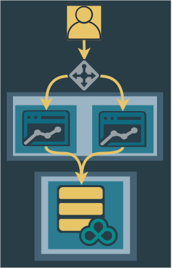

1. Add green to the database.

    In this step, additive updates are applied to the database to introduce the green version. This is done while the rest of the system is still in the blue state. In our example, since we want to change the `family_name` column to `surname` in a `users` table, you would execute DDL to add the surname column to your users table and may also execute DML to populate the new column initially. Since our application is forward-compatible in this scenario, the additional field in queries won't cause problems.

    **Rollback strategy**: If something goes wrong at this stage, you can simply drop the newly added `surname` column. Since your application is forward-compatible, this won't affect its operation.

2. Push traffic to one VM to be blue. Upgrade the other to green. Thoroughly test green. 

    Next, using your traffic routing capability, all inbound traffic is routed to one of the two VMs, scaling up capacity as needed. The application running on the blocked site is then upgraded to the green version. This new version of your application may incorporate some backwards compatibility as well to handle either `family_name` or `surname`. Once the green version is upgraded, it is thoroughly tested.

    **Rollback strategy**: If issues are detected during testing, you can roll back the green environment to the previous version of the application. Since all traffic is still being served by the other half of your applications, this won't affect users.

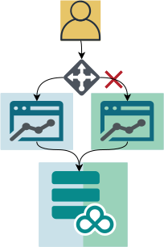

3. Push traffic to green, upgrade blue.

    After gaining confidence in the green version, traffic is shifted to the green environment. The remaining blue application is then blocked from traffic and upgraded to green.

    **Rollback strategy**: If issues are detected after traffic has been routed to the green environment, you can quickly route traffic back to the blue (as long as it has not yet been upgraded) while you fix the issues in the green environment.

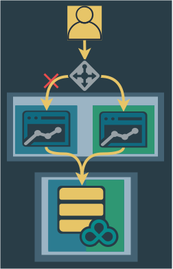    

4. Route traffic equally/fully to both VMs.

    After the blue application is upgraded and tested, traffic is routed equally or fully to the upgraded applications. At this point the entire application layer is green as both VMs have been upgraded, but the database is still in a mixed blue/green state because it still has the `family_name` column.

    **Rollback strategy**: You can still rollback the application, but there will be some downtime. At this point your database is still fine with either a blue or green application, as blue is forward-compatible.

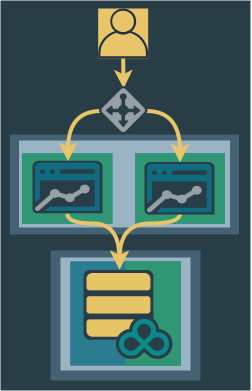    

5. Subtract Blue, all Green.

The final step is to subtract the blue from the database. In this simple scenario, you must delete the old `family_name` column once everything is upgraded. This approach allows for zero downtime during the upgrade process, resulting in a system that is now all green.

**Rollback strategy**: At this point, rollback would require restoring from a backup.

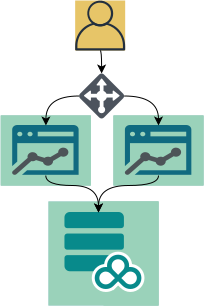    

## Blue/green with cross-region high-availability clusters

**Scenario**: Consider a production environment with applications distributed across two regions in either an active/active or active/passive configuration. Each application instance is serving traffic its own subgroup of an EDB Postgres Distributed cluster in its region. There is a witness node in a third group in a third region to weigh in on consensus decisions when necessary. 

    

In the users table of the database, you need to change the `family_name` column to `surname`, just like in the last scenario. You have the three essential capabilities for blue/green deployments involving stateful components: traffic routing, forward compatibility, and additive first subtractive last capability. Using these, you can successfully update your applications and database with zero downtime and reduced risk. The whole system starts as all blue.

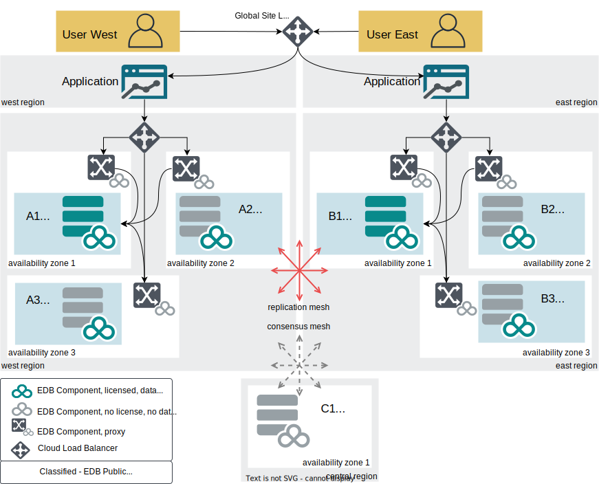    

As with a single region case, it's crucial to manage any stateful objects in the application layer. However, distributed database systems present additional challenges when trying apply a blue/green deployment pattern. 

Fortunately, EDB Postgres Distributed (PGD) eases these challenges greatly, primarily by providing an active/active interface, which means the basic pattern of blue/green can be successfully practiced even across regions with little adjustment necessary. The PGD cluster can be treated as a single database despite being distributed across multiple regions, allowing the conventional blue/green upgrade process to be practiced given a more complicated architecture. Moreover, the multi-writer functionality of PGD is especially powerful for blue/green practices as it eliminates the difficulty of managing a database layer failover.

### 1. Add green to the database. Can still rollback.

    

Add the new version (green) to the database. This involves adding the new column `surname` with data. At this stage, it's still possible to roll back if necessary.

**Rollback Strategy**: If something goes wrong at this stage, you can simply drop the newly added `surname` column. Since your application is forward compatible, this won't affect its operation.

### 2. Push traffic to one side. Upgrade the other to green. Thoroughly test green. Can still rollback.

    

Push traffic to one of the two regions and block traffic to the other. This allows you to upgrade the blocked region to the green version and test thoroughly. At this point, it's still possible to rollback if necessary.

**Rollback strategy**: If issues are detected during testing, you can roll back the green environment to the previous version of the application. Since all traffic is still being served by the other region, this won't affect users.

### 3. Push traffic to green. Upgrade blue. Test blue.

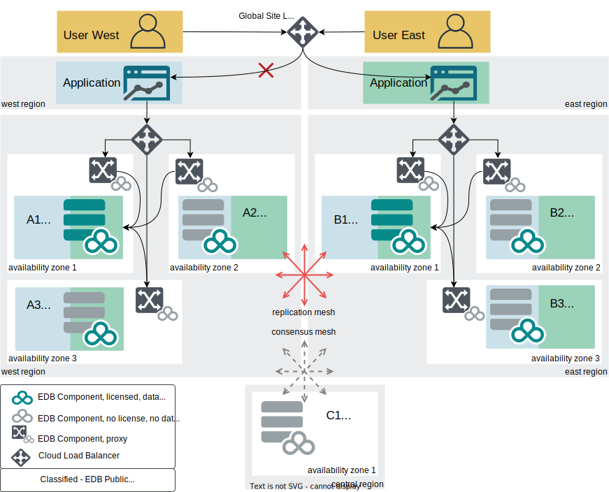    

Now flip the traffic from going to the blue environment to the green environment and test again. If all goes well, upgrade the blue version and test it.

**Rollback strategy**: If issues are detected after traffic has been routed to the green environment and you haven't yet upgraded blue to green, you can quickly route traffic back to the other region (which is still running the old version) while you fix the green environment. 

### 4. Route traffic equally/fully to upgraded applications.

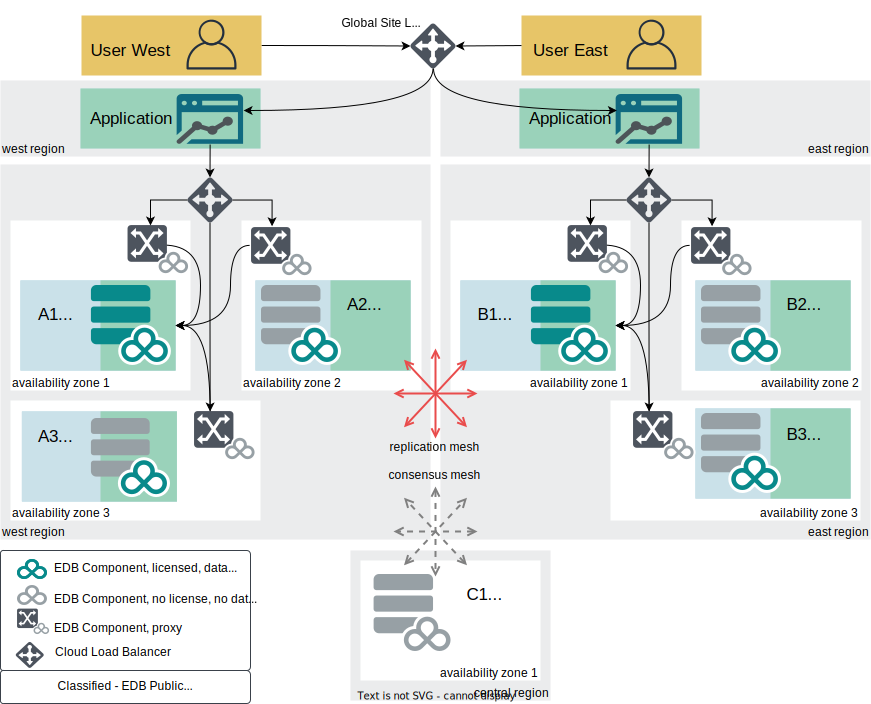    

This involves treating the PGD cluster as a single database despite being distributed across multiple regions. 

**Rollback strategy**: If issues are detected after traffic has been routed to the blue environment, you can quickly route traffic back to the green environment (which is still running the new version) while you fix the issues in the blue environment. 

### 5. Subtract blue from the database. All green.

    

Delete the old blue version from the database. That means removing the `family_name` column with DDL in this case. This final step allows for zero downtime during updates. The importance of considering the entire stack, not just the database layer, when discussing availability and upgrades is emphasized. The whole production system is now green.

**Rollback strategy**: Restore data from a backup. Rollback applications. Downtime is nearly unavoidable.

## Database-only blue/green with cross-region high-availability clusters

PGD's capability to provide multiple write endpoints across a distributed set of multiple Postgres databases effectively presents an eventually consistent database across regions. PGD also provides a robust set of functions, which, when combined, can enable node-level control of the deployment of database schema or data updates.

These functions provided by PGD make node-level control of the deployment of database schema or data updates.

1. **[bdr.run_on_nodes](https://www.enterprisedb.com/docs/pgd/latest/node_management/maintainance_with_proxies/#using-bdrrun_on_nodes)** - PGD provides the capability to apply operations against the database one PGD node at a time.
2. **[switchover](https://www.enterprisedb.com/docs/pgd/latest/cli/command_ref/pgd_switchover/)** - The PGD CLI provides the switchover feature, which changes the Write Leader with sub-second interruption of service.
3. **[bdr.xact_replication](https://www.enterprisedb.com/docs/pgd/latest/reference/pgd-settings/#bdrxact_replication)** - PGD also provides transactional-level replication control
    - you will also want to turn DDL replication off 

**Scenario**: We have the same setup as we did in our last scenario, the only difference being that this time, we want to update a stored procedure in just the database layer, which is a DDL ALTER statement. We should still ensure that our existing application is forward-compatible with the changes we plan to roll out to the database layer. We start all blue.

    

### Deploy green to PGD Group B

1. Deploy green to PGD node B2 only using transaction-level replication control so the changes replicate to other nodes.

    

- Depending on your appetite for testing, you can optionally switch your traffic over to the blue site to enable testing of the green. Moreover, you could use the switchover feature to promote A2 to Write Leader (as depicted) to test through the application stack:

2. Deploy green to PGD node B3.

    

3. Deploy green to PGD node B1.

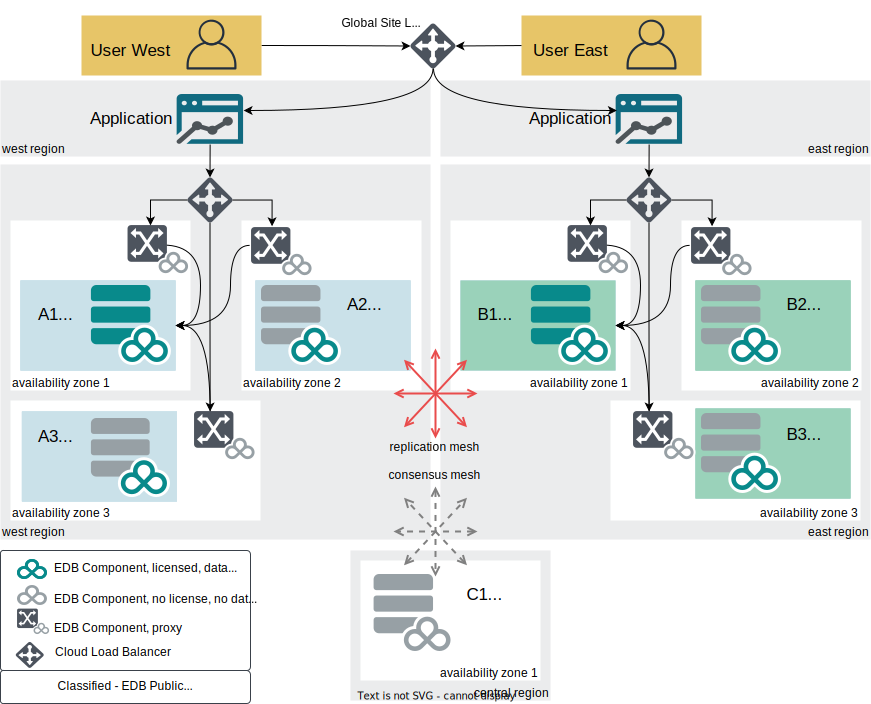    

### Deploy green to PGD Group A

1. Apply changes to PGD node A2.

    

2. Apply changes to PGD node A3.

    

3. Apply changes to PGD node A1. Re-enable traffic to PGD Group A. All green.

    

