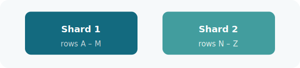
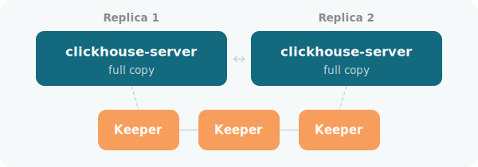
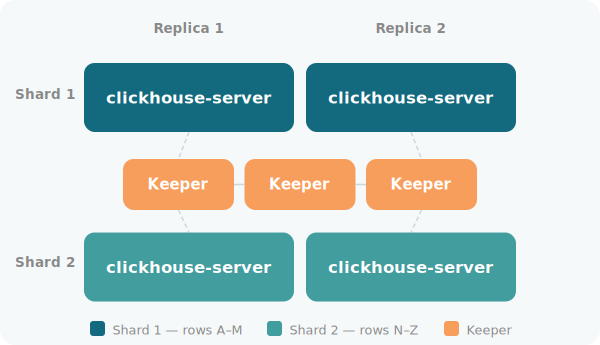

EDB Postgres AI for ClickHouse runs as a standalone instance or as a distributed cluster, with support for sharding, replication, or both.

The ClickHouse server is the database engine that stores and processes data. The ClickHouse client is the command-line interface for connecting to a server and running queries.

## Deployment topologies

Your topology determines how data is stored, replicated, and served, as well as how much operational complexity you take on.

- **Single-node**: ClickHouse runs as a standalone instance on a single host. No cluster coordination is needed. Suitable for development, testing, and single-tenant analytical workloads.
- **Multi-node cluster**: Data is distributed across shards for horizontal scale and replicated for high availability. A multi-node cluster can use sharding alone, replication alone, or both together. Replication requires ClickHouse Keeper.

## Table engines

In ClickHouse, every table has an engine that determines how data is stored, indexed, and replicated. The primary family is `MergeTree`, designed for high-throughput analytical workloads. `ReplicatedMergeTree` extends it with built-in replication across nodes. For distributed queries, the `Distributed` engine acts as a virtual table that routes queries to the underlying shards and merges the results. For a full reference, see [Table engines](https://clickhouse.com/docs/en/engines/table-engines) in the ClickHouse documentation.

## Sharding

ClickHouse uses a shared-nothing architecture: each node has its own storage and operates independently. Sharding takes advantage of this by splitting your data horizontally across multiple nodes, each holding a different subset of rows. Queries run in parallel across shards and their results are merged before being returned to the client. This approach scales write throughput and storage beyond what a single node can handle, but doesn't provide high availability. If a shard goes down, its data is unavailable.

Sharding doesn't require cluster coordination. Query routing is handled by the `Distributed` table engine, which sends queries to all shards in parallel and merges the results transparently. See [How ClickHouse routes queries](#how-clickhouse-routes-queries) for details.

## Replication

Replication keeps identical copies of the same data on multiple nodes. If one node goes down, another replica can serve queries. Replication provides high availability but doesn't increase storage capacity or write throughput on its own.

To enable replication in ClickHouse, choose `ReplicatedMergeTree` as your table engine and deploy ClickHouse Keeper. Keeper coordinates replicas by tracking which data parts exist and keeping copies in sync.

## ClickHouse Keeper

ClickHouse Keeper is ClickHouse's built-in coordination service, equivalent in role to Apache ZooKeeper and compatible with it at the protocol level. It handles:

- Tracking which data parts exist across replicas
- Coordinating inserts so replicas stay in sync
- Executing distributed DDL (schema changes applied across all nodes)
- Electing leaders for replicated operations

Keeper uses the Raft consensus algorithm and requires a quorum of nodes to function. The minimum is three Keeper nodes, which allows the cluster to tolerate one node failure. With five Keeper nodes it can tolerate two failures.

Keeper can run in two ways. In a co-located deployment, Keeper runs alongside the ClickHouse server on the same nodes. Co-location is simpler to manage and works well for smaller clusters. In a dedicated deployment, Keeper runs on separate nodes with no server workload, which gives better isolation and is recommended for larger or production clusters.

## Combining sharding and replication

Combine sharding and replication to achieve both horizontal scale and high availability. A common production topology is two shards with two replicas each, giving four server nodes total:

- Two shards provide horizontal scale across two independent data sets.
- Two replicas per shard provide high availability: each shard has a standby copy.

Keeper runs on at least three nodes, either co-located on server nodes or on separate dedicated nodes. See [Deployment options](../install_guide/#multi-node-cluster) for guidance on the two Keeper deployment approaches.

## How ClickHouse routes queries

When data is sharded across multiple nodes, queries need to reach all shards and have their results combined. ClickHouse handles this routing with the `Distributed` table engine.

A `Distributed` table is a virtual table that sits on top of the underlying `MergeTree` or `ReplicatedMergeTree` tables on each shard. When you query a `Distributed` table on any node, that node fans the query out to all shards in parallel, collects the results, and returns the merged result.

Your application connects to any server node and queries the `Distributed` table without needing to know the sharding topology. For writes, inserting into a `Distributed` table routes each row to the correct shard using a sharding key you define, typically a hash of a column.

Sharding, replication, and Keeper topology are all defined in the ClickHouse server configuration file. For details, see [Configuration files](https://clickhouse.com/docs/en/operations/configuration-files) in the ClickHouse documentation.
