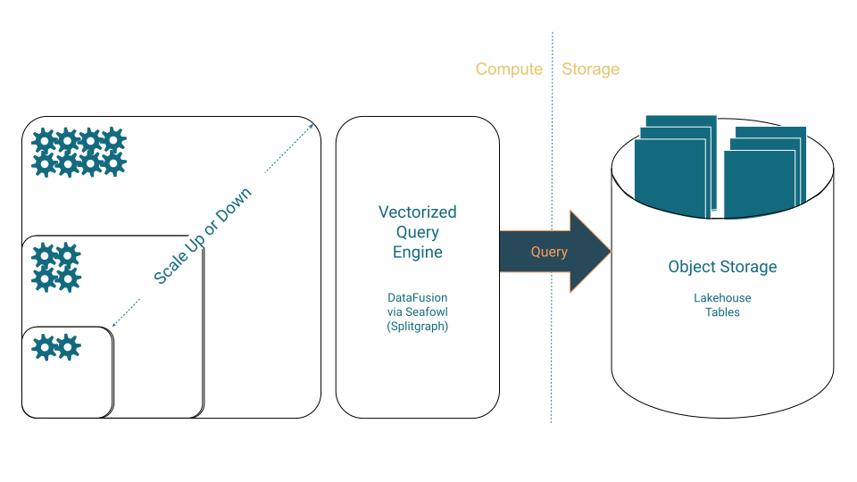

Use the **Analytics Accelerator** to explore the analytical capabilities built on EDB Postgres®. This accelerator helps you understand core concepts, explore key technologies such as EDB Postgres® Lakehouse, and learn how to implement analytics with EDB Hybrid Manager (HM).

We integrate modern data architectures and open standards with the reliability and flexibility of Postgres to help you unlock valuable insights.

## Navigating the analytics accelerator

The accelerator organizes content into four areas:

- **Conceptual foundations**
Build your understanding of analytics principles and EDB’s approach.

- **EDB core analytics technologies**
Learn about EDB solutions and technologies that power our analytics offerings.

- **Practical guidance and solutions**
Find use cases, persona-based guides, how-to articles, and tutorials.

- **Product-specific implementations**
Access documentation for how these analytics capabilities surface and are managed in EDB products, such as EDB Hybrid Manager.

## Conceptual foundations

Understand the principles and strategies behind modern data analytics and EDB’s approach.

- [Generic analytics concepts](learn/explained/generic-concepts.mdx)
Learn about data architectures (Data Warehouse, Data Lake, Lakehouse) and foundational technologies (columnar storage, vectorized engines, and others).

- [EDB analytics concepts](learn/explained/analytics-concepts.mdx)
Explore EDB’s vision for Postgres® analytics and how EDB leverages core technologies.

- [Explained: Analytics](learn/explained)
Review in-depth explanations of EDB analytical features, design choices, and advanced topics. *(Coming soon)*

## EDB core analytics technologies

Learn about EDB’s analytics technologies and how they extend Postgres®.

- [Lakehouse clusters (EDB Postgres Lakehouse overview)](lakehouse)
Review the EDB Postgres® Lakehouse solution and its components for enabling analytics on object storage.

- [Apache Iceberg with EDB solutions](iceberg)
Understand how EDB solutions use Apache Iceberg to manage large analytical datasets.

- [Delta Lake with EDB solutions](delta_lake)
Learn how EDB Postgres® interacts with Delta tables to enable reliable data lakes.

- [Tiered tables with EDB Postgres](tiered_tables)
Manage data across storage tiers using EDB Postgres Distributed (PGD) and Lakehouse capabilities to optimize cost and performance.

## Use Anywhere (Manual/Reference)

- Lakehouse overview: [Lakehouse clusters](lakehouse)
- Open formats: [Apache Iceberg](iceberg), [Delta Lake](delta_lake)
- Storage locations: [Configure PGFS for Delta/FS](configure-delta-pgfs), [Configure PGFS for Tiered Tables](configure-tiered-pgfs)
- Reference: [Functions](reference/functions.mdx), [PGAA functions](reference/pgaa_functions.mdx), [Direct scan](reference/directscan.mdx), [Datasets](reference/datasets.mdx)

## Use With PGD (Manual/Reference)

- Concepts: [Tiered Tables](tiered_tables)
- Configure PGD: [Configure analytics offload](configure-tiered-offload), [Configure BDR AutoPartition](configure-tiered-autopartition)
- Operate: [Query Tiered Tables](query-tiered-tables), [Monitor Tiered Tables](monitor-tiered-tables)
- Overviews: [Offload PGD to Iceberg](offload-pgd-to-iceberg)

## Use In Hybrid Manager (Manual/Reference)

- Getting ready: [Getting setup](getting-setup.mdx)
- Provision: [Create a Lakehouse cluster](create-lakehouse-cluster.mdx)
- Catalogs: [Configure an Iceberg REST catalog](configure-iceberg-catalog.mdx)
- Interop: [Verify catalog with PyIceberg and PySpark](verify-catalog-with-pyiceberg-pyspark.mdx)

## How-Tos (Runbook-Aligned)

These guides mirror the runbook flows and code examples.

— No Catalog
- How-to  [Read Delta Lake tables without a catalog](delta-read-without-catalog.mdx)
- How-to  [Read Iceberg tables without a catalog](iceberg-read-without-catalog.mdx)
- How-to  [PGD offloads without a catalog (setup and test)](pgd-offloads-without-catalog.mdx)
- How-to  [BDR AutoPartition test without a catalog](autopartition-test-without-catalog.mdx)

— Catalog (Lakekeeper)
- How-to  [Set up a Lakekeeper catalog and import sample tables](setup-catalog-and-import.mdx)
- How-to  [Attach a catalog on Lakehouse and read data](attach-catalog-and-read.mdx)
- How-to  [Offload PGD data to a catalog (end-to-end tests)](offload-to-catalog-tests.mdx)

— Verification & Operations
- How-to  [Verify catalog with PyIceberg and PySpark](verify-catalog-with-pyiceberg-pyspark.mdx)
- How-to  [PGD catalog reads from a non-leader node](read-catalog-from-non-leader.mdx)

## Where to start

- Start with [Generic analytics concepts](learn/explained/generic-concepts.mdx) and [Lakehouse overview](lakehouse) to understand core ideas.
- If you’re experimenting with external data, use the No Catalog how-tos.
- If you’re integrating with PGD/Tiered Tables or catalogs, follow the PGD and Catalog how-tos.

Postgres Lakehouse is built using a number of technologies:

-   PostgreSQL
-   [Seafowl](https://seafowl.io/), an analytical database
-   [Apache DataFusion](https://datafusion.apache.org/), the query engine used by Seafowl
-   [Delta Lake](https://delta.io) (and specifically [delta-rs](https://github.com/delta-io/delta-rs)),
for implementing the storage and retrieval layer of Delta Tables

### Level 100

The most important thing to understand about Postgres Lakehouse is that it
separates storage from compute. This design allows you to scale them independently,
which is ideal for analytical workloads where queries can be unpredictable and
spiky. You wouldn't want to keep a machine mostly idle just to hold data on
its attached hard drives. Instead, you can keep data in object storage (and also
in highly compressible formats), and only provision the compute needed to query
it when necessary.

On the compute side, a vectorized query engine is optimized to query Lakehouse
tables but still fall back to Postgres for full compatibility.

On the storage side, Lakehouse tables are stored using highly compressible
columnar storage formats optimized for analytics.

### Level 200

Here's a slightly more comprehensive diagram of how these services fit together:

### Level 300

Here's the more detailed, zoomed-in view of "what's in the box":

