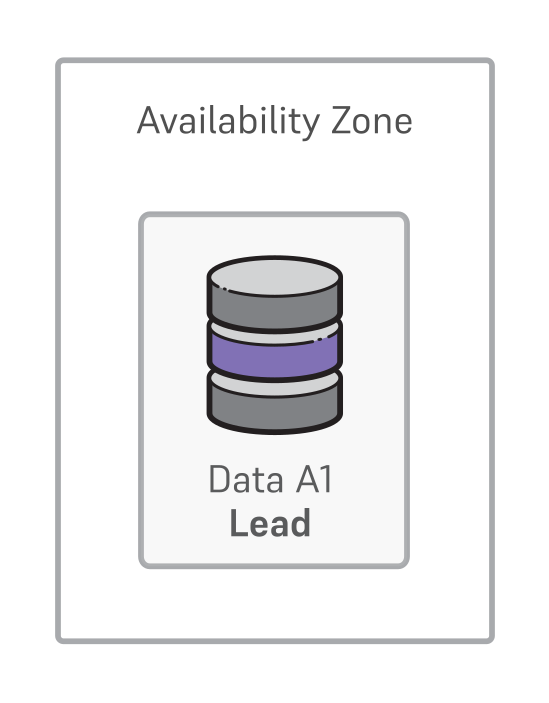

For nonproduction use cases where high availability isn't a primary concern, a cluster deployment without high availability enabled provides one primary with no standby replicas for failover or read-only workloads. 

In case of unrecoverable failure of the primary, a restore from a backup is required. 

