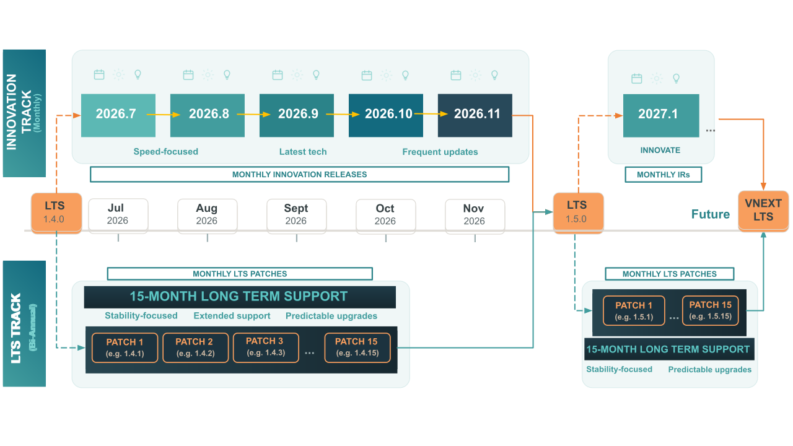
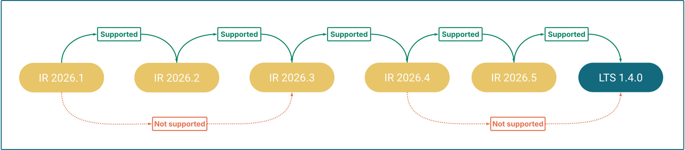
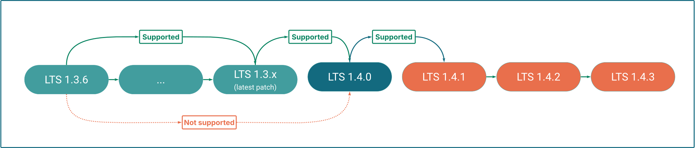
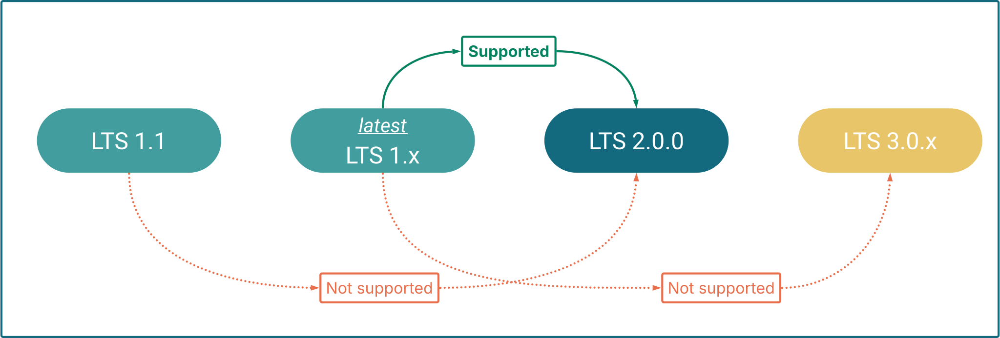

Hybrid Manager (HM) offers a [dual release strategy](/edb-postgres-ai/current/hybrid-manager/release_notes/#hybrid-manager-dual-release-strategy): **Long-Term Support (LTS) Releases** and **Innovation Releases (IR)**. Because these streams follow different versioning logic, the supported paths for moving among them depend on your current version and the target environment.

!!!tip

If you want to upgrade your **Postgres database clusters** instead, see [Upgrading database clusters in Hybrid Manager](../upgrading/).
!!!

## Release types

**Innovation Releases (IR)** are delivered monthly. They focus on continuous platform hardening, workflow improvements, stability, reliability, and introduce smaller, iterative new features. They are ideal for customers and teams that want early access to the latest capabilities and want to follow the leading edge of product development.

**Long-Term Support (LTS) releases** are delivered twice a year. They consolidate the innovations from preceding monthly releases into a stable, well-tested foundation suited to production deployments that require predictability and an extended support window. Each LTS release is supported for 15 months from its release date, with monthly patch releases throughout that period delivering bug fixes and security updates.

| | LTS | Innovation Release (IR) |
|---|---|---|
| **Version format** | Semantic versioning (for example, `1.x.x`) | Calendar-based (for example, `2026.x`) |
| **Release cadence** | Bi-annual | Monthly |
| **Patches** | Monthly patch releases with bug and security fixes | No planned patches—replaced by the next monthly release. Critical fixes, such as CVEs, may result in an unplanned patch. |
| **Upgrade path** | One minor version at a time (for example, 1.3.x → 1.4.y); skipping minor versions not supported | Sequential month-to-month upgrades required |
| **Best for** | Production environments requiring stability and extended support | Development, testing, or teams wanting leading-edge features |

!!!important
For current support timelines and end-of-support dates, see [Platform Compatibility](https://www.enterprisedb.com/resources/platform-compatibility#hybrid%20management%20).
!!!

## IR upgrade paths

You must upgrade month-to-month within the IR stream (for example, 2025.10 → 2025.11). Each IR cycle runs until a consolidation point, where a new LTS version is released. To continue receiving updates after a consolidation point, you must transition to the newly released LTS version (for example, 1.5.0), which then serves as the foundation for the next IR cycle.

## LTS upgrade paths

LTS releases follow standard semantic versioning (`major.minor.patch`, for example, **1.3.x**). These versions focus on stability, receiving monthly patch releases with bug and security fixes for their full support lifespan.

### Minor and patch version upgrades

To upgrade to the next minor version (for example, **1.3._latest_** to **1.4.0**), you must be on the latest available patch of your current minor version first.

Within the same minor version, patch upgrades are flexible: you may upgrade from any patch to any higher patch (for example, 1.3.1 to 1.3.5) without installing intermediate patches.

### Major version upgrades

When a new major version (for example, **2.0**) is released, you must be running the latest available minor and patch release of the **1._latest_._latest_** stream to perform the upgrade.

## Cross-stream upgrade paths

Moving between LTS and Innovation Releases is possible but has specific constraints.

### Innovation Release to LTS

You can move from the **final Innovation Release** of a cycle to the **LTS release** that consolidates those features, but not from any other IR in the cycle.

To determine if your current IR supports transitioning to LTS, check the upgrade instructions for that specific version—they indicate whether the transition is supported.

### LTS to Innovation Release

You can upgrade an LTS release to its immediate succeeding Innovation Release. You can't jump to an arbitrary or later IR—upgrade to the immediate successor first, then follow the sequential IR upgrade path.

!!!Warning

Once you move from an LTS release to an Innovation Release, you can't return to LTS until the next consolidation point (see [Innovation Release to LTS](#innovation-release-to-lts) above). Consolidation points occur twice a year.
!!!

## Service availability during upgrades

Some upgrades may trigger an automatic restart of your HM-managed Postgres database clusters. To avoid unexpected interruptions, check the service availability notes in the specific upgrade guide you are following.
