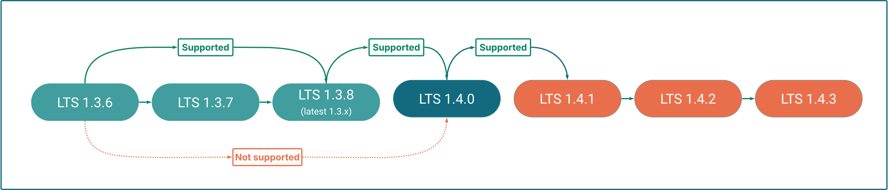
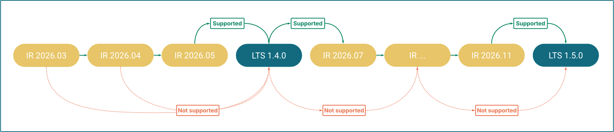

Hybrid Manager (HM) offers a [dual release strategy](/edb-postgres-ai/current/hybrid-manager/release_notes/#hybrid-manager-dual-release-strategy): **LTS (Long-Term Support)** and **Innovation Releases (IR)**. Because these streams follow different versioning logic, the supported paths for moving among them depend on your current version and the target environment.

!!!tip
If you want to upgrade your **Postgres database clusters** instead, see [Upgrading database clusters in Hybrid Manager](../upgrading/).
!!!

## Release types

**Innovation Releases (IR)** are delivered monthly. They provide the latest features, continuous platform hardening, and iterative improvements—suited for environments that want to stay on the leading edge.

**LTS releases** are delivered twice a year. They consolidate the features of previous Innovation Releases into a stable, well-tested foundation for production environments that need a predictable upgrade schedule and extended support commitment.

| | LTS | Innovation Release (IR) |
|---|---|---|
| **Version format** | Semantic versioning (e.g., `1.3.x`) | Calendar-based (e.g., `2025.11`) |
| **Release cadence** | Bi-annual | Monthly |
| **Patches** | Monthly patch releases with bug and security fixes | No planned patches—replaced by the next monthly release. Critical fixes (e.g., CVEs) may result in an unplanned patch. |
| **Upgrade path** | One minor version at a time (e.g., 1.3.x → 1.4.y); skipping minor versions not supported | Sequential month-to-month upgrades required |
| **Best for** | Production environments requiring stability and extended support | Development, testing, or teams wanting leading-edge features |

For current support timelines and end-of-support dates, see [Platform Compatibility](https://www.enterprisedb.com/resources/platform-compatibility#hybrid%20management%20).

## IR upgrade paths

You must upgrade month-to-month within the IR stream (e.g., 2025.11 → 2025.12). IR streams are not open-ended: twice a year, the stream consolidates into a new LTS version. To continue receiving updates after a consolidation point, you must transition to the newly released LTS version (e.g., 1.4.0), which then serves as the foundation for the next IR.

## LTS upgrade paths

LTS releases follow standard semantic versioning (`major.minor.patch`, e.g., **1.3.x**). These versions focus on stability, receiving monthly patch releases with bug and security fixes for their full support lifespan. For current support timelines, see [Platform Compatibility](https://www.enterprisedb.com/resources/platform-compatibility#hybrid%20management%20).

### Minor and patch version upgrades

To upgrade to the next minor version (e.g., **1.3.x** to **1.4.y**), you must be on the latest available patch of your current minor version first.

Within the same minor version, patch upgrades are flexible: you may upgrade from any patch to any higher patch (e.g., 1.3.1 to 1.3.5) without installing intermediate patches.

### Major version upgrades

When a new major version (e.g., **2.0**) is released, you must be running the latest available **1.x** minor release to perform the upgrade.

## Cross-stream upgrade paths

Moving between LTS and Innovation Releases is possible but has specific constraints.

### Innovation Release to LTS

You can move from the **final Innovation Release** of a cycle to the **LTS release** that consolidates those features, but not from any other IR in the cycle.

To determine if your current IR supports transitioning to LTS, check the upgrade instructions for that specific version—they will indicate whether the transition is supported.

### LTS to Innovation Release

You can upgrade an LTS release to its immediate succeeding Innovation Release. You cannot jump to an arbitrary or later IR—upgrade to the immediate successor first, then follow the sequential IR upgrade path.

!!!Warning
Once you move from an LTS release to an Innovation Release, you cannot return to LTS until the next consolidation point (see [Innovation Release to LTS](#innovation-release-to-lts) above). Consolidation points occur twice a year.
!!!

## Service availability during upgrades

Some upgrades may trigger an automatic restart of your HM-managed Postgres database clusters. To avoid unexpected interruptions, check the service availability notes in the specific upgrade guide you are following.
