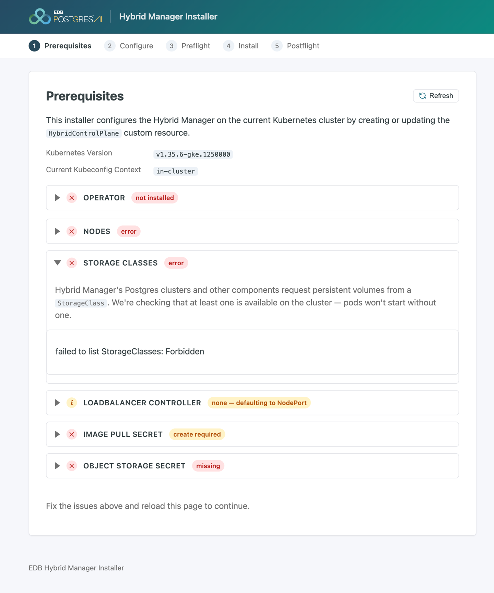
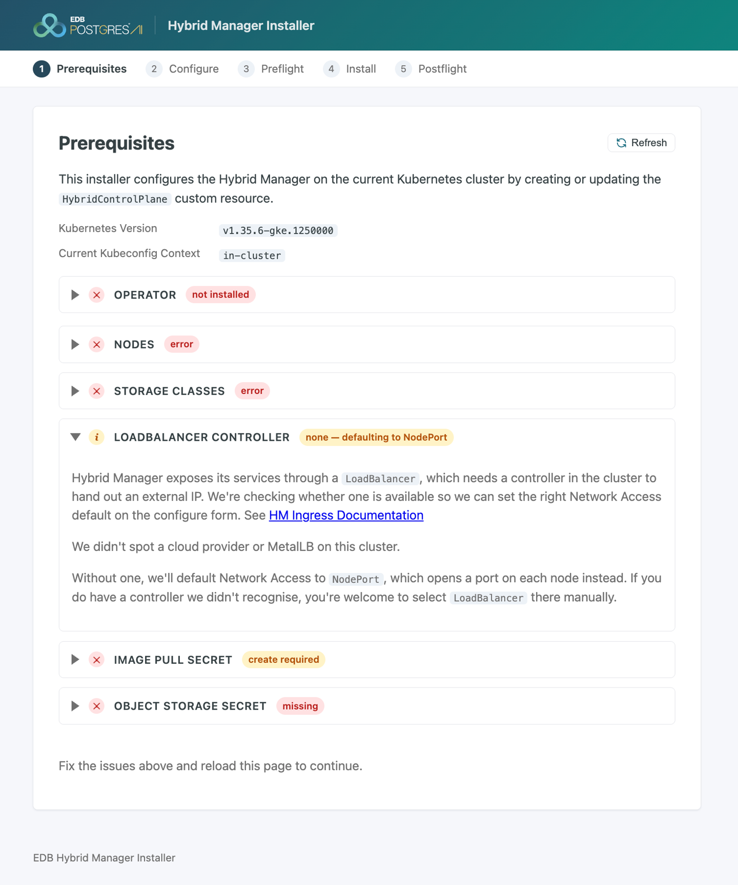
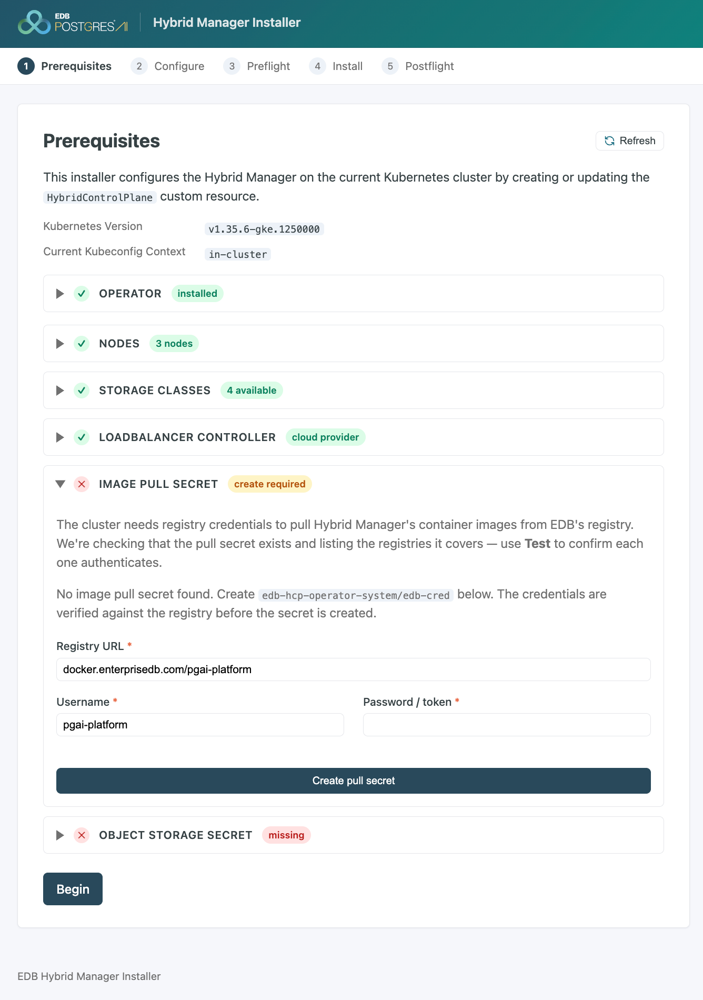
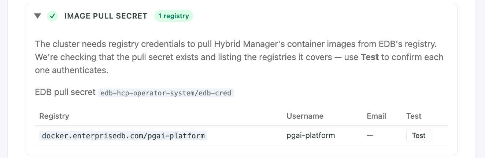
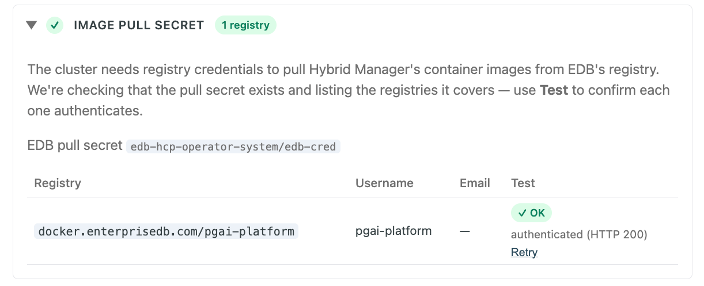
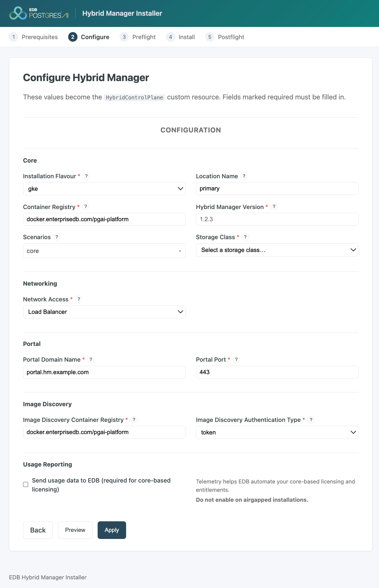
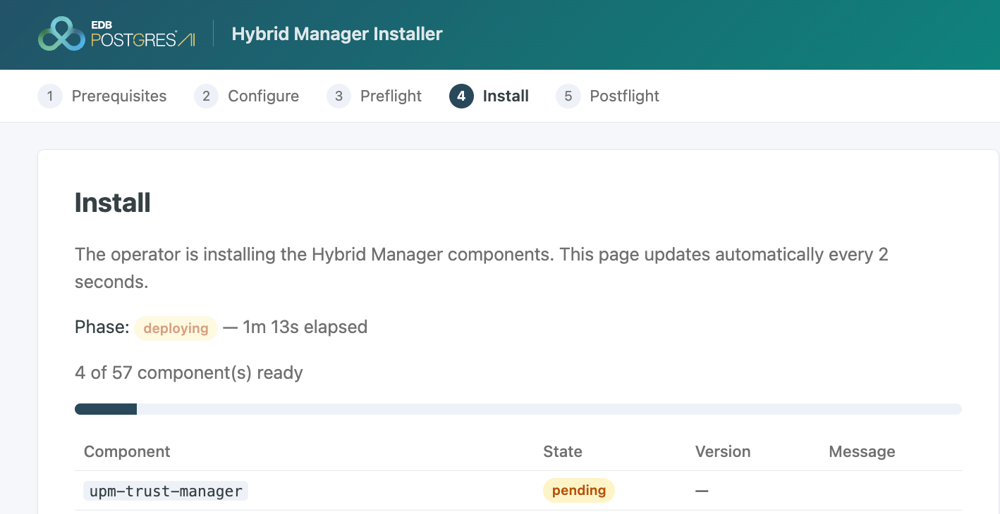

## Overview

The Web Installer is a guided, browser-based alternative to authoring the `HybridControlPlane` custom resource by hand. It runs in the cluster, gates on the `edb-hcp-operator`, and does two jobs: it validates your cluster against HM's dependencies before you attempt an install, and it assembles a well-formed `HybridControlPlane` custom resource from your answers. The second job matters on its own — `globalParameters` and `componentsParameters` only accept string values, so a hand-authored manifest that uses a bare number or boolean is silently dropped by the API; the installer always emits strings.

It walks five gated screens — **Prerequisites**, **Configure**, **Preflight**, **Install**, and **Postflight** — validating at each step so an install is never attempted against unmet requirements.

### Prerequisites

- A Kubernetes cluster, as described in [Deploying your Kubernetes cluster](../k8s_install).
- The `edb-hcp-operator` installed — the Web Installer's Prerequisites screen gates on it; see [1.1 Operator](#11-operator) below.
- An EDB subscription token, for the registry credential the installer needs to pull its own image and, later, HM's component images.

### When to use the Web Installer

Across every environment — public cloud, private cloud, or air-gapped — the pattern is the same: deploy the Kubernetes cluster, then deploy the Web Installer, and resolve what it reports before touching the operator manifest directly. It pulls from the customer-facing registry or a private mirror, needs only a pull credential to start, and re-reads cluster state on every page load rather than holding on to prior state.

Use it for a guided first installation — a proof of concept, a first production cluster, or an unfamiliar platform — where its validation and Preview reduce manifest errors. A team with a known-good `HybridControlPlane` already captured in git, and a mature release process around it, can reasonably skip it and use the [operator manifest method](install_hm) instead for automated, repeatable, or GitOps-managed deployments.

**Multi-location (multi-DC) deployments** sit in between. The installer works one cluster at a time and has no awareness of federation: the configuration that wires locations together — cluster groups and federation pairings, additional trust domains, SPIRE federation, and the synchronized `edb-object-storage` secret — isn't part of the form. Prepare that separately; see [Configuring multi-location architecture](../environment_prep#configuring-multi-location-architecture) and [Configuring multiple data centers for Hybrid Manager](/edb-postgres-ai/current/hybrid-manager/install/configuration/multi_dc/). What you can do safely is use the installer to stand up each location's HM individually — giving each a unique **Location Name** on the Configure screen — and apply the federation wiring outside it. The form only ever writes the fields it manages, so opening it against a CR that already carries multi-location configuration passes that configuration through untouched; use **Preview** to confirm before applying. Treat Location Name as immutable once a location is federated — see [2. Configure](#2-configure).

### How it behaves: temporary, resumable, and deliberately unprivileged

The installer holds no state of its own — every screen re-reads the cluster, so it can be deleted and reinstalled, or left mid-wizard and resumed later, without losing anything.

It's meant to be temporary because it has no authentication of its own. Its only real protection is that reaching it requires an authenticated `kubectl port-forward` to the cluster's API — never expose it through an Ingress or a LoadBalancer Service.

!!! Warning Reach the installer only through a port-forward
The Web Installer has **no authentication**. Its access control is entirely the requirement that you already hold authenticated `kubectl` access to the cluster. Reach it exclusively through `kubectl port-forward`; never expose it through an Ingress, a LoadBalancer, or any other public endpoint.
!!!

Because it's unsecured, it deliberately doesn't deploy artifacts itself — the operator and the component secrets are installed separately via `edbctl`, under your own credentials. The one exception is the image pull secret: the Prerequisites screen can create it inline, because that action is small, self-contained, and verified directly against the registry before anything is written.

## Deploying and running the Web Installer

Two commands. First, the pull credential — this also satisfies the Prerequisites screen's Image pull secret check:

```shell
edbctl image-pull-secret create \
  --registry "$INSTALL_REGISTRY" --username "$REGISTRY_USER" --password "$EDB_SUBSCRIPTION_TOKEN" -y
```

Then deploy the chart from the EDB Helm repository:

```shell
helm repo add enterprisedb-edbpgai "$EDB_HELM_REPO"
helm repo update enterprisedb-edbpgai

helm upgrade --install hm-installer enterprisedb-edbpgai/hm-installer \
  --version "$INSTALLER_VERSION" \
  -n edbpgai-bootstrap --create-namespace \
  --set "imagePullSecrets[0].name=edb-cred"

kubectl -n edbpgai-bootstrap port-forward svc/hm-installer 8080:8080     # then open http://localhost:8080
```

!!! Note
The chart's `imagePullSecrets` value defaults to an empty list, and the template only renders the field when it's set — omit `--set "imagePullSecrets[0].name=edb-cred"` and the installer's own pod fails to pull with `ImagePullBackOff` / `401 Unauthorized`, even though `helm repo add` succeeded. The Helm chart repository and the container image registry are two different endpoints with two different credentials: the chart repo URL carries your subscription token inline, but the pod's image pull is a separate, cluster-side authentication that needs this secret.
!!!

## The five screens

Each screen gates the next.

### 1. Prerequisites


Each row below reports green, amber, or red:

- **Green** — the requirement is satisfied; there's nothing to do.
- **Amber** — a warning, not a blocker. Something is absent or unverifiable in a way that doesn't stop the install right now, but it usually means a capability will be missing later, or the installer picked a safe default on your behalf. Read the row's detail, decide whether it matters for you, and move on.
- **Red** — the requirement isn't met. Fix it before installing.

!!! Note Read the text, not just the color
Today, only the **Operator** row's red actually blocks the **Begin** button — every other row surfaces its finding inline without stopping you. A red Storage Classes or Object Storage Secret row still lets you click Begin; the consequences show up later, at Preflight or Install. Treat every red and amber row as something to resolve now, not something you're technically allowed to skip, since this gating is expected to tighten in future releases.

Green also doesn't always mean *verified*. Several rows go green once an API call succeeds, not once EDB has confirmed the requirement is actually met: Nodes goes green as soon as it can list your cluster's nodes at all, independent of whether any of them carry HM's labels (more on this below); the Image Pull Secret and Object Storage Secret rows go green once a secret of the right shape exists, not once its credentials have been tested against the registry or bucket. Where a **Test** control exists, use it — it's the only way to confirm the credential itself works, not just that it's present.
!!!

#### 1.1 Operator

The EDB Postgres AI Operator (`edb-hcp-operator`) is what actually installs and runs Hybrid Manager for you: a Kubernetes operator that manages every HM component — portal, Beacon, PGD data planes, the observability stack — as one unit, so you set it up once rather than installing each service individually. It also owns HM's day-to-day lifecycle afterward, including upgrades.

The installer confirms the operator and its CRDs are installed and running; its CRDs must exist before anything else, and this is the only Prerequisites row that blocks the wizard. See [Install the EDB Postgres AI Operator](install_hm#install-the-edb-postgres-ai-operator).

```shell
edbctl hm upgrade-operator \
  --registry-uri "$INSTALL_REGISTRY" --registry-username "$REGISTRY_USER" --registry-password "$EDB_SUBSCRIPTION_TOKEN" -y
```

Since HM 1.4, the operator's release cadence is decoupled from HM's — one operator version supports multiple HM lines. This requires `edbctl` 1.7.0 or later; older versions fail on `--registry-uri` with an unhelpful "unknown flag" error. On OpenShift, install the operator through the Red Hat certified-operators catalog (or `oc mirror` when disconnected) instead — see [Installing the operator on OpenShift](install_rhos).

#### 1.2 Kubernetes version and context

This row exists as much to confirm you're pointed at the right cluster as it is to check version compatibility — a safeguard before you commit any of the following rows to a cluster you didn't mean to touch. It displays the cluster's Kubernetes version and the active kubeconfig context, but doesn't assert anything against either one — an unsupported version or the wrong cluster produces no warning here. Check both manually against [Kubernetes platform verification](../sys_reqs#2-kubernetes-platform-verification) before proceeding.

!!! Note
A context of `in-cluster` means the installer is running with the credentials of a pod already inside the target cluster, rather than through your own kubeconfig — worth knowing, since in-cluster access carries different permission and audit implications than an external admin context.
!!!

#### 1.3 Nodes

Hybrid Manager separates its workloads across purpose-specific node pools, so that each part of HM runs on hardware sized for its job — you create these pools yourself, then apply the labels that tell the operator where each component belongs.

This row looks for the node role labels `edbaiplatform.io/control-plane: "true"` (3 or more nodes) and `edbaiplatform.io/postgres: "true"` (0, or 3 or more nodes) — see [Node roles summary](../sys_reqs#node-roles-summary) and [Set your node abstractions](../k8s_install#set-your-node-abstractions). HM's own system databases run on the control-plane pool, so a `core`-only install needs no data-plane pool at all. Apply labels at the node-pool level, not per node. Each control-plane node also needs a pod capacity (`maxPods`) of 60 or more — an all-scenario install runs roughly 150 pods — which is the classic silent failure on AKS, where Azure CNI's default `maxPods` of 30 can't be raised after cluster creation.

!!! Note
This section can report green even with zero labeled nodes — it surfaces what it finds but doesn't currently assert the requirement. Confirm node labels yourself: `kubectl get nodes -L edbaiplatform.io/control-plane,edbaiplatform.io/postgres`. A restrictive RBAC role bound to the installer's own service account produces a different, more visible failure — `failed to list nodes: Forbidden` — shown below.
!!!


#### 1.4 Storage classes

HM's Postgres clusters and other stateful components request persistent volumes from a Kubernetes `StorageClass` — without at least one available, they have nowhere to store their data.

This row lists the cluster's available `StorageClass` objects and confirms at least one exists — the class you pick here becomes a required Configure field. It doesn't check for a `VolumeSnapshotClass`, which HM's backup and restore path needs; verify that separately with `kubectl get volumesnapshotclass`. See [Block storage](../sys_reqs#6-block-storage-database--logs) and [Volume snapshots](../sys_reqs#61-volume-snapshots).



#### 1.5 LoadBalancer controller

HM exposes the portal and its other services through a Kubernetes `LoadBalancer` Service, which needs a controller in the cluster willing to hand out an external IP for it. Cloud-managed clusters normally provide one automatically; bare-metal and on-premises clusters need something like MetalLB installed first.

This row detects whether such a controller — a cloud load-balancer controller or something like MetalLB — is present, and uses that to set Configure's Network Access default (Load Balancer vs. NodePort). It detects the controller only: DNS, TLS, firewall rules, ingress routing, CNI choice, and subnet sizing all remain your responsibility. Treat an amber "none — defaulting to NodePort" result here as a prompt to talk to whoever owns networking, not as something to click past. See [5.1 Load balancer controller](../sys_reqs#51-load-balancer-controller) and [5.1.2 NodePort alternative](../sys_reqs#512-nodeport-alternative).



#### 1.6 Image pull secret

HM's container images live in EDB's private registry, so your cluster needs a Kubernetes secret carrying registry credentials before the operator (and later, HM's components) can pull them.

This row looks for OpenShift's `openshift-config/pull-secret`, or for `edb-cred` in the operator's namespace elsewhere. If you already ran `edbctl image-pull-secret create`, this reports green. Otherwise, this is the one Prerequisites row the screen can remediate itself: an inline form creates `edb-cred`, and the value is verified against the registry before it's written.

!!! Note
`edbctl hm upgrade-operator` creates a *different* secret (`edb-hcp-operator-pull-secret`) for the operator's own image pulls — it does not satisfy this check. A green badge here means the secret exists and decodes, not that its credentials still authenticate; use the screen's per-registry **Test** control to confirm that separately.
!!!







#### 1.7 Object storage secret

HM uses external object storage — S3, GCS, Azure Blob, or MinIO or any other S3-compatible service — for Postgres backups and WAL archives, so it needs credentials that can reach a bucket before it can protect any data it manages.

This row reads the `edb-object-storage` secret in the `default` namespace. The required keys vary by provider (AWS or S3-compatible, Azure Blob, GCP); the screen detects the variant present and checks it for completeness. The installer doesn't create this secret — you create it manually; see [7. Object storage](../sys_reqs#7-object-storage) and [Configuring object storage](/edb-postgres-ai/current/hybrid-manager/install/configuration/object_storage/).


!!! Note
The credential needs to read bucket **metadata**, not just objects. On GCP, `roles/storage.admin` passes; `roles/storage.objectAdmin` fails the check with `forbidden ... does not have storage.buckets.get`. The screen's **Test credentials** control performs that same metadata read — use it to confirm before moving on, and allow up to a minute for IAM changes to propagate.

HM also expects a dedicated bucket. Pointing a new installation at a bucket that already holds another installation's backups isn't detected by any check here — use a fresh bucket per HM instance.
!!!


### 2. Configure

This is where your input becomes the `HybridControlPlane` custom resource. The installer auto-detects several values — platform flavor (from node provider identity), the Network Access default, available storage classes, and the registry/portal-port fields — leaving six decisions that are genuinely yours:



1. **Hybrid Manager Version** — the HM release to install; must exist in the pull registry.
2. **Scenarios** — feature bundles. `core` is required and sufficient for a working portal on its own; each additional scenario (`dbaas`, `migration`, `ai`, `analytics`, `klio`) carries its own secrets, images, and — for `ai` — hardware, none of which this screen cross-checks (see the note below).
3. **Storage Class** — usually the one marked `(default)`; becomes `storage_class` in the CR.
4. **Portal Domain Name** — becomes `portal_domain_name`; this is the hostname you'll point a DNS record at after install.
5. **Migration Service Domain Name** — shown only when the `migration` scenario is enabled; becomes `dms_domain_name`.
6. **Location Name** — defaults to `primary`, which is fine for a single-location install. It becomes `beacon_location_id` in the CR, the label HM uses to identify this cluster among multiple locations. In a multi-location deployment, give each location a unique value here — a region or datacenter name works well — and never change it on a location that's already federated.

Hostnames are format-checked only, never resolved, so a typo surfaces only later as a portal link that doesn't load.


!!! Note Scenarios are a commitment, not a checkbox
Nothing on this screen cross-checks a selected scenario against what else needs to be true for it to work:

- **Secrets** — Preflight blocks until the matching secrets exist. Run `edbctl hm create-install-secrets` with the same scenario set you select here; `core` alone doesn't cover `ai`, `analytics`, or `migration`.
- **Registry contents** — each scenario pulls its own component images. In a mirrored or air-gapped registry, Install stalls if those images weren't synced.
- **Hardware** — the `ai` scenario needs GPU nodes, which no earlier gate checks for.

Decide the scenario set once, and keep it consistent across this screen, `create-install-secrets`, and your registry sync. `core` is always installed; other scenarios can be added later with a CR update.
!!!

Use **Preview** before every **Apply** — it's the only place computed fields (the load-balancer provider, TDE methods, the beacon host) become visible, and it shows you the fields the form doesn't manage passing through unchanged, including any multi-location wiring already present on the CR. It's worth saving as the artifact you keep for future installs.

!!! Note Known issues
Selecting the **Marketplace** or **Observability** scenario currently makes the form silently unsubmittable — untick it to proceed. The beacon (estate/agent) hostname isn't yet its own form field; it's derived from the portal domain. The platform flavor is prefilled but not validated against the cluster — changing it changes the computed load-balancer provider without warning.
!!!

### 3. Preflight

Applying the CR hands control to the operator, and Preflight is the operator's own validation: it declares the secrets required for your selected scenarios, checks each one, and renders a card with `kubectl` remediation hints for any that fail. This is an absolute gate with no override — Install redirects back here until every card reads Valid.

```shell
edbctl hm create-install-secrets --version "$HM_VERSION" -y
```

Run this with the same scenario set you chose on Configure; it also creates the namespaces those secrets live in. The portal bootstrap secret (admin credentials and the encryption key) is protected from rotation — re-running the command won't reset a wrong admin password.

!!! Note
If the screen shows "Waiting for the operator to create the Preflight resource…" for more than a minute or two, check the operator's own controller logs directly — the message doesn't currently distinguish a slow operator from a missing one. See [Troubleshooting preflight checks](../../troubleshooting/preflight_checks).
!!!


### 4. Install

The operator deploys HM's components, one scenario at a time. The screen shows a per-component table refreshed every couple of seconds, a progress bar, and a phase that advances the wizard once it reaches `deployed`. If it stalls, check individual component states — `pending` usually means pods can't schedule, which is where under-labeled or under-provisioned nodes bite.

```shell
kubectl get hcp edbpgai -o jsonpath='{.status.components[?(@.state=="failed")]}'
kubectl logs -f -n edb-hcp-operator-system deploy/edb-hcp-operator-controller-manager
```

The table currently only surfaces an explanatory message for components in a `failed` state, not ones stuck `pending` — if a component sits at `pending` without explanation, use the commands above rather than waiting on the screen.




### 5. Postflight

Reports the operator's ongoing health checks — pods, internal databases, backups, nodes, and certificates — and surfaces the portal link once healthy. DNS is the one remaining manual task: this screen reminds you it's needed but doesn't test it. See [Troubleshooting postflight checks](../../troubleshooting/postflight_checks).

Postflight is a living report, not a one-time gate — the operator keeps re-running these checks indefinitely, so anything that turns unhealthy after install is a prompt to check the named subsystem, not a stale result.


#### 5.1 Clean up the Web Installer

Removing the installer is the correct last step, not optional tidying — your HM installation doesn't depend on it staying deployed:

```shell
helm uninstall hm-installer -n edbpgai-bootstrap
```

This removes the installer's Deployment, Service, ServiceAccount, and RBAC, and ends any active port-forward.

!!! Warning
Leave the `edbpgai-bootstrap` namespace and the `edb-cred` secret in place. The `HybridControlPlane` CR references `edb-cred` for its own image pulls — deleting it breaks the running installation, not just the installer.
!!!

If you need the installer again later, reinstall with the same two commands from [Deploying and running the Web Installer](#deploying-and-running-the-web-installer) — it's stateless, so nothing is lost by removing and redeploying it.

## Next phase

After the portal is reachable, continue to [Exploring your post-installation options](../post_install).
