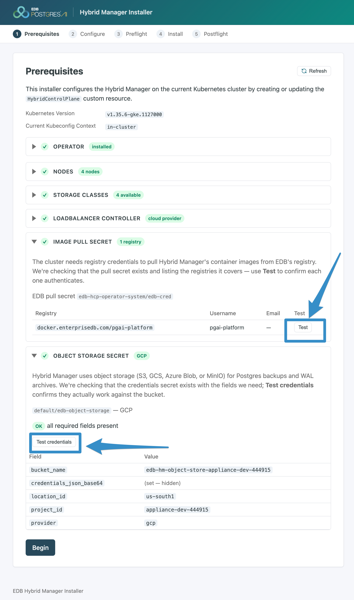

This quickstart takes you from an empty Google Cloud project to a reachable Hybrid Manager (HM) portal on a dedicated GKE cluster, using the Web Installer.

It mirrors the six phases of the [step-by-step installation guide](../../install_guide) — plan, gather requirements, deploy Kubernetes, prepare your environment, install HM, and explore post-installation — but collapses each phase to the shortest supported path. The two planning phases are deliberately brief: rather than have you design the deployment, the quickstart *prescribes* an opinionated architecture and set of requirements and records them for you, so the decisions here map one-to-one onto the full guide and onto later platform quickstarts. Each phase links to the guide page that explains it in depth.

Commands set shell variables that later phases reuse, so run them in a single session.

!!! Note
This path was validated end to end on GKE with HM 1.4.1, the `edb-hcp-operator` 2.0.0, and the Web Installer chart 1.11.17.
!!!

## Steps

This quickstart prescribes phases 1 and 2, so they are already decided for you — begin at phase 3. Confirm the [requirements checklist](../#requirements-checklist) on the quickstart overview first.

- 1. [x] [Plan your architecture](#1-plan-your-architecture)
- 2. [x] [Gather system requirements](#2-gather-system-requirements)
- 3. [ ] [Deploy the GKE cluster](#3-deploy-the-gke-cluster)
- 4. [ ] [Prepare your environment](#4-prepare-your-environment)
- 5. [ ] [Install Hybrid Manager](#5-install-hybrid-manager)
- 6. [ ] [Explore post-installation](#6-explore-post-installation)

* * *

## 1. Plan your architecture (prescribed ADR)

The quickstart prescribes the architecture so you don't have to design one. These are the decisions you would otherwise capture in an architecture decision record; the [Planning your architecture](../../install_guide/planning_arch) guide covers the full set of choices and trade-offs.

- **Topology** — One dedicated GKE cluster, 1:1 with HM, in a single region.
- **Nodes** — A labeled control-plane node pool for HM's services and an optional Postgres pool for database workloads, placed with the `edbaiplatform.io/control-plane` and `edbaiplatform.io/postgres` node labels.
- **Ingress** — A single public Google Cloud load balancer, provisioned automatically from HM's Istio ingress gateway. No load-balancer controller add-on is required on GKE.
- **Scenarios** — All scenarios: `core` plus `dbaas`, `migration`, `ai`, `analytics`, and `klio`. `core` is required and always on; this quickstart enables the full set so every capability is available. For a minimal portal, `core` alone is sufficient.

* * *

## 2. Gather system requirements (prescribed ADR)

These are the prescribed requirements for the architecture above — your system-requirements record. The [Gathering your system requirements](../../install_guide/sys_reqs) guide gives the full matrix and the reasoning behind each value.

| Requirement | Quickstart value |
|---|---|
| Kubernetes | GKE, x86-64 node pools, Kubernetes 1.32–1.34 |
| Control-plane nodes | 3 × `e2-standard-8` (8 vCPU / 32 GB), 500 GB `pd-ssd` boot disk |
| Data-plane nodes | 1 × `e2-standard-8` (non-HA; use 3 or more for HA) |
| Block storage | `standard-rwo` (default) plus a `VolumeSnapshotClass` |
| Object storage | A dedicated, empty GCS bucket and a service account key |
| Ingress and DNS | Public load balancer; A records to its IP in a Cloud DNS zone |
| TLS | Self-signed for a test portal; a `cert-manager` issuer for production |
| Registry and token | Images from `docker.enterprisedb.com/pgai-platform`; an EDB subscription token |

!!! Note
`e2-standard-8` provides 8 vCPU and 32 GB (the E2 standard family is 4 GB per vCPU); the standard family has no size between 8 and 16 vCPU, so use an `e2-custom` or `e2-highmem` type if you need something in between. Boot disks are billed on provisioned size, so lower `--disk-size` or use `pd-balanced`/`pd-standard` if you don't need the headroom.
!!!

* * *

## 3. Deploy the GKE cluster

Authenticate, select your project, and enable the required APIs:

```shell
gcloud auth login
gcloud auth application-default login

export PROJECT_ID="my-gcp-project"
export REGION="us-east1"
export ZONE="$(gcloud compute zones list --filter="region:$REGION" --format='value(name)' | head -1)"

gcloud config set project "$PROJECT_ID"
gcloud config set compute/region "$REGION"
gcloud services enable container.googleapis.com compute.googleapis.com storage.googleapis.com
```

Create a regional cluster — its control plane spans zones at no extra cost — with worker nodes pinned to one zone to keep node counts literal and costs down. Then replace the default pool with two labeled pools. The labels place HM's components; see [Set your node abstractions](../../install_guide/k8s_install#set-your-node-abstractions).

```shell
export CLUSTER="edb-hm"

gcloud container clusters create "$CLUSTER" \
  --region "$REGION" --node-locations "$ZONE" \
  --release-channel regular --enable-ip-alias \
  --num-nodes 1 --machine-type e2-small     # throwaway default pool, removed below

gcloud container clusters get-credentials "$CLUSTER" --region "$REGION"

# Control plane: 3 x e2-standard-8 (8 vCPU / 32 GB); data plane: 1 (use 3+ for HA)
gcloud container node-pools create edb-hm-cp \
  --cluster "$CLUSTER" --region "$REGION" \
  --machine-type e2-standard-8 --disk-type pd-ssd --disk-size 500 --num-nodes 3 \
  --node-labels edbaiplatform.io/control-plane=true

gcloud container node-pools create edb-hm-dp \
  --cluster "$CLUSTER" --region "$REGION" \
  --machine-type e2-standard-8 --disk-type pd-ssd --disk-size 500 --num-nodes 1 \
  --node-labels edbaiplatform.io/postgres=true

gcloud container node-pools delete default-pool --cluster "$CLUSTER" --region "$REGION" --quiet
kubectl get nodes -L edbaiplatform.io/control-plane,edbaiplatform.io/postgres
```

GKE provides the `standard-rwo` storage class but no `VolumeSnapshotClass` object. Create one — HM uses it for backups:

```shell
kubectl apply -f - <<'EOF'
apiVersion: snapshot.storage.k8s.io/v1
kind: VolumeSnapshotClass
metadata:
  name: gke-snapshotclass
driver: pd.csi.storage.gke.io
deletionPolicy: Delete
EOF
```

Create the object storage the platform will use for backups and WAL archives now, alongside the other Google Cloud infrastructure. Create a dedicated, empty GCS bucket and a service account key, then the `edb-object-storage` secret HM reads. The service account needs bucket-scoped `roles/storage.admin` — the installer validates the secret with a bucket-metadata read (`storage.buckets.get`), which `objectAdmin` does not grant. See [Configuring object storage](../../configuration/object_storage#gcp-object-storage).

```shell
export BUCKET="edb-hm-object-store-$PROJECT_ID"

gcloud storage buckets create "gs://$BUCKET" --location "$REGION" --uniform-bucket-level-access
gcloud iam service-accounts create edb-hm-object-storage --display-name "EDB HM Object Storage"
gcloud storage buckets add-iam-policy-binding "gs://$BUCKET" \
  --member "serviceAccount:edb-hm-object-storage@$PROJECT_ID.iam.gserviceaccount.com" \
  --role roles/storage.admin
gcloud iam service-accounts keys create sa-key.json \
  --iam-account "edb-hm-object-storage@$PROJECT_ID.iam.gserviceaccount.com"
export GCP_CREDENTIAL_BASE64=$(base64 < sa-key.json | tr -d '\n')

kubectl create secret generic edb-object-storage -n default \
  --from-literal=provider=gcp \
  --from-literal=location_id="$REGION" \
  --from-literal=project_id="$PROJECT_ID" \
  --from-literal=bucket_name="$BUCKET" \
  --from-literal=credentials_json_base64="$GCP_CREDENTIAL_BASE64"
```

Confirm the cluster can obtain a public load balancer, and note the Cloud DNS zone you will write records into. On GKE the load balancer is provisioned natively from HM's Istio gateway — no controller add-on is needed. See [Deploying your Kubernetes cluster](../../install_guide/k8s_install).

```shell
kubectl create service loadbalancer lb-check --tcp=80:80
kubectl get svc lb-check -w    # EXTERNAL-IP goes from <pending> to an IP within ~1-3 min, then Ctrl-C
kubectl delete service lb-check

gcloud dns managed-zones list --format="table(name,dnsName,visibility)"    # note the NAME column
```

* * *

## 4. Prepare your environment

Set the variables the remaining phases reuse:

```shell
export EDB_SUBSCRIPTION_TOKEN="your-edb-subscription-token"
export HM_VERSION="1.4.1"
export INSTALLER_VERSION="1.11.17"
export INSTALL_REGISTRY="docker.enterprisedb.com/pgai-platform"
export EDB_HELM_REPO="https://downloads.enterprisedb.com/$EDB_SUBSCRIPTION_TOKEN/pgai-platform/helm/charts/"
export REGISTRY_USER="pgai-platform"
export PORTAL_DOMAIN="portal.hm.example.com"     # the hostname you enter in the wizard
```

Create the EDB image-pull secret and the install secrets. `create-install-secrets` also creates the namespaces the operator uses, so run it before installing the operator. It prompts for the portal admin email and password — your first HM login. See [Preparing your environment](../../install_guide/environment_prep).

```shell
edbctl image-pull-secret create \
  --registry "$INSTALL_REGISTRY" --username "$REGISTRY_USER" --password "$EDB_SUBSCRIPTION_TOKEN" -y

edbctl hm create-install-secrets --version "$HM_VERSION" -y
```

* * *

## 5. Install Hybrid Manager

Install the operator, deploy the Web Installer and run its wizard, then point DNS at the load balancer.

### 5.1 Install the operator

Install the operator, which provides the custom resources the Web Installer depends on. `edbctl` selects the matching operator version automatically:

```shell
edbctl hm upgrade-operator \
  --registry-uri "$INSTALL_REGISTRY" --registry-username "$REGISTRY_USER" --registry-password "$EDB_SUBSCRIPTION_TOKEN" -y

kubectl get pods -n edb-hcp-operator-system     # controller-manager Running
```

### 5.2 Deploy and run the Web Installer

Deploy the Web Installer from the EDB Helm repository and open it with a port-forward. The installer has no built-in authentication, so reach it only through the port-forward — never expose it through an Ingress or load balancer.

```shell
helm repo add enterprisedb-edbpgai "$EDB_HELM_REPO"
helm repo update enterprisedb-edbpgai

helm upgrade --install hm-installer enterprisedb-edbpgai/hm-installer \
  --version "$INSTALLER_VERSION" \
  -n edbpgai-bootstrap --create-namespace \
  --set "imagePullSecrets[0].name=edb-cred"

kubectl -n edbpgai-bootstrap port-forward svc/hm-installer 8080:8080     # then open http://localhost:8080
```

Work through the installer's five screens; each gates the next. For the operator method in detail, see [Install Hybrid Manager on Kubernetes](../../install_guide/installing/install_hm).

#### 5.2.1 Prerequisites

The installer validates the cluster before letting you proceed. The operator check is the hard gate; the screen also verifies the nodes and their role labels, the storage classes, the load-balancer controller, and the image-pull and object-storage secrets. Use the per-row test controls, fix anything flagged, refresh, then begin.



#### 5.2.2 Configure

Set the values that become the `HybridControlPlane` custom resource — the only screen with significant input. `gke` and `Load Balancer` are auto-detected and `core` is always on. Print the values to enter with:

```shell
echo "Hybrid Manager Version   : $HM_VERSION"
echo "Portal Domain Name       : $PORTAL_DOMAIN"
echo "Migration Service Domain : $(echo "$PORTAL_DOMAIN" | sed 's/^portal/migration/')"
echo -n "Storage Class (default)  : "; kubectl get sc -o jsonpath='{.items[?(@.metadata.annotations.storageclass\.kubernetes\.io/is-default-class=="true")].metadata.name}'; echo
```

1. **Hybrid Manager Version** — the HM release to install (`$HM_VERSION`).
2. **Scenarios** — feature bundles. Select all scenarios (`core`, `dbaas`, `migration`, `ai`, `analytics`, `klio`) to enable the full platform; `core` is required and always on. Selecting `dbaas` or `migration` reveals additional fields (Load Balancer Mode and the Migration Service Domain).
3. **Storage Class** — the class marked `(default)`: `standard-rwo`.
4. **Portal Domain Name** — the hostname users browse to (`$PORTAL_DOMAIN`). Becomes `portal_domain_name` in the custom resource and the first DNS record you create below.
5. **Migration Service Domain Name** — shown only when the `migration` scenario is enabled. Use a sibling of the portal hostname. Becomes `dms_domain_name`.

Container Registry and Image Discovery Container Registry are both `$INSTALL_REGISTRY`; Portal Port is `443`; set Image Discovery Authentication Type to `token` (your subscription token). Leave **Send usage data to EDB** off for a proof of concept.


#### 5.2.3 Preflight

After you apply, the operator validates the Kubernetes secrets the custom resource references and advances automatically when they pass. If a secret is missing or malformed, the screen reports the specific blocker; fix it and retry.

#### 5.2.4 Install

The operator rolls out the selected components, scenario by scenario (roughly 20–30 minutes). The `HybridControlPlane` moves from `deploying` to `deployed`.

#### 5.2.5 Postflight

When the deployment reaches `deployed`, the operator runs its ongoing health checks — pods, databases, backups, nodes, and certificates — and reports `Healthy`, then shows the portal link. Create the DNS records in the next section so that link resolves.

### 5.3 Point DNS at the load balancer and sign in

Read the load-balancer IP and the HM hostnames from the custom resource, then create an A record for each unique hostname. On GKE the load balancer is an IP address, so use A records, not CNAMEs. Set `DNS_ZONE` to the managed zone's resource name (the `NAME` column above), not its DNS name.

```shell
export LB_IP=$(kubectl get svc -n istio-system istio-ingressgateway -o jsonpath='{.status.loadBalancer.ingress[0].ip}')
export DNS_ZONE="<managed-zone-name>"

for H in $(kubectl get hybridcontrolplane -A -o jsonpath='{range .items[*]}{.spec.globalParameters.portal_domain_name}{"\n"}{.spec.globalParameters.dms_domain_name}{"\n"}{.spec.componentsParameters.upm-beacon.server_host}{"\n"}{end}' | sort -u); do
  gcloud dns record-sets create "${H}." --zone="$DNS_ZONE" --type=A --ttl=300 --rrdatas="$LB_IP" \
    || gcloud dns record-sets update "${H}." --zone="$DNS_ZONE" --type=A --ttl=300 --rrdatas="$LB_IP"
done
```

!!! Note
The Web Installer currently derives the beacon host from the portal domain, so `sort -u` yields two unique records here — the portal and the migration (DMS) domain — because this quickstart enables the `migration` scenario. (A `core`-only install would yield one.) Production deployments should use three distinct hostnames for the portal, transporter (DMS), and beacon roles; see [DNS requirements](../../install_guide/sys_reqs#52-dns).
!!!

Confirm each hostname resolves to the load-balancer IP, then sign in at `https://<portal_domain_name>` with the portal admin credentials you set in phase 4. The portal uses a self-signed certificate by default, so accept the browser warning.

* * *

## 6. Explore post-installation

Create a single-instance Postgres cluster from the console or the CLI, then connect. Obtain an `imageId` from `edbctl image list-image-tags --location-id <location>`.

```shell
cat > pg.yaml <<'EOF'
clusterType: single
clusterName: my-first-pg
password: ChangeMe-12chars-min
primaryPgName: primary-node
imageId: <from: edbctl image list-image-tags>
deploymentLocation: <your-location-id>
networking: public
instanceSize:
  cpuCores: 2
  memoryGi: 4
storage:
  databaseStorage:
    sizeGi: 20
    storageClass: standard-rwo
EOF

edbctl cluster create -F pg.yaml -y
edbctl cluster list-connection-info --id <cluster-id>
psql "postgres://edb_admin@<rw-host>:5432/edb_admin?sslmode=require"
```

!!! Note
HM accepts very small and very large instance sizes (fractional CPU, memory in MiB, single-gigabyte storage). The values above are a comfortable set for a test cluster; use extreme sizes only deliberately.
!!!

From here, mirror the guide's post-installation phase — see [Exploring your post-installation options](../../install_guide/post_install):

- **Identity and access** — connect an identity provider and map users to roles so access is least-privilege from the start.
- **Advanced node placement** — separate node groups and use affinity and tolerations to isolate control-plane, Postgres, and AI workloads.
- **Capabilities** — estate monitoring, migration, analytics, and AI Factory build on this base.
