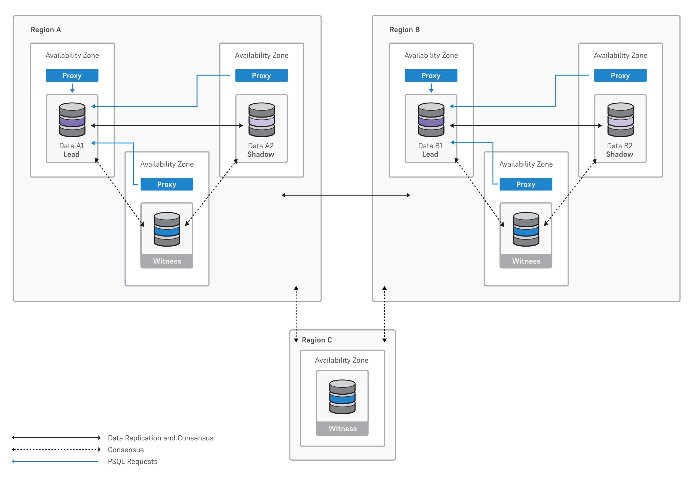

Distributed high-availability clusters are powered by [EDB Postgres Distributed](/pgd/latest/). They use multi-master logical replication to deliver more advanced cluster management than a physical replication-based system. Distributed high-availability clusters allow you to deploy a cluster across multiple regions or a single region. For use cases where high availability across regions is a requirement, a cluster deployment with distributed high availability can provide up to two data groups in distinct regions, along with a witness group in a third separate region.

This configuration provides a true active-active solution as each data group is configured to accept write operations. 

Distributed high-availability clusters support both EDB Postgres Advanced Server and EDB Postgres Extended Server database distributions.

Distributed high-availability clusters contain one or two data groups. Your data groups can contain either three data nodes or two data nodes and one witness node. At any given time, one of these data nodes in each group is the leader and accepts writes, while the rest are referred to as [shadow nodes](/pgd/latest/overview/terminology/#write-leader). We recommend that you don't use two data nodes and one witness node in production unless you use the [lag control commit scope](/pgd/latest/commit-scopes/lag-control/). 

[PGD Connection Manager](/pgd/latest/connection-manager/) can route all application traffic to the write leader node. Each group has its own write leader, reducing distributed data conflicts. PGD leverages a distributed consensus model to determine availability of the data nodes in the cluster. On failure or unavailability of the leader, PGD elects a new write leader and redirects application traffic. Together with the core capabilities of EDB Postgres Distributed, this mechanism of routing application traffic to the leader node enables fast failover and switchover.

The witness node/witness group doesn't host data but exists for management purposes. It supports operations that require a consensus, for example, in case of a region failure.

!!!note
    Operations against a distributed high-availability cluster leverage the [EDB Postgres Distributed set-leader](/pgd/latest/reference/cli/command_ref/group/set-leader) feature, which provides subsecond interruptions during planned lifecycle operations.

## Single data location

A configuration with a single data location has one data group and either:

-   Three data nodes with one write leader and two shadow nodes, each in separate availability zones

    

    

    

-   Two data nodes with one write leader, one shadow node, and a witness node, each in separate availability zones

    

    

    

    !!!note
        For production workloads, EDB strongly advises using three data nodes to be more resilient to failures. If you must use two data nodes in production, use the [lag control commit scope](/pgd/latest/commit-scopes/lag-control/).

## Multiple groups with a witness group

A configuration with multiple data locations has two data groups, each deployed in a separate region. Each data group can contain either two data nodes and one witness node, or three data nodes, each in separate availability zones. A third region hosts a witness group that provides consensus support for region-level failures.

The following diagram shows a configuration with two data nodes and one witness node in each data group.

### Advisory locks

Advisory locks aren't replicated between Postgres nodes, so advisory locks taken on a shadow node don't conflict with advisory locks taken on the leader. We recommend that applications that rely on advisory locking avoid using read-only workloads for those transactions.

DHA clusters also support read-only connections per data group, allowing read-only operations to be routed to nodes that aren't currently designated as the write leader, improving performance and workload isolation. To enable this, see [Data groups](../../using_hybrid_manager/cluster_management/create-clusters/data-groups.mdx#connections-read-only).

## For more information

For instructions on creating, retrieving information from, and managing a distributed high-availability cluster using the HM CLI, see [Using the HM CLI](../../using_hybrid_manager/edbctl/).
