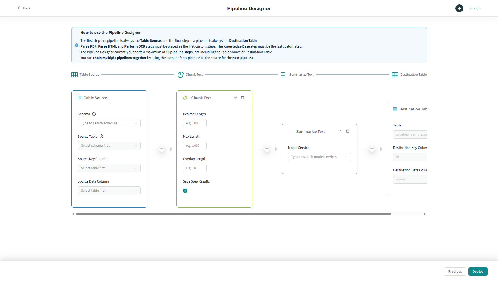

Pipeline Designer is a visual interface for [AIDB pipelines](/aidb/latest/). 
The concepts on this page focus on how the designer presents and constrains AIDB functionality. 
For the underlying pipeline, knowledge base, and model concepts, see the [AIDB documentation](/aidb/latest/).

## Pipeline structure

A pipeline is a sequence of one to ten processing steps that transform data from a source table into a destination. 
You configure the source, steps, and destination through the [pipeline creation wizard](creating-pipelines).

Pipeline names must be lowercase, start with a letter, and contain only letters, digits, and underscores. 
The maximum length is 46 characters (AIDB reserves up to 17 characters of the Postgres identifier limit for internal suffixes).
These constraints are validated when you enter the pipeline name in the [pipeline creation wizard](creating-pipelines).

## Step types

Pipeline Designer exposes the AIDB [pipeline steps](/aidb/latest/data-pipelines/pipeline-steps) and [knowledge base](/aidb/latest/knowledge-bases) functionality as pipeline steps. For detailed descriptions of what each operation does, its parameters, and its input/output types, see the [AIDB pipeline steps documentation](/aidb/latest/data-pipelines/pipeline-steps).

| Step type         | Input         | Output        | Use case                                                 |
|-------------------|---------------|---------------|----------------------------------------------------------|
| **ParsePDF**      | Bytes (PDF)   | Text          | Extract text content from PDF files                      |
| **PdfToImage**    | Bytes (PDF)   | Bytes (image) | Convert PDF pages to images, typically before OCR        |
| **PerformOCR**    | Bytes (image) | Text          | Extract text from scanned images or image-based PDFs     |
| **ParseHTML**     | Text (HTML)   | Text          | Strip HTML markup and extract clean text                 |
| **ChunkText**     | Text          | Text          | Split long text into smaller segments                    |
| **SummarizeText** | Text          | Text          | Condense text using a completion model                   |
| **KnowledgeBase** | Text          | Vector        | Generate embeddings and store in a vector knowledge base |

!!! Note "SQL enum casing"
    When calling AIDB SQL functions such as `aidb.create_pipeline()`, use the step type spelling from the [AIDB documentation](/edb-postgres-ai/current/ai-factory/pipeline/), not the display names shown in the Pipeline Designer UI. Some step types differ in casing between the two (for example, ParsePDF in the UI versus `ParsePdf` in SQL).

## Multi-step pipelines

Pipelines can chain up to ten steps. The designer enforces the following ordering and compatibility constraints when you build a multi-step pipeline:

**Ordering constraints enforced by the designer:**
-   Steps that consume raw document data (ParsePDF, PdfToImage) must be placed first. PerformOCR also accepts binary input but can appear later in the pipeline (for example, after PdfToImage).
-   The KnowledgeBase step, if present, must be placed last.
-   Middle steps (ChunkText, SummarizeText, ParseHTML) can appear in any order between the first and last positions.

**Type compatibility:**

Each step produces output of a specific type (text or bytes), and the next step must accept that type as input. The designer validates this automatically and prevents you from deploying incompatible step sequences. For example, you cannot place a ChunkText step (which expects text input) immediately after a PdfToImage step (which produces bytes output) without an intermediate OCR step to convert bytes to text.

**Common multi-step patterns:**

| Pattern                     | Steps                                             | Use case                                      |
|-----------------------------|---------------------------------------------------|-----------------------------------------------|
| PDF to knowledge base       | ParsePDF, ChunkText, KnowledgeBase                | Index PDF documents for semantic search       |
| Image OCR to knowledge base | PerformOCR, ChunkText, KnowledgeBase              | Extract and index text from scanned documents |
| HTML processing             | ParseHTML, ChunkText, SummarizeText               | Clean, chunk, and summarize web content       |
| Full document pipeline      | ParsePDF, ChunkText, SummarizeText, KnowledgeBase | Parse, chunk, summarize, and index documents  |

Pipelines are limited to 10 steps, and the step structure cannot be changed after creation. See [Limitations](limitations#pipeline-creation-and-structure) for details.

## Processing modes

During pipeline creation, select one of three AIDB auto-processing modes. You can change the mode after creation without recreating the pipeline.

| Mode                    | How it works                                                                      | When to use                                                                                        |
|-------------------------|-----------------------------------------------------------------------------------|----------------------------------------------------------------------------------------------------|
| **On Demand** (default) | Processes rows only when triggered manually via SQL                               | Testing, ad-hoc runs, or pipelines where you control exactly when processing occurs                |
| **Live**                | Processes rows immediately as they are inserted or updated, via database triggers | Low-latency use cases where results must reflect writes with minimal delay                         |
| **Background**          | Processes rows asynchronously in batches on a configurable interval               | Most production workloads; handles large backlogs and continuous ingestion without blocking writes |

In Background mode, the designer exposes two additional controls: batch size (default: 100) and sync interval (default: 30 seconds, range: 1 second to 2 days). For a full explanation of how each mode works, see the [AIDB auto-processing documentation](/aidb/latest/data-pipelines/orchestration/auto-processing).

## Data flow and step results

When a pipeline executes, data flows through AIDB's internal envelope from one step to the next. For details on how AIDB handles data lineage, chunking identifiers, and step-to-step data transfer, see the [AIDB pipelines documentation](/aidb/latest/data-pipelines).

In the pipeline creation wizard, each intermediate step has a **Save Step Results** toggle (enabled by default). When enabled, the step's output is persisted to a destination table, letting you inspect intermediate results at each stage of the pipeline and not just the final output. The toggle is hidden on the last step, whose output is always written to the pipeline's destination. See [Creating pipelines](creating-pipelines) for where this toggle appears in the wizard.