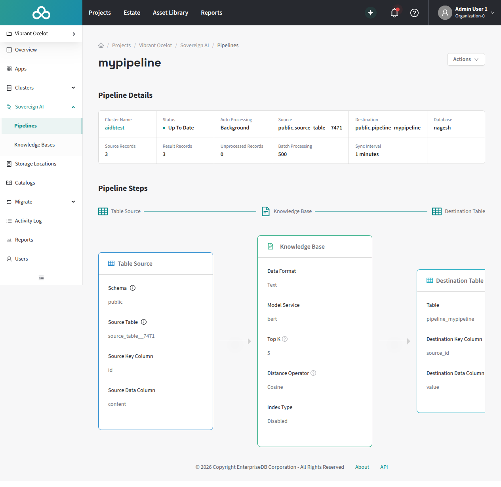

Pipeline execution is the process of reading source data, running it through the configured processing steps, and writing results to the destination. 
The sections below cover how to trigger execution, how processing modes affect execution behaviour, and how execution works across different cluster types.

## Execution flow

When a pipeline executes (whether triggered automatically or manually), the following sequence occurs:

1.  Pipeline operations run under the [`visual_pipeline_user` (VPU)](vpu-and-permissions) role. 
    The mechanism depends on how the pipeline is triggered.
    - For manual execution and pipeline management operations, the EDB Postgres AI agent (`beacon-agent`) opens a transaction and switches to VPU using `SET LOCAL ROLE`. 
    - For Background mode, the AI Database (AIDB) background worker connects to the database as the pipeline's owner role directly. 
    - For Live mode, per-pipeline SECURITY DEFINER wrapper functions owned by VPU execute with VPU's privileges regardless of the invoking session's role.

1.  AIDB reads pending rows from the source table.

1.  Each step processes the data sequentially. The output of one step becomes the input for the next.

1.  If any step encounters a record-level error (for example, a malformed PDF), the error is logged and the pipeline continues with the remaining records. Pipeline-level errors (for example, model unreachable) halt execution.

1.  The final output is written to the destination table, or to the knowledge base vector table if the last step is KnowledgeBase.

## Running a pipeline manually

You can trigger pipeline execution manually regardless of the processing mode:

1.  Connect to the pipeline's database.

1.  Run `SELECT aidb.run_pipeline('your_pipeline_name');`.

1.  The pipeline processes all pending source records.

!!!Note
Pipeline Designer doesn't currently provide a UI button for manual execution. Use the SQL function above to trigger pipeline runs on demand.
!!!

Manual execution is useful for:

-   Testing a newly created pipeline before enabling automatic processing.

-   Processing a backlog of records after re-enabling a previously On Demand pipeline.

-   One-time batch operations where automatic processing isn't needed.

## Automatic execution modes

### Live mode

In Live mode, AIDB installs a trigger on the source table that fires on every `INSERT`, `UPDATE`, or `DELETE`. The pipeline processes the affected row within the triggering transaction, so the application writing to the source table incurs the full latency of pipeline processing before the write returns.

**Characteristics:**

-   Writes to the source table are blocked until the pipeline finishes processing the affected row. The application pays the cost of pipeline processing on every write.

-   A slow inference model call (for example, embedding or summarization) adds latency directly to the application's write path.

-   Suitable for low-volume, latency-sensitive scenarios where data must be embedded or processed immediately after writing.

### Background mode

In Background mode, AIDB's background worker (running inside the Postgres instance) processes unprocessed rows in batches on a configurable schedule. Application transactions complete immediately. Pipeline processing happens independently.

**Characteristics:**

-   Application writes to the source table are unaffected by pipeline processing. There is a delay (determined by the sync interval) before results appear.

-   Batch size and sync interval are configurable (defaults: 500 rows per batch, 15-hour interval).

-   Recommended for most production workloads.

-   The background worker runs on the database cluster, not in the HM control plane. On Postgres Distributed (PGD) clusters, it runs on the write leader node.

## Deployment types

Pipeline Designer can create and manage pipelines on clusters across all three Hybrid Manager (HM) deployment types. Understanding these categories is useful because they determine which model access paths are available. See [How models reach pipeline steps](#how-models-reach-pipeline-steps) below for the full breakdown.

An HM **location** is a Kubernetes environment managed by the HM control plane. HM supports multiple locations in a hub-and-spoke topology:

-   **Primary location.** The initial HM-managed environment where the full platform stack runs, including the control plane, KServe model serving, the external inference service proxy, and all Sovereign AI services. Clusters on the primary location have full access to every feature.

-   **Secondary locations.** Additional HM-managed environments in a multi-datacenter deployment. Secondary locations run the `core` installation scenario, which includes database clusters and essential services but excludes the AI scenario (KServe, model serving). They maintain control-plane connectivity back to the primary location.

-   **Self-managed clusters.** Customer-managed single-instance Postgres servers registered with HM through the EDB Postgres AI agent (`beacon-agent`). External PGD clusters and Cloud Native Postgres (CNP) clusters are not supported. Self-managed clusters are not provisioned by HM and do not have network connectivity to the primary location by default. Without that connectivity, only AIDB-native and built-in models are available. See [How models reach pipeline steps](#how-models-reach-pipeline-steps) for details.

### Supported clusters

Pipeline Designer manages pipelines on HM-managed clusters (both primary and secondary locations) and on self-managed Postgres instances. When you create a pipeline, you select the target cluster from the estate dropdown regardless of its deployment type. Pipeline Designer discovers databases, schemas, tables, and available models through the EDB Postgres AI agent on each cluster.

Self-managed clusters must meet additional prerequisites. They need Postgres 16 or later, the AIDB extension installed and configured, and the EDB Postgres AI agent connected to the HM control plane.

## How models reach pipeline steps

Pipeline steps that perform inference (KnowledgeBase, SummarizeText, PerformOCR) reference a model by name from the AIDB model registry on the target database. Pipeline Designer does not distinguish between model sources at the pipeline level: the model picker shows every registered model whose function type matches the step being configured. However, models enter the registry through three distinct paths, each with different availability characteristics depending on where the pipeline's cluster sits in the deployment topology.

### HM-hosted KServe models (Path 1)

Models deployed through HM's Model Serving run on the primary location's Kubernetes cluster. AIDB automatically discovers and registers these models, making them available for use when creating pipeline steps. When a pipeline step invokes such a model, AIDB routes the inference request to the model's serving endpoint on the primary location.

**Availability:** Available by default on the primary location. Clusters on secondary locations or self-managed instances can use these models only if they have network connectivity to the primary location's model-serving endpoints. This connectivity isn't present in a default deployment.

### HM external inference service proxy (Path 2)

When you register an external provider (OpenAI, AWS Bedrock, NVIDIA NIM) through the HM UI, HM deploys a managed proxy on the primary location that forwards inference requests to the external provider, handling credential management on the user's behalf. AIDB discovers and addresses this proxy exactly as it would a locally hosted model (path 1).

**Availability:** Same constraint as path 1. The proxy runs on the primary location, so a cluster needs network connectivity to the primary to use it. Although the external provider itself is internet-accessible, AIDB's traffic goes through the proxy, not to the provider directly. For registration and management details, see [External inference services: HM external inference service proxy](external-inference-services#hm-external-inference-service-proxy).

### AIDB-native model registration (Path 3)

The `aidb.create_model()` SQL function registers a model directly in the AIDB model registry, backed by a Foreign Data Wrapper (FDW) pointing at the provider's API endpoint. When a pipeline step invokes an AIDB-native model, the Postgres process contacts the provider directly, with no intermediary proxy. Credentials are stored as FDW user mappings (`CREATE USER MAPPING FOR PUBLIC`).

**Availability:** Any cluster running the AIDB extension, regardless of HM connectivity. This is the only model access path available to clusters that can't reach the primary location. For details on providers, configuration, and credential management, see [External inference services: AIDB-native model registration](external-inference-services#aidb-native-model-registration) and the [AIDB model registry reference documentation](/aidb/latest/integrating-models/integrated-models).

### Model availability by deployment type

| Deployment type                                      | HM-hosted KServe (path 1) | HM external inference proxy (path 2) | AIDB-native registration (path 3) |
|------------------------------------------------------|---------------------------|--------------------------------------|-----------------------------------|
| Primary location                                     | Yes                       | Yes                                  | Yes                               |
| Secondary location (or self-managed with HM network) | Not by default ¹          | Not by default ¹                     | Yes                               |
| Self-managed without HM network                      | Not by default ¹          | Not by default ¹                     | Yes                               |

¹ Requires network connectivity to the primary location's model-serving endpoints, which isn't present in a default deployment.

Paths 1 and 2 require network connectivity to the primary location's model-serving endpoints, which isn't present by default on secondary locations or self-managed clusters. Path 3 works anywhere because the Postgres process contacts the provider endpoint directly.

### Built-in models

AIDB also ships with several built-in models (bert, clip, t5, llama) that run locally within the Postgres process and require no network access. These are available on every cluster with the AIDB extension installed.

## Replication and failover

Pipeline execution behavior depends on the cluster architecture, not on the deployment type. The same mechanics apply whether the cluster is on the primary location, a secondary location, or self-managed.

-   **PGD clusters** execute pipelines on the write leader node. Pipeline metadata (configuration, state, and metrics) replicates to all nodes through BDR (Bi-Directional Replication) logical replication, but execution occurs only on the write leader. On a write leader switchover, the new leader resumes execution: in Background mode, AIDB's background worker starts on the new leader and picks up unprocessed rows; in Live mode, trigger functions are replicated to all nodes and fire on the new write leader automatically. There may be a brief gap during the switchover while the new leader is elected.

-   **Primary/Standby Replication (PSR) clusters** execute pipelines on the single writable node. On failover to a promoted standby, background processing resumes once the new primary is operational and AIDB's background worker starts. Live mode triggers are present on the promoted standby and fire normally. Rows written during the failover window (if any) are processed as part of the normal unprocessed-row backlog.

## Monitoring execution

Pipeline execution status is visible in the pipeline list and detail pages:


-   **Status indicator**: Shows whether the pipeline is Up To Date, Processing, Stale, Has Errors, or Failed.

-   **Record counts**: Source records, destination records (or embeddings for KB pipelines), and unprocessed records.

A pipeline in an error state displays a Configuration Error badge in the list view:




-   **Error log**: For detailed error information, query the AIDB error log directly:

    ```sql
    SELECT * FROM aidb.get_error_logs('your_pipeline_name');
    ```

    For more on error log queries and error categories, see the [AIDB error log documentation](/aidb/latest/data-pipelines/orchestration/error-log).

    Errors are categorized as:
    
    -   **RecordTemporary / RecordPermanent**: Errors affecting individual records. The pipeline continues processing other records.
    
    -   **PipelineTemporary / PipelinePermanent**: Errors affecting the entire pipeline. Execution halts until the issue is resolved.
