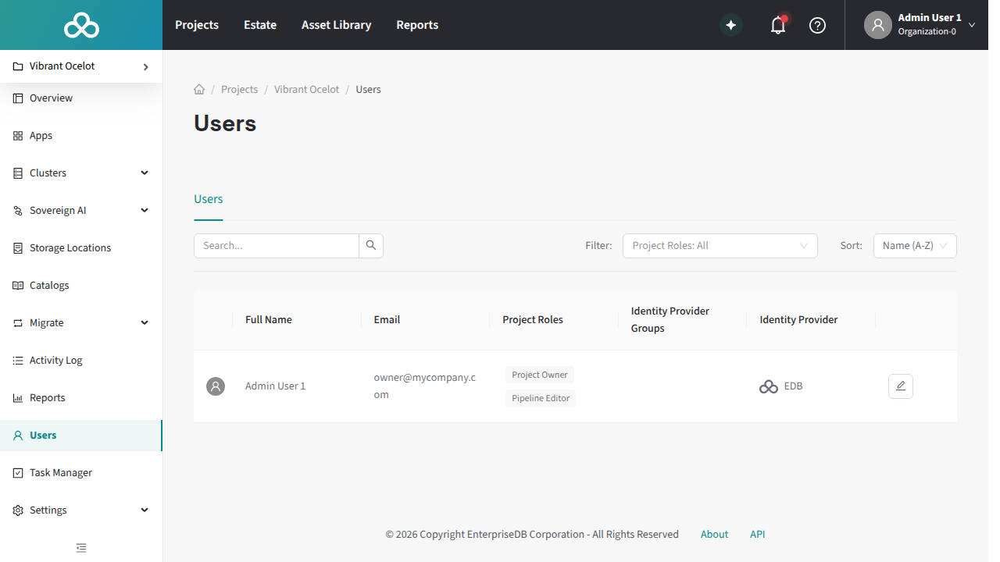

Pipeline Designer uses a dedicated PostgreSQL role called `visual_pipeline_user` (VPU) to execute all pipeline operations against the AIDB extension. Understanding how VPU works is important because it directly affects what pipelines are visible in the Pipeline Designer, what tables pipelines can access, and how permissions must be configured.

## What is VPU?

`visual_pipeline_user` is a PostgreSQL role that you create manually as a prerequisite before using Pipeline Designer. The role is not created automatically; see [Getting started: VPU role creation](getting-started#vpu-role-creation) for the setup steps. The role has basic connectivity once created, but it does not have the grants needed to read your data or create pipeline objects; you must configure those permissions yourself (see [Configuring VPU permissions](#configuring-vpu-permissions)). Pipeline management operations (creating, updating, and deleting pipelines) run under this role: the agent opens a transaction and switches identity using `SET LOCAL ROLE visual_pipeline_user`. Pipeline execution also runs as VPU, though the mechanism varies by processing mode (see [Executing pipelines: Execution flow](executing-pipelines#execution-flow) for details).

VPU exists for two reasons:

1.  **Privilege isolation.** Pipeline SQL does not run with superuser or administrator privileges. If a pipeline operation triggers unexpected behavior in the AIDB extension, the blast radius is limited to what VPU is authorized to access.

1.  **Pipeline Designer visibility control.** Pipeline Designer displays only the pipelines and knowledge bases owned by VPU. This creates a clean separation between pipelines managed through the Pipeline Designer and pipelines created through other means (SQL, scripts, third-party tools). The Pipeline Designer does not attempt to manage pipelines it did not create, avoiding potential conflicts with incompatible configurations.

For environment setup steps (extension installation, cluster configuration, platform roles, and source table grants), see [Getting started](getting-started#setup-prerequisites).




## How VPU affects visibility

When a pipeline is created through Pipeline Designer, AIDB stamps the pipeline's `owner_role` as `visual_pipeline_user`. The EDB Postgres AI agent periodically collects pipeline and knowledge base data from AIDB and filters for `owner_role = 'visual_pipeline_user'`. Only matching objects are reported to the HM control plane and displayed in the Pipeline Designer.

This has a direct consequence: **pipelines and knowledge bases created outside Pipeline Designer are not visible in the Pipeline Designer.** If you create a pipeline through SQL (for example, using `psql` as the `edb_admin` role), it will function correctly at the database level but will not appear in Pipeline Designer's pipeline list or knowledge base views.

There is no AIDB function to change a pipeline's `owner_role` after creation. If you need a SQL-created pipeline to appear in the Portal, you must create it while assuming the VPU role. Your PostgreSQL role must have been granted VPU (`GRANT visual_pipeline_user TO your_role`) to perform the role switch:

```sql
-- SET LOCAL ROLE scopes the identity change to the current transaction.
BEGIN;
SET LOCAL ROLE visual_pipeline_user;
SELECT aidb.create_pipeline(...);
COMMIT;
```

!!! Note
    All pipelines created this way are stamped with `owner_role = 'visual_pipeline_user'`, regardless of which user executed the `SET LOCAL ROLE`. There is no per-user attribution in the pipeline metadata. Use `SET LOCAL ROLE` (transaction-scoped) rather than `SET ROLE` (session-scoped) to avoid accidentally running subsequent SQL as VPU.

## Configuring VPU permissions

VPU does not automatically have access to your data tables or the ability to create pipeline objects. Every pipeline requires three permissions on the database, described in the overview below. If any of these are missing, pipeline creation or execution will fail with a permission error.

### What VPU needs

1.  **Read source data.** VPU must have `SELECT` on the source table so it can read the rows that the pipeline processes.

2.  **Create destination tables.** AIDB creates a destination table (named `pipeline_<name>`) in the same schema as the source table. VPU needs `CREATE ON SCHEMA` for that schema.

3.  **Install processing triggers.** Live and Background processing modes attach triggers to the source table so that new or updated rows are processed automatically. VPU needs `TRIGGER` on the source table for these modes. (Disabled mode does not use triggers and does not require this grant.)

The subsections below show the exact `GRANT` statements for each topology.

### Tables in the public schema

On PostgreSQL 15 and later, `CREATE` on the `public` schema is no longer granted to `PUBLIC` by default. VPU therefore needs an explicit `CREATE ON SCHEMA public` grant regardless of whether the cluster is managed or self-managed. The `aidb_users` role grant configured automatically by beacon-agent provides `SELECT` access, but it does not cover schema-level `CREATE` or table-level `TRIGGER`.

Connect to the database as an administrator and run:

```sql
GRANT SELECT ON public.<source_table> TO visual_pipeline_user;
GRANT CREATE ON SCHEMA public TO visual_pipeline_user;
GRANT TRIGGER ON public.<source_table> TO visual_pipeline_user;
```

Replace `<source_table>` with the actual table name. The `TRIGGER` grant is only required for Live and Background processing modes; if you use Disabled mode exclusively, you can omit it.

### Tables in user-created schemas

For tables in custom schemas, you must grant VPU access explicitly. Connect to the database as an administrator and run:

```sql
GRANT USAGE ON SCHEMA <schema> TO visual_pipeline_user;
GRANT SELECT ON <schema>.<source_table> TO visual_pipeline_user;
GRANT CREATE ON SCHEMA <schema> TO visual_pipeline_user;
GRANT TRIGGER ON <schema>.<source_table> TO visual_pipeline_user;
```

Replace `<schema>` and `<source_table>` with your actual schema and table names. `USAGE` allows VPU to see objects in the schema; `CREATE` allows it to create destination tables there. As with the public schema, the `TRIGGER` grant is only required for Live and Background processing modes.

!!!Important
Grant access on a per-table basis. Do not grant VPU membership in other roles (for example, `GRANT myrole TO visual_pipeline_user`), as this would give VPU access to all objects owned by that role, which may be broader than intended. A common but overly broad shortcut is `GRANT edb_admin TO visual_pipeline_user`; this effectively gives VPU administrator-level access to the entire database, defeating the privilege isolation that VPU is designed to provide.
!!!

### Tables on PGD clusters

PGD clusters require the same three grants as any other topology, plus additional considerations for BDR replication. All grants must be consistent across every BDR node, not just the write leader; a grant that exists on the write leader but is missing on a subscriber node will cause replication failures when the trigger fires on that node.

Apply the base grants on every BDR node (or use a replicated DDL mechanism):

```sql
-- Run on each BDR node:
GRANT USAGE ON SCHEMA <schema> TO visual_pipeline_user;
GRANT SELECT ON <schema>.<source_table> TO visual_pipeline_user;
GRANT CREATE ON SCHEMA <schema> TO visual_pipeline_user;
GRANT TRIGGER ON <schema>.<source_table> TO visual_pipeline_user;
```

Replace `<schema>` and `<source_table>` with your actual schema and table names. For tables in `public`, omit the `USAGE` grant.

#### PGD-specific: trigger handler ownership

When you enable Live or Background processing, AIDB creates a per-pipeline SECURITY DEFINER wrapper function and sets its owner to the pipeline's `owner_role` (which is `visual_pipeline_user` for Portal-created pipelines). BDR enforces ownership constraints on trigger functions attached to replicated tables: it checks that the trigger function owner satisfies replication constraints for the relation on all nodes.

The narrow `GRANT TRIGGER` shown above is the intended approach. If BDR still rejects the trigger because VPU cannot satisfy replication constraints, you can fall back to transferring ownership of the source table to VPU:

```sql
ALTER TABLE <schema>.<source_table> OWNER TO visual_pipeline_user;
```

This is broader than intended because it makes VPU the owner of the source table, not just a role with trigger privileges on it. Use it only as a PGD-specific workaround when the narrow `TRIGGER` grant is insufficient. See [Trigger function ownership on PGD clusters](limitations#trigger-function-ownership-on-pgd-clusters-aid-1076-aid-1136) for more detail on the underlying constraint.

## Security and isolation considerations

The preceding sections cover VPU setup and permissions grants. The topics below address the architectural implications of VPU's shared-identity model for security, credential isolation, and object ownership.

### Shared identity

All pipelines created through Pipeline Designer run as the same PostgreSQL role. There is no per-HM-user isolation at the database level: HM user A's pipeline and HM user B's pipeline both execute as `visual_pipeline_user` and have access to the same set of tables. Isolation between users' pipelines is managed at the HM project level (through Pipeline Designer access controls), not at the PostgreSQL level.

This also means there is no per-user audit trail at the PostgreSQL level. All pipeline activity in the database logs appears as operations by `visual_pipeline_user`.

### Shared model credentials

Model credentials (API keys for external inference services) are stored as FDW user mappings and are shared across all database users. Any pipeline on the same database, regardless of which HM user created it, can use any registered model. There is no per-pipeline or per-user credential isolation.

### Objects created by VPU

When Pipeline Designer creates a pipeline, VPU becomes the owner of several database objects:

-   The pipeline's destination table (for example, `pipeline_my_pipeline`)

-   The knowledge base vector table (if the pipeline includes a KnowledgeBase step)
-   Per-pipeline SECURITY DEFINER wrapper functions (for Live and Background processing modes). These wrappers call the actual AIDB trigger handler and are owned by VPU so that they execute with VPU's privileges regardless of the invoking role.
-   Pipeline state tracking tables used internally by AIDB

These objects persist until the pipeline is deleted through Pipeline Designer.

## Common VPU issues

### "Permission denied for table" during pipeline creation

**Cause**: VPU is missing one or more of the required permissions (SELECT, CREATE ON SCHEMA, or TRIGGER) for the source table or its schema.

**Fix**: Grant the required permissions as described in [Configuring VPU permissions](#configuring-vpu-permissions).

### Pipeline created via SQL does not appear in Pipeline Designer

**Cause**: The pipeline was created under a role other than `visual_pipeline_user`, so its `owner_role` does not match the Pipeline Designer's filter.

**Fix**: Recreate the pipeline using `SET LOCAL ROLE visual_pipeline_user` before calling `aidb.create_pipeline()`. See [How VPU affects visibility](#how-vpu-affects-visibility) for the full procedure.

### Pipeline works but knowledge base is not visible

**Cause**: Same as above. The knowledge base inherits the `owner_role` from the pipeline. If the pipeline was not created under VPU, neither the pipeline nor the KB will appear in the Pipeline Designer.

### Trigger creation fails on PGD clusters

**Cause**: When AIDB enables Live or Background processing, it creates a per-pipeline SECURITY DEFINER wrapper function owned by VPU. BDR requires that the trigger function owner satisfies replication constraints on the source table. If VPU lacks the necessary grants on any BDR node, trigger creation fails.

**Fix**: Apply consistent GRANT statements on all PGD nodes as described in [Tables on PGD clusters](#tables-on-pgd-clusters). If the narrow `TRIGGER` grant is insufficient due to BDR replication constraints, see the [PGD-specific: trigger handler ownership](#pgd-specific-trigger-handler-ownership) fallback.
