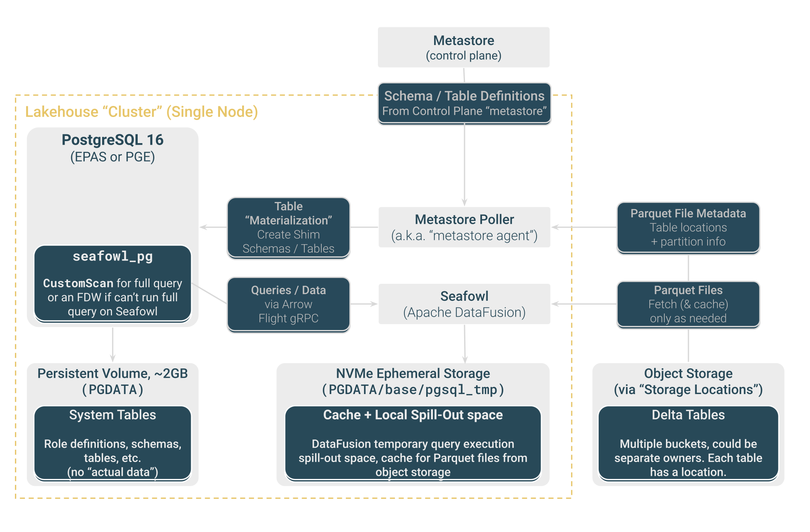

In this quick start, you will:

1.  Create a Lakehouse node.
2.  Connect to the node with your preferred Postgres client.
3.  Query sample data (TPC-H, TPC-DS, Clickbench, or 1BRC) in object storage.

For more details and advanced use cases, see [Reference](/edb-postgres-ai/current/analytics/reference).

## Introduction

Postgres Lakehouse is a new type of Postgres cluster (it's really just one
node) that you can provision with on the EDB Postgres® AI Platform. It includes a vectorized query engine based on Apache
[DataFusion](https://github.com/apache/datafusion) for fast queries over
columnar Lakehouse tables in object storage
(using the [Delta Lake protocol](https://delta.io/)).

### What to know

For more details, see [Concepts](/edb-postgres-ai/current/analytics/analytics-concepts) and [Reference](/edb-postgres-ai/current/analytics/reference),
but these are the main points to know:

-   Postgres Lakehouse nodes are ephemeral.
-   Postgres Lakehouse nodes are preconfigured to query benchmark datasets
    in object storage.
-   Postgres Lakehouse is generally read-only but otherwise supports all
    valid Postgres queries.
-   System tables are writable, so you can create users and roles. These tables
    are stored on the attached block storage, so they persist between instance
    restarts and are saved as part of backup/restore operations. Otherwise,
    Lakehouse tables aren't part of backups, since they're ultimately stored
    in object storage.

### Basic architecture

The figure shows what's in the box of a Lakehouse node:

[](images/level-300.svg)

## Getting started

Once you've logged in to your HCP portal and created a project, you can create a cluster.

### Create a Lakehouse node

On your project page, select **Create New > Lakehouse Analytics**:

<center>


</center>

The **Create Analytical Cluster** page opens, where you can choose between a templated build or a custom build:


Select **Custom Build**, and then select **Start from Scratch**. The **Create Analytical Cluster** page opens, where you can choose the cluster size and configuration:


You then return to the **Clusters** page, where you can see the status of your cluster as it's created. Provisioning the cluster can take 10-15 minutes.

A few notes:

-   You must provide your own password. Create a secure password and save
    it to your password manager. HCP doesn't save passwords.
-   You can choose EDB Postgres Advanced Server or EDB Postgres Extended Server.
-   All data on the NVMe drives is lost on cluster shutdown.
-   Persistent data in system tables (users, roles, and so on) is stored in an attached block storage device and will survive a restart or backup/restore cycle.
-   Only Postgres 16 is supported.

## Operating a Lakehouse node

### Connect to the node

You can connect to the Lakehouse node with any Postgres client in the same way that you connect to any other cluster from EDB Postgres AI Platform. Navigate to the cluster detail page and copy its connection string.

For example, you might copy the `.pgpass` blob into `~/.pgpass` (making sure to replace `$YOUR_PASSWORD` with the password you provided when launching the cluster).
Then you can copy the connection string and use it as an argument to psql or pgcli.

In general, you can connect to the database with any Postgres client.
We expect all introspection queries to work, and if you find one that doesn't, then that's a bug.

### Understand the constraints

-   Every cluster uses EDB Postgres Advanced Server or EDB Postgres Extended Server. So expect to see boilerplate tables from those flavors in the installation when you connect.
-   Queryable data (like the benchmarking datasets) is stored in object storage as Delta Tables. Every cluster comes preloaded to point to a storage bucket with benchmarking data inside (TPC-H, TPC-DS, Clickbench) at scale factors from 1 to 1000.
-   Only AWS is currently supported. Bring-your-own-account (BYOA) isn't supported.
-   You can deploy a cluster in any region that's activated in your EDB Postgres AI account. Each region has a bucket with a copy of the
    benchmarking data. So when you launch a cluster, it uses the benchmarking data in the location closest to it.
-   The cluster is ephemeral. None of the data is stored on the hard drive, except for data in system tables, for example, roles and users and grants.
    If you restart the cluster or back up the cluster and then restore it, it restores these system tables. But the data in object storage
    remains untouched.
-   The cluster supports read-only queries of the data in object storage, but it supports write queries to system tables for creating users and so on. You can't write directly to object storage. You can't create tables.
-   If you want to load your own data into object storage, see [Reference - Bring your own data](/edb-postgres-ai/current/analytics/reference/loadingdata.mdx).

## Inspect the benchmark datasets

Inspect the benchmark datasets. Every cluster has some benchmarking data
available out of the box. If you're using pgcli, you can run `\dn` to see
the available tables.

The available benchmarking datasets are:

-   TPC-H, at scale factors 1, 10, 100, and 1000
-   TPC-DS, at scale factors 1, 10, 100, and 1000
-   ClickBench, 100 million rows
-   1 Billion Row Challenge

For more details on benchmark datasets,
see [Reference - Available benchmarking datasets](/edb-postgres-ai/current/analytics/reference/datasets.mdx).

## Query the benchmark datasets

You can try running some basic queries:

```sql
edb_admin> select count(*) from clickbench.hits;
+----------+
| count    |
|----------|
| 99997497 |
+----------+
SELECT 1
Time: 0.945s


edb_admin> select count(*) from brc_1b.measurements;
+------------+
| count      |
|------------|
| 1000000000 |
+------------+
SELECT 1
Time: 0.651s
```

!!!note

   See [Reference](/edb-postgres-ai/current/analytics/reference) for more caveats and information about syntax/query compatibility.
!!!
