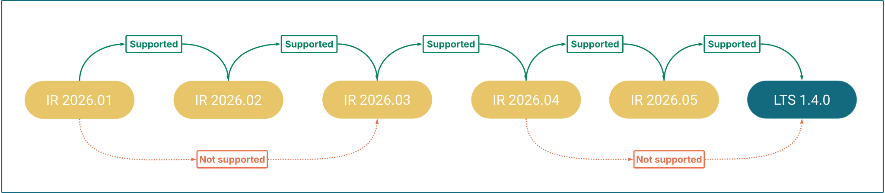
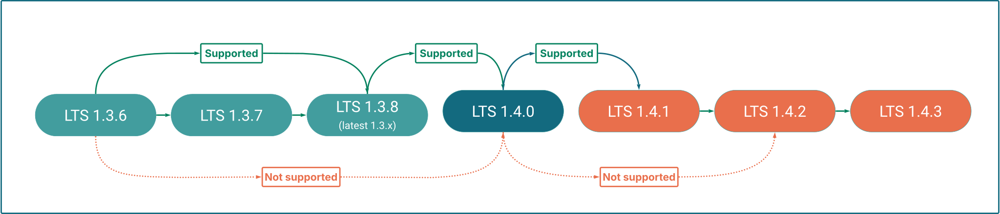
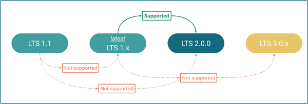
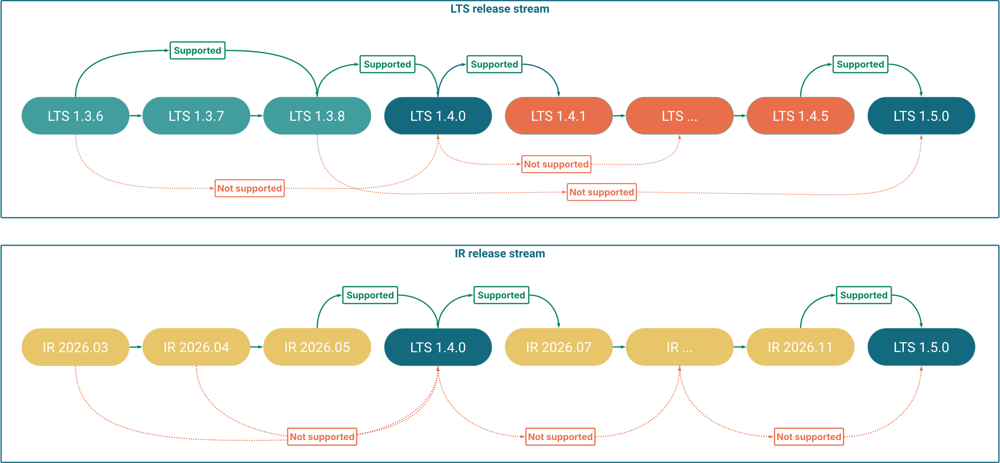

Hybrid Manager (HM) offers a [dual release strategy](/edb-postgres-ai/preview/hybrid-manager/release_notes/#hybrid-manager-dual-release-strategy): **LTS (Long-Term Support)** and **Innovation Releases (IR)**. Because these streams follow different versioning logic, the supported paths for moving between them depend on your current version and the target environment.

!!!tip
If you want to upgrade your **Postgres database clusters** instead, see [Upgrading database clusters in Hybrid Manager](../upgrading/).
!!!

## IR upgrade paths

Innovation Releases follow a date-based versioning scheme (e.g., **2025.11**). These releases provide the latest features and platform hardening at a faster cadence.

Innovation Releases require a **strict sequential upgrade pattern**. You cannot skip a monthly release.

## LTS upgrade paths

LTS releases follow standard semantic versioning (`major.minor.patch`, e.g., **1.3.x**). These versions focus on stability and are intended for production environments requiring a long support lifecycle.

### Minor and patch version upgrades

You can upgrade from one minor version to the immediate next minor release (e.g., 1.3.x to 1.4.y). However, you must first ensure you are running the latest available patch version of your current minor release before moving forward.

Within the same minor version, patch upgrades are flexible: you may upgrade from any patch version to any higher patch version (e.g., 1.3.1 to 1.3.5) without the need to install intermediate patches.

### Major version upgrades

When a new major version (e.g., **2.0**) is released, you must be running the latest available `1.x` minor release to perform the upgrade.

## Cross-stream upgrade paths

Moving between LTS and Innovation Releases is possible, but subject to specific constraints regarding version numbering and platform limitations.

### Innovation Release to LTS

Innovation Releases (IR) eventually converge into a new Long-Term Support (LTS) version. This is known as a **consolidation point**. You can move from the **final Innovation Release** of a cycle (two cycles in a year) to the **LTS release** that consolidates those features, but you can't move to an LTS release from any other Innovation Release.

**Supported:** You can only upgrade to a new LTS version from the specific Innovation Release that immediately precedes the consolidation point.

**Unsupported:** You cannot move to an LTS release from an older or mid-cycle Innovation Release. If you are on an earlier IR, you must first upgrade sequentially through the IR stream until you reach the consolidation point.

To determine if your current Innovation Release can move to an LTS version, refer to the documented upgrade instructions provided with each new release. These release-specific instructions will explicitly state if a version is an Innovation Release and whether it supports a transition to the LTS stream.

### LTS to Innovation Release

You can upgrade an LTS release to its immediate succeeding Innovation Release.

!!!Warning
Once you move from an LTS release to an Innovation Release, you cannot move back to an LTS release until the next consolidation point (see Innovation Release to LTS below). Consolidation points occur twice a year.
!!!

## Service availability during upgrades

The impact of upgrades on your HM-managed Postgres database clusters depends on your specific upgrade path and the components being updated.

While many upgrades are designed to be non-disruptive to database traffic, certain system updates may trigger an automatic restart of your HM-managed Postgres database clusters. To avoid unexpected service interruptions, verify the specific requirements of your upgrade path.