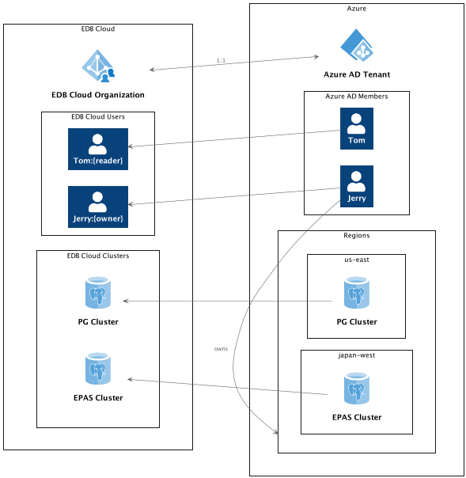

EDB Cloud uses Azure Active Directory to authenticate users and role based access controls to grant users access to different parts of the application.

## Organizations

Each subscribed customer has a unique *organization*. Each organization’s database clusters are deployed and managed in the customer's cloud account. This ensures complete segregation of customer data between organizations.

Each EDB Cloud organization is associated with an Azure Active Directory (AD) tenant. Azure AD establishes the identity of users that belong to an organization. After Azure AD is linked during subscription, users that belong to that AD can login with minimum access privileges.

EDB Cloud supports role based access control policies. A user with the **owner** role may assign roles to other users in the same organization. 

## Roles
Access to EDB Cloud is controlled by roles. Roles are sets of permissions. You use roles to manage permissions assigned to users.

### Default Roles

* Each organization will have three default 'roles' available:
  * _owner_
  * _reader_
  * _contributor_  

* These roles can be edited by changing their name, description, or permissions.

### Role Permissions

Permissions are generally represented in the format 'action:object' where 'action' represents an operation that can be performed and 'object' represents a category of portal functionality.

The available 'actions' are:
* _create_
* _read_
* _update_
* _delete_

The available 'objects' are:
* _databases_
* _backups_
* _events_
* _permissions_
* _roles_
* _users_
* _billing_
* _versions_

### Editing Roles

To edit roles:
1. Navigate to Admin > Roles.
2. Select the edit icon for the role in the list.

#### Changing Role Name

To change the name or description of the role:
1. Select the **Settings** tab.
2. Edit **Name** or **Description**.
3. Press **Save**.

#### Changing Role Permissions

To change permissions associated with the role:
1. Select **Permissions** tab.
2. Select the **Change Permissions** button on the top right.
3. Select the list of permissions you want to be associated with the role.
4. Press **Submit**

## Users

When you configured your Azure subscription, you also enabled EDB Cloud to authenticate users from your organization using Azure Active Directory (AD). Before users become visible in the EDB Cloud **Users** screen they need to sign in using Azure AD after receiving special emails sent by your organization. New users signed in to EDB Cloud have a minimum set of permissions until you assign them a role.

### Assigning Roles to Users
To assign appropriate roles to users:
1. Navigate to Admin > Users.
2. Select the edit icon for the user.
3. Select **Assign Roles**.
4. Select or deselect roles for the user.
5. Select **Submit**.

!!! Note
    For a user's role assignment to take effect, the user needs to log out from EDB Cloud and log in again.

### Viewing Users

To view all users from your organization that have logged in at least once:

1. Navigate to Admin > Users.
2. View the list of users sorted by most recent log in.

## Example Scenario
1. AcmeBank owns a subcription to Azure and the acmebank.com Azure AD.
1. AcmeBank purchases a subscription to the EDB Cloud and assigns the name acmebank-com for their organization.
1. Tom and Jerry, who are members of acmebank.com Azure AD, can sign in.
1. Users Tom and Jerry have different roles with different permissions.
1. Jerry, a user with the **owner** role, can create and own PostgreSQL and EDB Postgres Advanced Server clusters.
2. Tom, a user with the **reader** role, can read the list of PostgreSQL and EDB Postgres Advanced Server clusters availabe in the account.
3. The clusters are deployed in the Azure cloud environment owned by AcmeBank, but managed by EDB.

The following diagram illustrates a mapping between objects that exist within the EDB Cloud and Azure cloud for AcmeBank example scenario.

