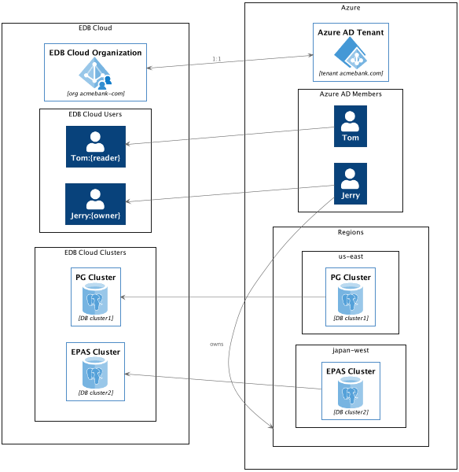

Each subscribed customer has a unique *organization* object in the cloud. An organization is synonymous with a customer. Organizations are completely isolated from each other. Each organization’s database clusters are installed and managed in their own cloud environment ensuring complete segregation of customer data.

Azure Active Directory (AD) establishes the identity of an organization. During subscription, you link your Azure AD and users that belong to that AD can login with minimum access privileges.

EDB Cloud supports role based access control policies. A user with the **owner** role may define their own sets of roles which can be applied across the organization. A user with the **owner** role may assign roles to other users in the same organization.

Example scenario:
1. AcmeBank owns a subcription to Azure and the acmebank.com Azure AD.
1. AcmeBank purchases a subscription to the EDB cloud and assigns the name acmebank-com for their organization.
1. Tom and Jerry, who are members of acmebank.com Azure AD, can sign in.
1. Users Tom and Jerry have different roles with different priviledges.
1. Jerry, a user with the **owner** role, can create and own PostgreSQL and EDB Postgres Advanced (EPAS) clusters. 
2. The clusters are deployed in the Azure cloud environment owned by AcmeBank, but managed by EDB.

The following diagram illustrates a mapping between objects that exist within the EDB cloud and Azure cloud for AcmeBank example scenario.

