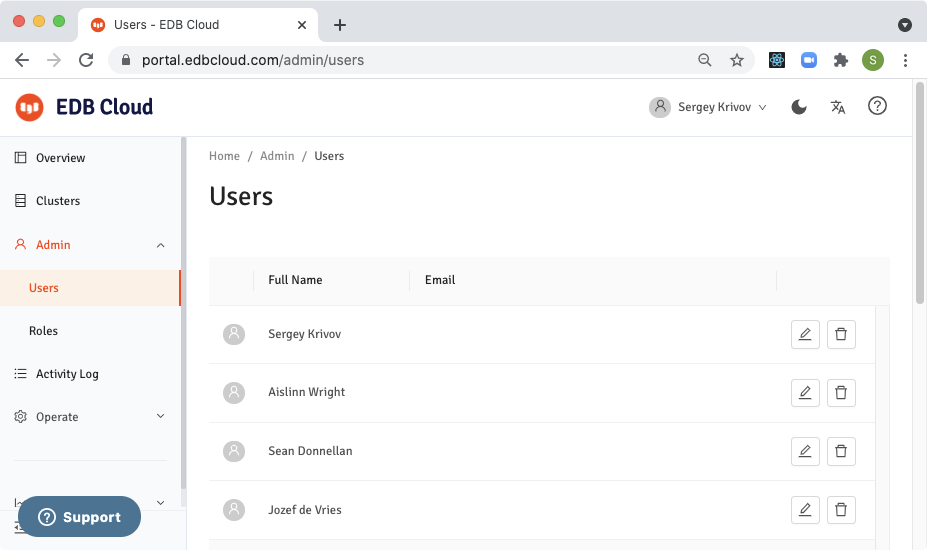

## Viewing Users
If you have a role that grants you  access to Admin screen, you can view all users from your organization that has been logged in at least once.

To view users:
- Navigate to Admin->Users.

The list of users is sorted by the time of the latest login.

!!! Note
The preview release contains only the minimum viable functionality for managing users and role based access control.

EDB will add search functionality as well as many other features for managing users in subsequent releases.
!!!

## Assigning Roles to Users
To assign appropriate roles to users:
1. Navigate to Admin > Users.
2. Select the edit icon for the user.
3. Select **Assign Roles**.
4. Select or deselect roles for the user.
5. Select **Submit**.

To learn about roles and how roles define user permissions to various functionalities [click here](https://docs.google.com/document/d/13GyHBRYt8fpNINQU6JcqEnuJI7fv33tJzIaPF4_Pcp4/edit#)

