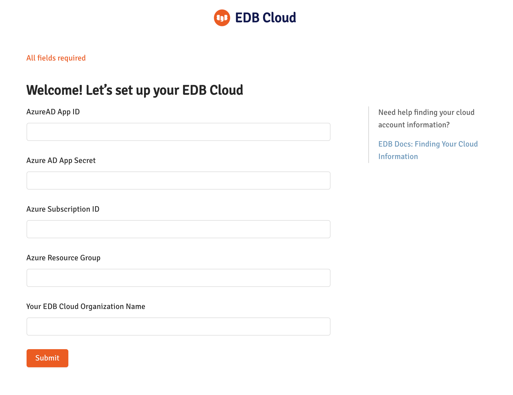

This topic shows you how to set up  UPM Cloud subscription on Azure Marketplace.

## Prerequisites


1. You should have an Azure subscription to be able to subscribe to EDB Cloud.
2. You should ensure that your Azure subscription allows for a sufficient  number of  vCPU cores and a sufficient number of Public IP Addresses as described below.
3. You should  create Azure Active Directory Application (client)  to manage the identity of your users within EDB Cloud.


### Azure Limits on Resources

By default, Azure sets a very low limit on the number of virtual machines and on the number of public Public IP Addresses that are available in a given subscription. Being in a role Owner, Contributor or[ Support Request Contributor](https://docs.microsoft.com/en-us/azure/role-based-access-control/built-in-roles#support-request-contributor) account you could send  requests to increase those limits. Please ensure that the _Default subscription filter_ is updated for expected _subscription id_.

You can check the current Azure limits for Virtual Machines and Public IP Addresses using the following steps.


1. In Azure Portal, select _Subscription_.
2. Under **Settings**, select _Usage + quotas_
3. To view Virtual Machines Limits enter the search term _vCPU_ in the **Search** box**.**
4. To view Networks Limits enter the search term _Public IP_ in the **Search** box**.**


### Increasing Virtual Machines Limits

Default [Azure Virtual Machine  limit per region](https://docs.microsoft.com/en-us/azure/azure-resource-manager/management/azure-subscription-service-limits#virtual-machines-limits---azure-resource-manager) is set to 20. This limit has to be increased to at least 50 virtual machines per region. Follow [these instructions](https://docs.microsoft.com/en-us/azure/azure-portal/supportability/per-vm-quota-requests#request-a-standard-quota-increase-from-help--support) to increase your Virtual Machines Limits for the regions where you are planning to deploy your EDB Cloud PostgreSQL clusters.

Below is an example of request to increase Virtual Machines Limits:


```
Request Summary / New Limit:
Resource Manager, EASTUS, DSv2 Series / 50
Resource Manager, EASTUS, ESv3 Series / 50
Resource Manager, EASTUS, ESv4 Series / 50
Resource Manager, UKSOUTH, DSv2 Series / 50
Resource Manager, UKSOUTH, ESv3 Series / 50
Resource Manager, UKSOUTH, ESv4 Series / 50
```


### Increasing Private Network Limits

The default [Public IP address limits](https://docs.microsoft.com/en-us/azure/azure-resource-manager/management/azure-subscription-service-limits#publicip-address) to `Public IP Addresses Basic` and `Public IP Addresses Standards` set to 10. Raise the limit of `Public IP Addresses - Basic` and `Public IP Addresses - Standard` to 100 for the regions where you plan to deploy your EDB Cloud PostgreSQL clusters. To make requests to increase Azure Networking Limits follow [these instructions](https://docs.microsoft.com/en-us/azure/azure-portal/supportability/networking-quota-requests#request-networking-quota-increase-at-subscription-level-using-help--support).


### Required Parameters


The following table describes the parameters   that need to be entered in the EDB Cloud subscription form.
Ensure that you know where to find the values of the parameters listed in the table before following the subscription procedure.


| Parameter                             | Description                                                                  |
| ------------------------------------- | ---------------------------------------------------------------------------- |
| **Azure AD App ID**                   | Application (client) ID                                                      |
| **Azure AD App Secret**               | Value of application (client) secret                                         |
| **Azure Subscription ID**             | You can get Azure subscription ID from the overview page of a subscription.  |
| **Your EDB Cloud Organization Name**  | Name you assign to your EDB Cloud Organization Name                          |


### Azure AD  Application

Azure Active Directory Application provides identity to  EDB Cloud users that come from your organization and are members of your Azure Active Directory Application.

To create  Azure Active Directory Application do the following:
1. Register an application with Azure AD and create a service principal using [these instructions](https://docs.microsoft.com/en-us/azure/active-directory/develop/howto-create-service-principal-portal#register-an-application-with-azure-ad-and-create-a-service-principal).

2. Assign Contributor role to the application as described [here](https://docs.microsoft.com/en-us/azure/active-directory/develop/howto-create-service-principal-portal#assign-a-role-to-the-application).

3. As an authentication option for the application, choose _application secret._ [Create a new application secret. ](https://docs.microsoft.com/en-us/azure/active-directory/develop/howto-create-service-principal-portal#option-2-create-a-new-application-secret)

4. If you can’t give away your existing Azure subscription, [create an additional Azure subscription](https://docs.microsoft.com/en-us/azure/cost-management-billing/manage/create-subscription).

## Procedure

1. Sign in to Azure portal portal.azure.com and go to Azure **Marketplace**
2. On the left navigation pane click link **Private Offers + Plans**.
Find an offer for **EDB PostgresQL-as-service (preview)** from **EnterpriseDB Corporation** and click on it.
You should see the following form:


3. In **Select Plan** input, select **Trial** option. Click on **Set up +subscribe** button. That should lead to the form.


Enter or create a Resource** Group** for your subscription. Select SaaS subscription **Name.**
Press the button at the bottom **Review+ subscribe** at the bottom of the form.
This will lead to the confirmation form that describes **Terms of use.
**Review the terms of use and press the **Subscribe** button at the bottom.
This will complete your Azure SaaS subscription and lead you to the following form.


4. Finally, you must configure EDB Cloud to use your Azure subscription, your Azure AD Application.
Before you click the **Configure account now** button, ensure that you have access to the values of parameters described in the prerequisite section above.
5. After clicking the **Configure  account now** button, you should see a form to enter prerequisite parameters.





Fill in the values of your parameters and press **Submit.**
If you fill in your parameters correctly, this will lead you to EDB Cloud login form where you can login to your EDB Cloud account using your Azure AD identity.
