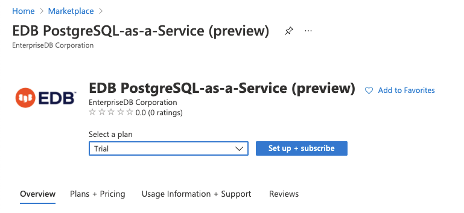
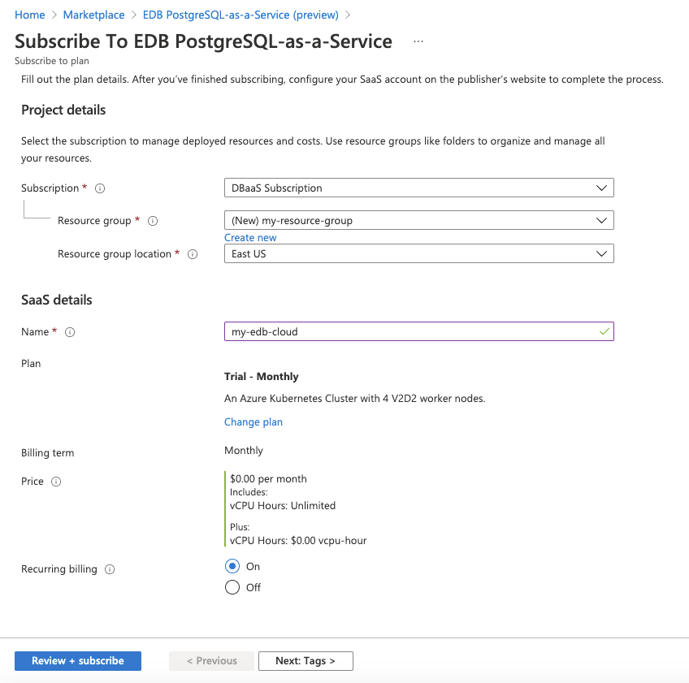
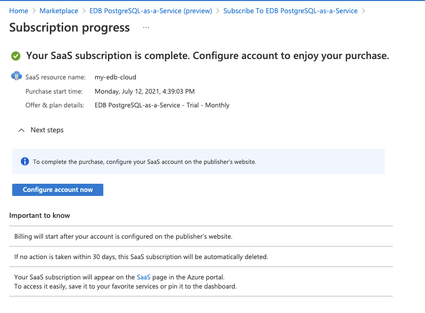
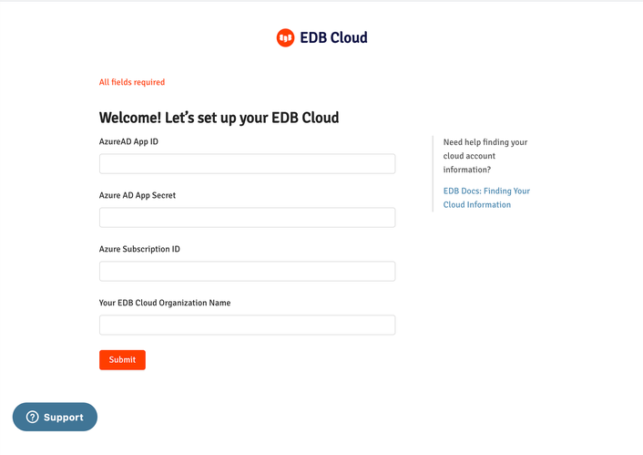

This topic describes how to set up your EDB Cloud subscription on Azure Marketplace. Your Azure subscription is where EDB Cloud can create and manage PostgreSQL clusters.

## Before You Begin

Check that your subscription allows for a sufficient number of vCPU cores and a sufficient number of Public IP Addresses. See [Azure Resource Limits](#Increase-Azure-Resource-Limits).

Create an Azure Active Directory Application client to delegate Identity and Access Management functions to Azure AD. See [Azure AD Application](#Create-Azure-AD-Application).

Gather information needed for the subscription form. See [Required Parameters](#Gather-Required-Parameters).

### Increase Azure Resource Limits

By default, Azure sets a very low limit on the number of virtual machines per region and on the number of Public IP Addresses per region that are available in a given subscription. 

The default [Azure Virtual Machine  limit per region](https://docs.microsoft.com/en-us/azure/azure-resource-manager/management/azure-subscription-service-limits#virtual-machines-limits---azure-resource-manager) is set to 20. You need to increase this limit to at least 50 virtual machines per region. EDB Cloud uses ESv3 Series virtual machines. 

The default [Public IP address limits](https://docs.microsoft.com/en-us/azure/azure-resource-manager/management/azure-subscription-service-limits#publicip-address) to `Public IP Addresses Basic` and `Public IP Addresses Standards` is set to 10. You need to increase the limit of `Public IP Addresses - Basic` and `Public IP Addresses - Standard` to 100 for the regions where you plan to deploy your EDB Cloud Postgres clusters.

To check the current Azure limits for virtual machines and public IP addresses:

1. In the Azure Portal, select **Subscription**.
2. Select **Settings** > **Usage + quotas**.
1. Search for vCPU to view virtual machines limits.
1. Search for Public IP to view networks limits.

If your role is Owner, Contributor, or [Support Request Contributor](https://docs.microsoft.com/en-us/azure/role-based-access-control/built-in-roles#support-request-contributor) for your Azure account, you can send requests to increase those limits. Please ensure that the *Default subscription filter* is updated for the expected *subscription id*.

Follow [these instructions](https://docs.microsoft.com/en-us/azure/azure-portal/supportability/per-vm-quota-requests#request-a-standard-quota-increase-from-help--support) to increase your ESv3 Series virtual machines limits for the regions where you are planning to deploy your EDB Cloud Postgres clusters. This is an example of a request to increase virtual machines limits:

```
Request Summary / New Limit:
Resource Manager, EASTUS, ESv3 Series / 50
Resource Manager, UKSOUTH, ESv3 Series / 50

```
To make requests to increase Azure Networking Limits follow [these instructions](https://docs.microsoft.com/en-us/azure/azure-portal/supportability/networking-quota-requests#request-networking-quota-increase-at-subscription-level-using-help--support).

### Create Azure AD Application

To create an Azure Active Directory Application:
1. Register an application with Azure AD and create a service principal using [these instructions](https://docs.microsoft.com/en-us/azure/active-directory/develop/howto-create-service-principal-portal#register-an-application-with-azure-ad-and-create-a-service-principal).
Take note of the **Application (client) ID**, you need it at the final step. Copy **Display name** of Azure AD application for the use in the next step.
You will need to enter **Display name** _as is_ in the **Select** field, at the bottom of  [**Add role assignment** panel](https://docs.microsoft.com/en-us/azure/role-based-access-control/role-assignments-portal?tabs=current#step-2-open-the-add-role-assignment-pane)   the panel.

2. Assign _Owner_ role to the application as described [here](https://docs.microsoft.com/en-us/azure/active-directory/develop/howto-create-service-principal-portal#assign-a-role-to-the-application). Enter the **Display name** of the Azure AD application in the **Select** field of the **Add role assignment** panel.

3. Choose _application secret_ as an authentication option for the application. [Create a new Azure AD application secret. ](https://docs.microsoft.com/en-us/azure/active-directory/develop/howto-create-service-principal-portal#option-2-create-a-new-application-secret). After you created the secret, copy the value of Azure AD App Secret, you will need it for the final step.

4. If you can’t give away your existing Azure subscription, [create an additional Azure subscription](https://docs.microsoft.com/en-us/azure/cost-management-billing/manage/create-subscription).

### Gather Required Parameters

The following table describes the parameters that need to be entered in the EDB Cloud subscription form. Ensure that you know where to find the values of the parameters listed in the table before following the subscription procedure.


| Parameter                             | Description                                                                  |
| ------------------------------------- | ---------------------------------------------------------------------------- |
| **Azure AD App ID**                   | Application (client) ID                                                      |
| **Azure AD App Secret**               | Value of application (client) secret                                         |
| **Azure Subscription ID**             | Azure subscription ID from the overview page of a subscription.  |
| **Your EDB Cloud Organization Name**  | Name you assigned to your EDB Cloud Organization                          |

!!! Note
    You have to ensure the Azure AD App ID and Azure subscription ID are all in the same Azure AD tenant.


## Create Your Subscription

1. Sign in to Azure portal [portal.azure.com](https://portal.azure.com/) and go to Azure **Marketplace**.
2. Find an offer from **EnterpriseDB Corporation** and select it.



3. Select an available plan from the **Select Plan** drop-down list. 
4. Select **Set up + subscribe**. 



1. In the **Project details** section, 
   1. Enter or create a **Resource Group** for your subscription. 
   3. Enter the SaaS subscription name.
1. Select **Review + subscribe**.
1. Review the terms of use and select **Subscribe**.



4. Select **Configure account now** to configure EDB Cloud to use your Azure subscription and your Azure AD Application.
5. Fill in the form using the values of parameters described in [Required Parameters](#Required-Parameters).
   1. Azure AD App ID
   2. Azure AD App Secret
   3. Azure Subscription ID
   4. Your EDB Cloud Organization Name



5. Select **Submit.**
 
If you filled in your parameters correctly, you can login to your EDB Cloud account using your Azure AD identity.
