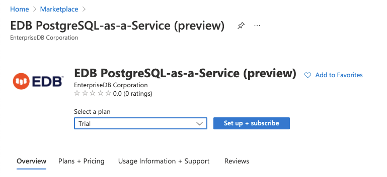
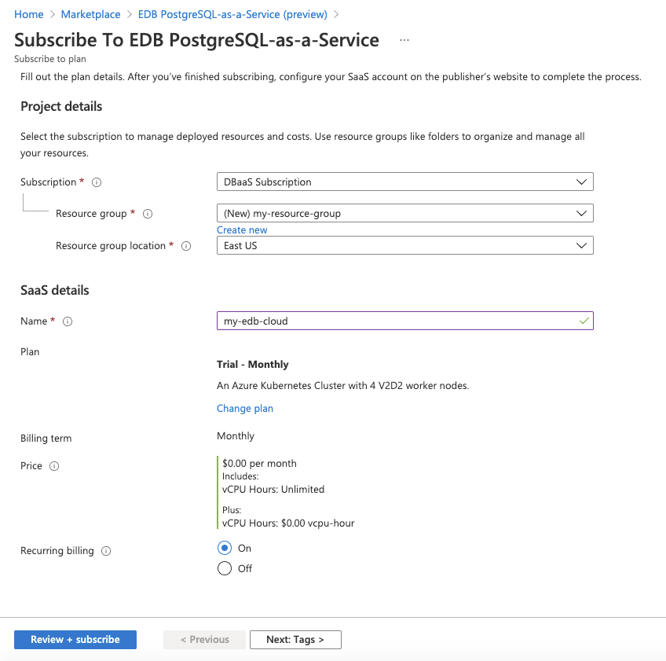
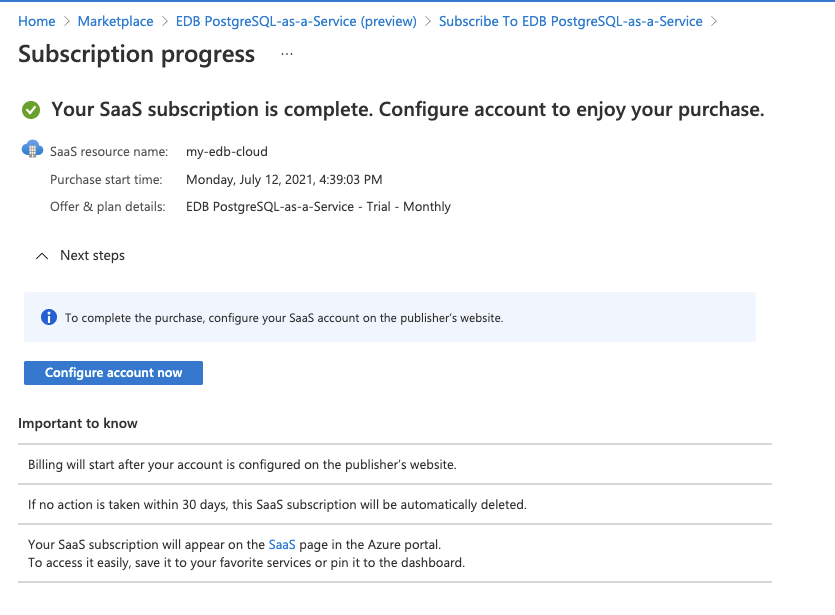
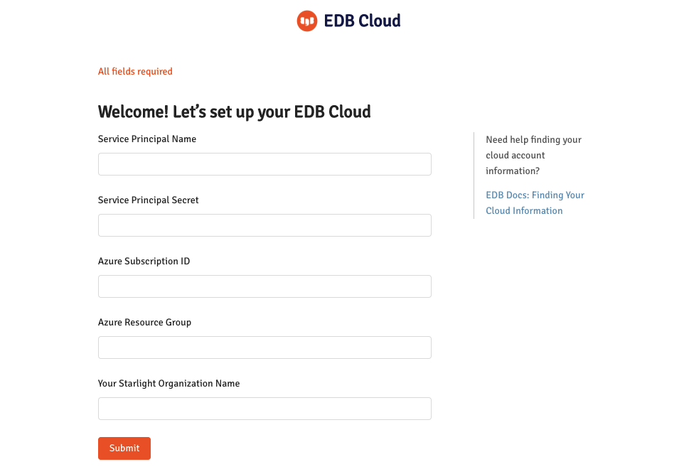

This topic shows you how to set up  UPM Cloud subscription on Azure Marketplace.

## Prerequisites

EDB Cloud account setup depends on three Azure objects:
1. _Azure Subscription_ - to connect to Azure.

2. [Azure Active Directory (AD) Application ](https://docs.microsoft.com/en-us/azure/active-directory/develop/howto-create-service-principal-portal#register-an-application-with-azure-ad-and-create-a-service-principal) -  to create Azure AD Service principal that provides identity to your organization.

3. [Azure Resource Group ](https://docs.microsoft.com/en-us/azure/azure-resource-manager/management/manage-resource-groups-portal#what-is-a-resource-group)- to identify the region and resources to be used by EDB Cloud.

Ensure that you have an Azure subscription. Secondly, use the  instructions in the following link to create [Azure Active Directory (AD) Application and a Service Principal](https://docs.microsoft.com/en-us/azure/active-directory/develop/howto-create-service-principal-portal#register-an-application-with-azure-ad-and-create-a-service-principal). The Azure AD app should have a _Contributor_ role. As an authentication option for the application, choose _application secret. _Thirdly, create [Azure Resource Group](https://docs.microsoft.com/en-us/azure/azure-resource-manager/management/manage-resource-groups-portal#what-is-a-resource-group). The later can also be created during the subscription. The following table describes the parameters   that need to be entered in EDB Cloud subscription form. All, but last one are properties of Azure objects.

<table>
    <tr>
        <td><strong>Parameter</strong>
        </td>
        <td><strong>Property Of</strong>
        </td>
        <td><strong>Name in Azure Portal Form</strong>
        </td>
    </tr>
    <tr>
        <td><strong>Service Principal Name</strong>
        </td>
        <td>Azure AD App
        </td>
        <td>Application (client) ID
        </td>
    </tr>
    <tr>
        <td><strong>Service Principal Secret</strong>
        </td>
        <td>Azure AD App
        </td>
        <td>Secret name your assign
        </td>
    </tr>
    <tr>
        <td><strong>Azure Subscription ID</strong>
        </td>
        <td>Azure Subscription
        </td>
        <td>Directory (tenant) ID
        </td>
    </tr>
    <tr>
        <td><strong>Azure Resource Group</strong>
        </td>
        <td>Azure Resource Group
        </td>
        <td>Name you assign
        </td>
    </tr>
    <tr>
        <td>Your EDB Cloud Organization Name
        </td>
        <td> NA
        </td>
        <td>
            Name you assign
        </td>
    </tr>
</table>

Ensure that you know where to find the values of the parameters listed in the table before following the subscription procedure.

## Procedure

1. Sign in to Azure portal portal.azure.com and go to Azure **Marketplace**
2. On the left navigation pane click link **Private Offers + Plans**. Find an offer for **EDB PostgresQL-as-service (preview)** from **EnterpriseDB Corporation** and click on it. You should see the following form:

3. In **Select Plan** input, select **Trial** option. Click on **Set up +subscribe** button. That should lead to the form.

Enter or create a Resource** Group** for your subscription. Select SaaS subscription **Name. **Press the button at the bottom **Review+ subscribe** at the bottom of the form. This will lead to the confirmation form that describes **Terms of use. **Review the terms of use and press the **Subscribe** button at the bottom. This will complete your Azure SaaS subscription and lead you to the following form. \

4. Finally, you must configure EDB Cloud to use your Azure subscription, your Azure Service Principal and your Resource Group. Before you click the Configure** account now** button, ensure that you have access to the values of parameters described in the prerequisite section above.
5. After clicking the Configure** account now **button, you should see a form to enter prerequisite parameters.

Fill in the values of your parameters and press **Submit. **If you fill in your parameters correctly, this will lead you to EDB Cloud login form where you can login to your EDB Cloud account using your Azure AD identity.
