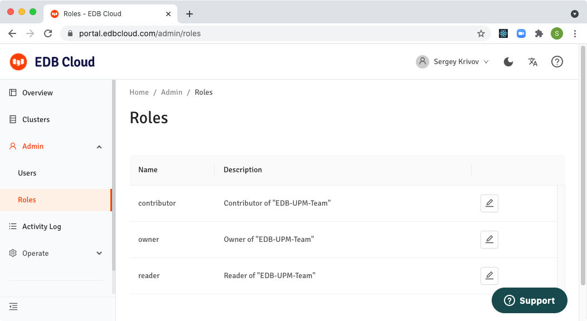

EDB Cloud uses Azure Active Directory to authenticate users and uses EDB Cloud Role Based Access Control to grant users access to different parts of the application.

### Procedure

After you created your Azure subscription and logged in into EDB Cloud for the first time you should do the following:

1. Configure organization-wide `Roles`.
2. Invite users from your organization to sign in to EDB Cloud.
3. Assign roles to users using the `Users` screen.

### Configure Roles

Organization wide roles are configured in the following screen:

Use the `Edit` button with a pen icon to edit permissions for a specific role.

### Invite Users

When you configured your Azure subscription, you also enabled EDB Cloud to authenticate users from your organization using Azure Active Directory. Before users become visible in the EDB Cloud `Users` screen they need to sign in to EDB Cloud using their organization emails. New users signed in to EDB Cloud have a minimum set of permissions.

### Assign Roles to Users

All users logged in to EDB Cloud will be listed in the following screen, sorted by the time of the latest login.

To assign appropriate roles to users, first find the right user and click `Edit` button with the pen icon. In the user screen, use the button `Assign Roles` to edit user roles.

