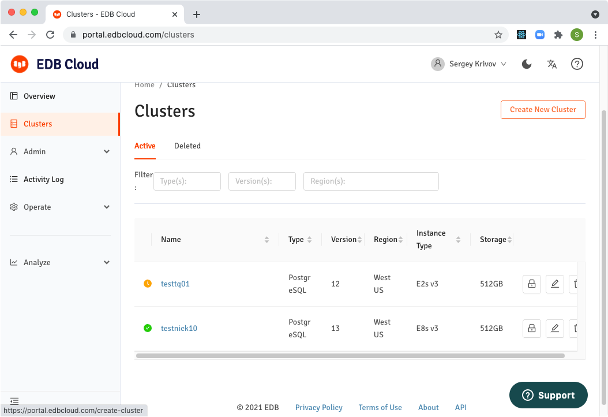
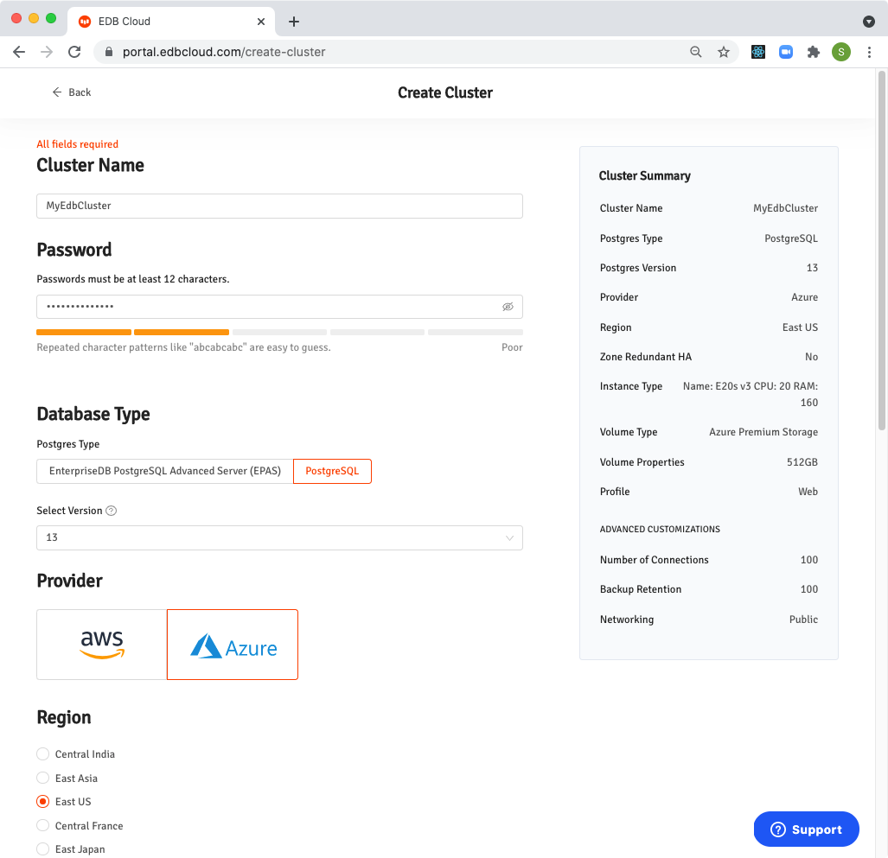
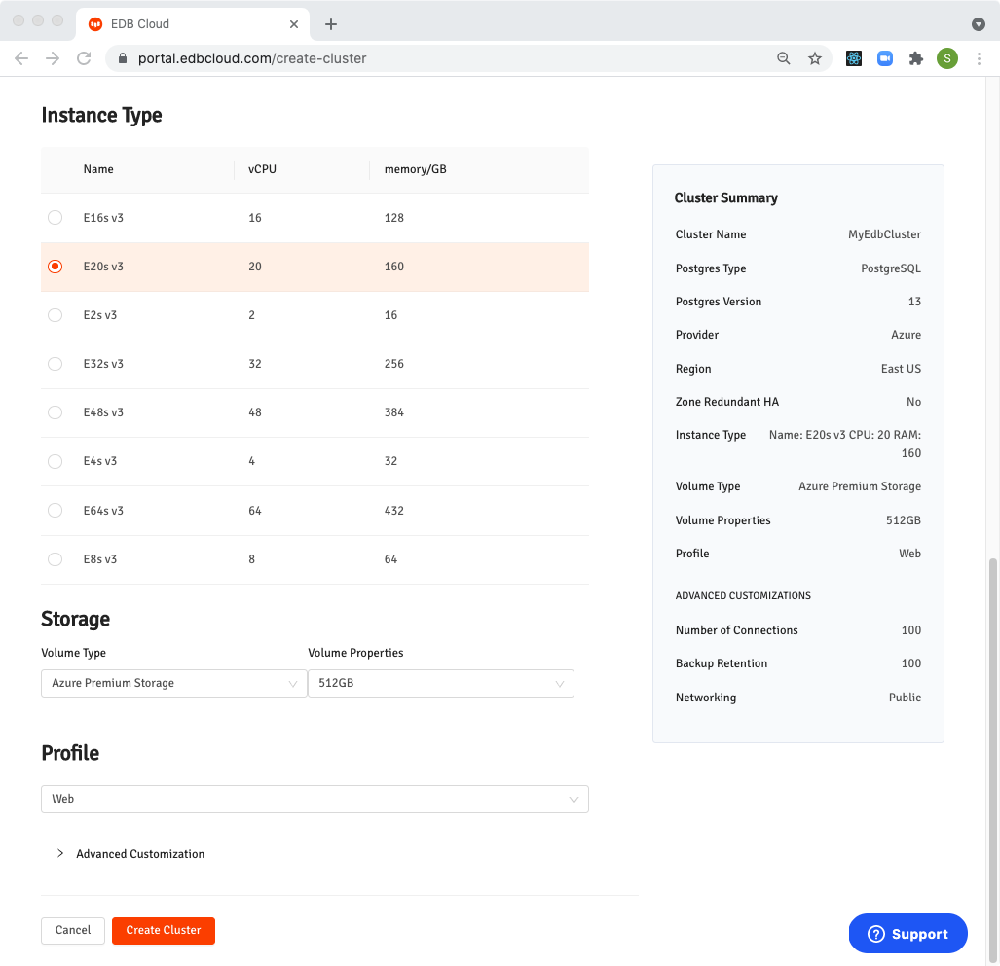

### List Clusters
To see all clusters deployed by your organization press  `Clusters` in the left navigation panel.

### Creating New Cluster

To create new cluster press button `Create New Cluster` on top right.

!!! Note
    Button `Create New Cluster` is also accessible from the `Overview` screen.

Enter `Cluster Name` and  `Password`. Select `Database Type` and  `Version` of PostgreSQL. Select `Provider` (Azure) and `Region`.

Select `Instance Type`, specify `Storage` and `Profile`.

Press `Create Cluster`.
