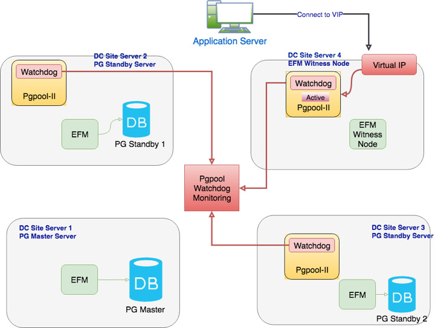

The sample architecture diagram shows four nodes as described in the table below:

| **Scenario**        | **Components**                                                                                                                                                                                                                                                                                                                                                                                                                                                                           |
| ------------------- | ---------------------------------------------------------------------------------------------------------------------------------------------------------------------------------------------------------------------------------------------------------------------------------------------------------------------------------------------------------------------------------------------------------------------------------------------------------------------------------------- |
| Server 1            | Master node, running Advanced Server and Failover Manager with Postgres Streaming Replication. Applications/clients will connect via the Pgpool port on Server 4 (or via a Virtual IP, if used) to perform write operations (i.e., INSERT, UPDATE, DELETE).                                                                                                                                                                                                                              |
| Server 2 & Server 3 | Standby nodes running Failover Manager (Pgpool-II optional). This is a Streaming Replication standby node. Applications/clients will connect to this database via the Pgpool port on Server 4 (or via a Virtual IP, if used) to perform read operations (i.e., SELECT). An optional standby Pgpool instance can be set up here with watchdog running, if desired.                                                                                                                        |
| Server 4            | Optional witness node running Pgpool-II and Failover Manager. This server is set up with no active database, but with Failover Manager and Pgpool. All applications/clients will connect to other databases via this server, either via this server’s IP address, or via a Virtual IP that points to this server. Note that a witness node is not required if at least three other EFM nodes exist. The witness node in this sample architecture is provided for demonstration purposes. |

This architecture:

-   Achieves maximum availability by providing two standbys in case of master node failure.
-   Achieves maximum performance with mixed and read-intensive workloads by introducing increased read scalability with more than one standby for load balancing.
-   Reduces load on the master node by performing load balancing and not running Pgpool on the master.
-   Avoids single point of failure of Pgpool by configuring Pgpool in high-availability mode using `watchdog`.
-   Runs Pgpool master/active instance on the least-burdened node (the witness node) to boost performance while sharing resources with Failover Manager (to reduce TCO).

If one or more standbys are configured with synchronous replication, users can achieve near-zero data loss in a failure event.

With this architecture, you can expect the following behavior:

| **Scenario**                                                                                                                                                           | **Impact on HA**                                                                                                                                                                                                                                                                                                                                                                                                                                                      | **Impact on Read Scalability**                                                                                                                                                                                                                                                                                                                                                                                                       |
| ---------------------------------------------------------------------------------------------------------------------------------------------------------------------- | --------------------------------------------------------------------------------------------------------------------------------------------------------------------------------------------------------------------------------------------------------------------------------------------------------------------------------------------------------------------------------------------------------------------------------------------------------------------- | ------------------------------------------------------------------------------------------------------------------------------------------------------------------------------------------------------------------------------------------------------------------------------------------------------------------------------------------------------------------------------------------------------------------------------------ |
| **Switchover/Switchback:** This is a planned downtime taken for some OS/DB level activities and when promoting any of the available standby as master during downtime. | **No impact on HA** (except couple of seconds of disturbance during role change). Number of nodes in the EFM/PgPool cluster is intact. Switchover will be done by EFM (via an EFM command). One of the available standbys will be promoted as the new master during the downtime. The old master will be reconfigured as a new standby by EFM w/o manual intervention to maintain the total number of nodes in HA setup.                                              | **No impact on read scalability** (except couple of seconds of disturbance during role change). After switchover the total number of standbys in the cluster will remain same so no impact on load balancing/read -scalability. Once the switchover is done by EFM, it will call post promotion script to update the PgPool with changes; accordingly PgPool will change the role of all the cluster nodes.                          |
| **Failover:** This is unplanned downtime which can occur, making the master database inaccessible to an Application (Primary DB down).                                 | **No Impact on HA**, although such an incident (Failover) leaves only one standby in the EFM/PgPool cluster. To maintain the maximum availability (1 master, 2 standbys) at all times, the old/downed master must be rebuilt as a new standby (either through pg_basebackup or pg_rewind) and attached to the EFM cluster (or a new machine should be introduced as a standby). Requires manual intervention by DBA. Failover will be performed automatically by EFM. | **Read scalability will be impacted**. Only one standby will be available for read-scalability/load balancing after the failover, until the old/downed master is rebuilt as a new standby and attached to the EFM cluster. Once are total number of nodes (three nodes in this case) are restored, the EFM attach script will attach the node with Pgpool cluster. After completion, both standbys are available for load balancing. |
