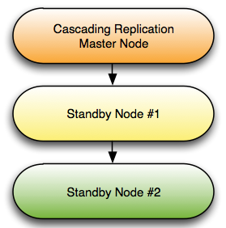

<div id="configuring_streaming_replication" class="registered_link"></div>

The following section will walk you through the process of configuring a simple two-node replication scenario that uses streaming replication to replicate data from a Master node to a Standby node. The replication process for larger scenarios can be complex; for detailed information about configuration options, please see the PostgreSQL core documentation, available at:

<https://www.postgresql.org/docs/10/static/warm-standby.html#streaming-replication>

In the example that follows, we will use a `.pgpass` file to enable md5 authentication for the replication user – this may or may not be the safest authentication method for your environment. For more information about the supported authentication options, please see the PostgreSQL core documentation at:

<https://www.postgresql.org/docs/10/static/client-authentication.html>

The steps that follow configure a simple streaming replication scenario with one Master node and one Standby node, each running an installation of EDB Postgres Advanced Server. In the example:

-   The Master node resides on `146.148.46.44`.
-   The Standby node resides on `107.178.217.178`.
-   The replication user name is `edbrepuser`.

The pathnames and commands referenced in the examples are for Advanced Server hosts that reside on a CentOS 6.x host – you may have to modify paths and commands for your configuration.

**Configuring the Master Node**

Connect to the master node of the replication scenario, and modify the [pg_hba.conf](https://www.postgresql.org/docs/11/auth-pg-hba-conf.html/) file (located in the data directory under your Postgres installation), adding connection information for the replication user (in our example, edbrepuser):

> host replication edbrepuser 107.178.217.178/32 md5

The connection information should specify the address of the standby node of the replication scenario, and your preferred authentication method.

Modify the [postgresql.conf](https://www.postgresql.org/docs/11/runtime-config-replication.html/) file (located in the data directory, under your Postgres installation), adding the following replication parameter and values to the end of the file:

```
wal_level = hot_standby
max_wal_senders = 8
wal_keep_segments = 128
archive_mode = on
archive_command = 'cp %p /tmp/%f'
```

Save the configuration file and restart the server:

> `/etc/init.d/edb-as10 restart`

Use the sudo su – command to assume the identity of the enterprisedb database superuser:

> `sudo su - enterprisedb`

Then, start a psql session, connecting to the edb database:

> `/opt/edb/as10/psql -d edb`

At the psql command line, create a user with the replication attribute:

> `CREATE ROLE edbrepuser WITH REPLICATION LOGIN PASSWORD 'password';`

**Configuring the Standby Node**

Connect to the Standby server, and assume the identity of the database superuser (enterprisedb):

> `sudo su - enterprisedb`

With your choice of editor, create a .pgpass file in the home directory of the enterprisedb user. The .pgpass file holds the password of the replication user in plain-text form; if you are using a .pgpass file, you should ensure that only trusted users have access to the .pgpass file:

Add an entry that specifies connection information for the replication user:

> `*:5444:*:edbrepuser:password`

The server will enforce restrictive permissions on the .pgpass file; use the following command to set the file permissions:

> `chmod 600 .pgpass`

Relinquish the identity of the database superuser:

> `exit`

Then, assume superuser privileges:

> `sudo su -`

You must stop the database server before replacing the data directory on the Standby node with the data directory of the Master node. Use the command:

> `/etc/init.d/edb-as-10 stop`

Then, delete the data directory on the Standby node:

> `rm -rf /opt/edb/as10/data`

After deleting the existing data directory, move into the bin directory and use the pg_basebackup utility to copy the data directory of the Master node to the Standby:

```
cd /opt/edb/as10/bin
./pg_basebackup –R –D /opt/edb/as10/data --host=146.148.46.44 –-port=5444 --username=edbrepuser --password
```

The call to pg_basebackup specifies the IP address of the Master node and the name of the replication user created on the Master node. For more information about the options available with the pg_basebackup utility, see the PostgreSQL core documentation at:

<https://www.postgresql.org/docs/10/static/app-pgbasebackup.html>

When prompted by pg_basebackup, provide the password associated with the replication user.

After copying the data directory, change ownership of the directory to the database superuser (enterprisedb):

> `chown -R enterprisedb /opt/edb/as10/data`

Navigate into the data directory:

> `cd /opt/edb/as10/data`

With your choice of editor, create a file named recovery.conf( in the /opt/PostgresPlus/9.xAS/data directory) that includes:

```
standby_mode = on
primary_conninfo = 'host=146.148.46.44 port=5444 user=edbrepuser
sslmode=prefer sslcompression=1 krbsrvname=postgres'
trigger_file = '/opt/edb/as10/data/mytrigger'
restore_command = '/bin/true'
recovery_target_timeline = 'latest'
```

The primary_conninfo parameter specifies connection information for the replication user on the master node of the replication scenario.

Change ownership of the recovery.conf file to enterprisedb:

> `chown enterprisedb:enterprisedb recovery.conf`

Modify the postgresql.conf file (located in data directory, under the Postgres installation), specifying the following values at the end of the file:

> wal_level = hot_standby max_wal_senders = 8 wal_keep_segments = 128 hot_standby = on

The data file has been copied from the Master node, and will contain the replication parameters specified previously.

Then, restart the server:

> `/etc/init.d/edb-as-10 start`

At this point, the Master node will be replicating data to the Standby node.

**Confirming Replication from the Master to Standby**

You can confirm that the server is running and replicating by entering the command:

> `ps -ef \| grep postgres`

If replication is running, the Standby server will echo:

```
501 42054 1 0 07:57 pts/1 00:00:00
/opt/PostgresPlus/9.2AS/bin/edb-postgres -D
/opt/PostgresPlus/9.2AS/data
501 42055 42054 0 07:57 ? 00:00:00 postgres: logger process
501 42056 42054 0 07:57 ? 00:00:00 postgres: startup process
recovering 000000010000000000000004
501 42057 42054 0 07:57 ? 00:00:00 postgres: checkpointer process
501 42058 42054 0 07:57 ? 00:00:00 postgres: writer process
501 42059 42054 0 07:57 ? 00:00:00 postgres: stats collector
process
501 42060 42054 0 07:57 ? 00:00:00 postgres: wal receiver process
streaming 0/4000150
501 42068 42025 0 07:58 pts/1 00:00:00 grep postgres
```

If you connect to the Standby with the psql client and query the pg_is_in_recovery() function, the server will reply:

```
edb=# select pg_is_in_recovery();
pg_is_in_recovery
-------------------
t
(1 row)
```

Any entries made to the Master node will be replicated to the Standby node. The Standby node will operate in read-only mode; while you can query the Standby server, you will not be able to add entries directly to the database that resides on the Standby node.

**Manually Invoking Failover**

To promote the Standby to become the Master node, assume the identity of the cluster owner (enterprisedb):

> `sudo su - enterprisedb`

Then, invoke pg_ctl:

> `/opt/edb/as10/bin/pg_ctl promote -D / opt/edb/as10 /data/`

Then, if you connect to the Standby node with psql, the server will confirm that it is no longer a standby node:

```
edb=# select pg_is_in_recovery();
pg_is_in_recovery
-------------------
f
(1 row)
```

For more information about configuring and using streaming replication, please see the PostgreSQL core documentation, available at:

<https://www.postgresql.org/docs/10/static/warm-standby.html#streaming-replication>

## Limited Support for Cascading Replication

While Failover Manager does not provide full support for cascading replication, it does provide limited support for simple failover in a cascading replication scenario. Cascading replication allows a Standby node to stream to another Standby node, reducing the number of connections (and processing overhead) to the master node.



For detailed information about configuring cascading replication, please see the PostgreSQL documentation at:

<https://www.postgresql.org/docs/10/static/warm-standby.html#cascading-replication>

To use Failover Manager in a cascading replication scenario, you should modify the cluster properties file, setting the following property values on Standby Node #2:

```
promotable=false
auto.reconfigure=false
```

In the event of a Failover, Standby Node #1 will be promoted to the role of Master node. Should failover occur, Standby Node #2 will continue to act as a read-only replica for the new Master node until you take actions to manually reconfigure the replication scenario to contain 3 nodes.

In the event of a failure of Standby Node #1, you will not have failover protection, but you will receive an email notifying you of the failure of the node.

Please note that performing a switchover and switch back to the original master may not preserve the cascading replication scenario.
