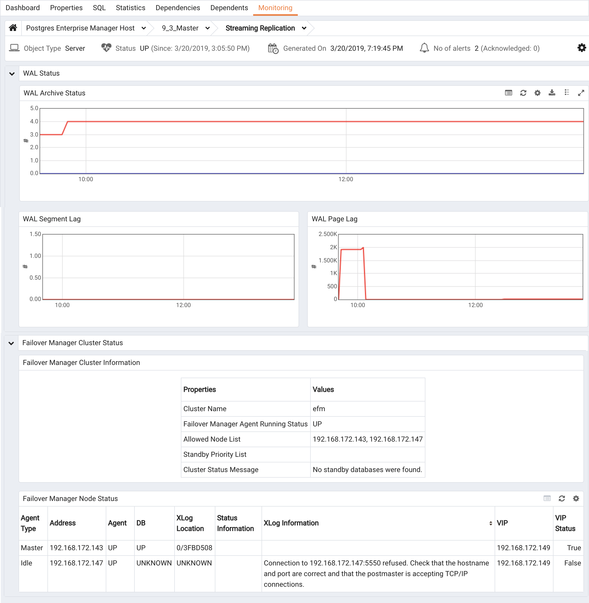
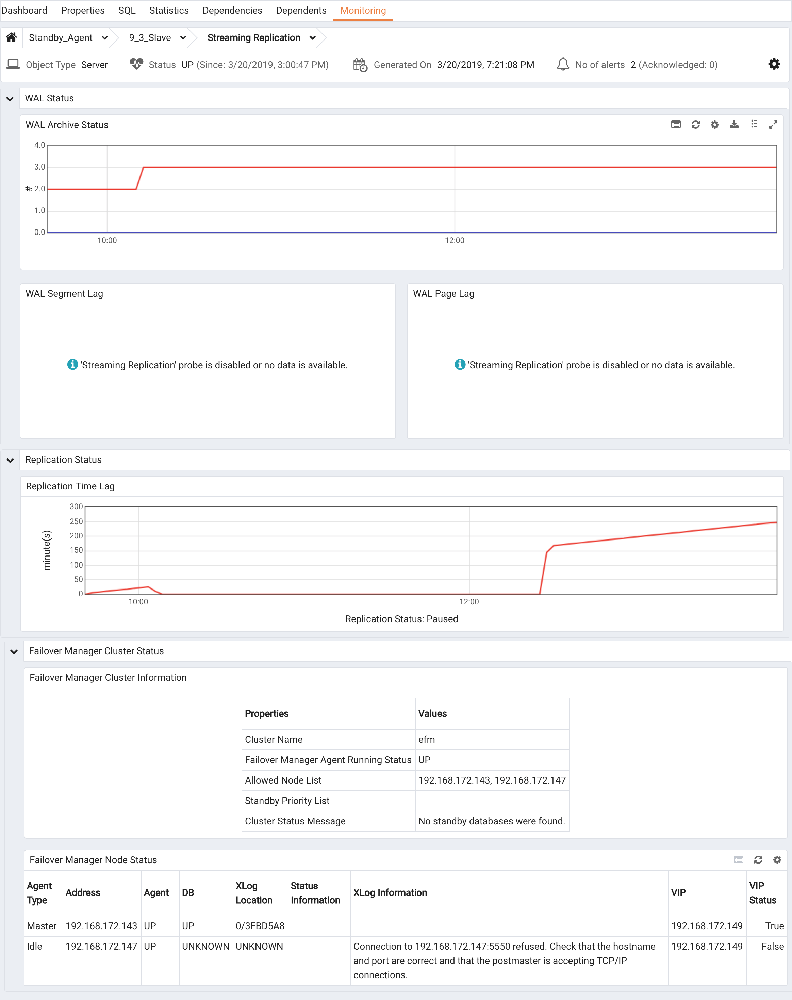

<div id="monitoring_efm_cluster" class="registered_link"></div>

You can use either the Failover Manager `efm cluster-status` command or the PEM Client graphical interface to check the current status of a monitored node of a Failover Manager cluster.

## Reviewing the Cluster Status Report

The efm cluster-status [cluster properties file](07_using_efm_utility/#efm_cluster_status) command returns a report that contains information about the status of the Failover Manager cluster. To invoke the command, enter:

> `# efm cluster-status <cluster_name>`

The following status report is for a cluster named edb that has four nodes running:

```
efm cluster-status efm
Cluster Status: efm
Agent Type Address Agent DB VIP
-----------------------------------------------------
Witness 172.19.12.170 UP N/A
Master 172.19.13.105 UP UP 172.19.13.107\*
Standby 172.19.13.113 UP UP 172.19.13.106
Standby 172.19.14.106 UP UP 172.19.13.108
Allowed node host list:
172.19.12.170 172.19.13.113 172.19.13.105 172.19.14.106
Membership coordinator: 172.19.12.170
Standby priority host list:
172.19.13.113 172.19.14.106
Promote Status:
DB Type Address WAL LSN Info
-------------------------------------------------------
Master 172.19.13.105 0/31000140
Standby 172.19.13.113 0/31000140
Standby 172.19.14.106 0/31000140
Standby database(s) in sync with master. It is safe to promote.

[root@FOUR efm-3.5]}:
```

The Cluster Status section provides an overview of the status of the agents that reside on each node of the cluster:

```
Cluster Status: efm
Agent Type Address Agent DB VIP
-----------------------------------------------------
Witness 172.19.12.170 UP N/A
Master 172.19.13.105 UP UP 172.19.13.107\*
Standby 172.19.13.113 UP UP 172.19.13.106
Standby 172.19.14.106 UP UP 172.19.13.108
```

The asterisk (\*) after the VIP address indicates that the address is available for connections. If a VIP address is not followed by an asterisk, the address has been associated with the node (in the properties file), but the address is not currently in use.

Failover Manager agents provide the information displayed in the Cluster Status section.

The `Allowed node host list` and `Standby priority host list` provide an easy way to tell which nodes are allowed to join the cluster, and the promotion order of the nodes. The IP address of the Membership coordinator is also displayed in the report:

```
Allowed node host list:
172.19.12.170 172.19.13.113 172.19.13.105 172.19.14.106
Membership coordinator: 172.19.12.170
Standby priority host list:
172.19.13.113 172.19.14.106
```

The `Promote Status` section of the report is the result of a direct query from the node on which you are invoking the cluster-status command to each database in the cluster; the query also returns the transaction log location of each database.

```
Promote Status:
DB Type Address WAL LSN Info
-------------------------------------------------------
Master 172.19.13.105 0/31000140
Standby 172.19.13.113 0/31000140
Standby 172.19.14.106 0/31000140
Standby database(s) in sync with master. It is safe to promote.
```

If a database is down (or if the database has been restarted, but the resume command has not yet been invoked), the state of the agent that resides on that host will be Idle. If an agent is idle, the cluster status report will include a summary of the condition of the idle node:

```
Agent Type Address Agent DB VIP
-----------------------------------------------------
Idle 172.19.18.105 UP UP 172.19.13.105
```

**Exit Codes**

The cluster status process returns an exit code that is based on the state of the cluster:

-   An exit code of `0` indicates that all agents are running, and the databases on the Master and Standby nodes are running and in sync.

-   A non-zero exit code indicates that there is a problem. The following problems can trigger a non-zero exit code:

    A database is down or unknown (or has an idle agent).

    Failover Manager cannot decrypt the provided database password.

    There is a problem contacting the databases to get xlog locations.

    There is no Master agent.

    There are no Standby agents.

    One or more Standby nodes are not in sync with the Master.

<div id="monitoring_streaming_replication" class="registered_link"></div>

## Monitoring Streaming Replication with Postgres Enterprise Manager

If you use Postgres Enterprise Manager (PEM) to monitor your servers, you can configure the Streaming Replication Analysis dashboard (part of the PEM graphical interface) to display the state of a Master or Standby node that is part of a Streaming Replication scenario.



The Streaming Replication Analysis Dashboard displays statistical information about activity for any monitored server on which streaming replication is enabled. The dashboard header identifies the status of the monitored server (either Replication Master or Replication Slave), and displays the date and time that the server was last started, the date and time that the page was last updated, and a current count of triggered alerts for the server.

When reviewing the dashboard for a Replication Slave (a Standby node), a label at the bottom of the dashboard confirms the status of the server.



By default, the PEM replication probes that provide information for the Streaming Replication Analysis dashboard are disabled.

To view the Streaming Replication Analysis dashboard for the Master node of a replication scenario, you must enable the following probes:

-   Streaming Replication
-   WAL Archive Status

To view the Streaming Replication Analysis dashboard for the Standby node of a replication scenario, you must enable the following probes:

-   Streaming Replication Lag Time

For more information about PEM, please visit the EnterpriseDB website at:

<http://www.enterprisedb.com/products-services-training/products/postgres-enterprise-manager>
