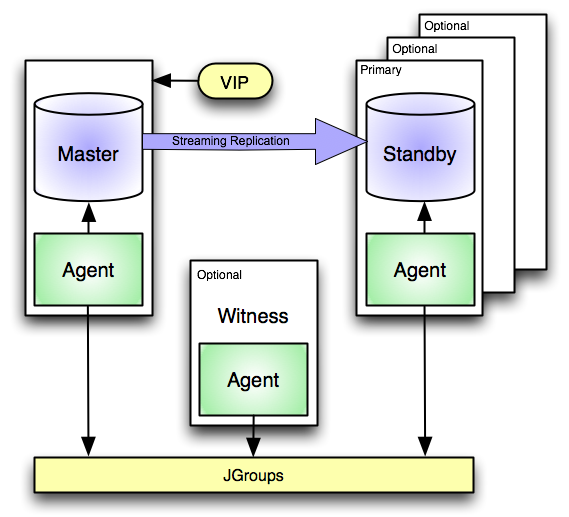

An EDB Postgres Failover Manager (EFM) cluster is comprised of Failover Manager processes that reside on the following hosts on a network:

-   A Master node - The Master node is the primary database server that is servicing database clients.
-   One or more Standby nodes - A Standby node is a streaming replication server associated with the Master node.
-   A Witness node - The Witness node confirms assertions of either the Master or a Standby in a failover scenario. A cluster does not need a dedicated witness node if the cluster contains three or more nodes. If you do not have a third cluster member that is a database host, you can a dedicated Witness node; a cluster may include more than one witness node.

Traditionally, a *cluster* is a single instance of Postgres managing multiple databases. In this document, the term cluster refers to a Failover Manager cluster. A Failover Manager cluster consists of a Master agent, one or more Standby agents, and an optional Witness agent that reside on servers in a cloud or on a traditional network and communicate using the JGroups toolkit.

When a non-witness agent starts, it connects to the local database and checks the state of the database:

-   If the agent cannot reach the database, it will start in idle mode.
-   If it finds that the database is in recovery, the agent assumes the role of standby;
-   If the database is not in recovery, the agent assumes the role of master.

In the event of a failover, Failover Manager attempts to ensure that the promoted standby is the most up-to-date standby in the cluster; please note that data loss is possible if the standby node is not in sync with the master node.

[JGroups](http://www.jgroups.org/) provides technology that allows Failover Manager to create clusters whose member nodes can communicate with each other and detect node failures.

The figure shown above illustrates a Failover Manager cluster that employs a virtual IP address. You can use a load balancer in place of a `virtual IP address <using_vip_addresses>` if you provide your own `fencing script <cluster_properties>` to re-configure the load balancer in the event of a failure.

supported_platforms prerequisites tutorial

