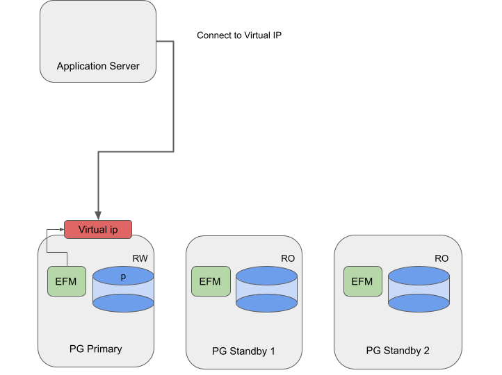

Failover Manager provides support for clusters that use a virtual IP (VIP). 

*Figure 1: Failover Manager's traffic routing using virtual IP*

Using Failover Manager with VIP
-------------------------------

### Installing

Install and configure the Advanced Server database and Failover Manager
on three servers as following:

  
  Systems                                   |Components
  ------------------------------------------|-----------------------------------------------------------------------------
  PG Primary, PG Standby1, and PG Standby2  | Primary / standby nodes running Advanced Server 13 and Failover Manager 4.2
  

### Specifying VIP

In the cluster properties file, provide the hostname or IP address in
the `virtual.ip` property. Specify the corresponding prefix in the
`virtual.ip.prefix` property. Use the `virtual.ip.interface` property to
provide the network interface used by the VIP. By default, the
`virtual.ip` and `virtual.ip.prefix` values must be the same across all the
agents.

The specified virtual IP address is assigned only to the primary node of
the cluster. If you specify `virtual.ip.single=true`, the same VIP address
will be used on the new primary in the event of a failover. Specify a
value of false to provide a unique IP address for each node of the
cluster.

For information about using a virtual IP address, see [Using Failover Manager with Virtual IP Addresses](https://www.enterprisedb.com/docs/efm/latest/efm_user/04_configuring_efm/05_using_vip_addresses/#using_vip_addresses).
