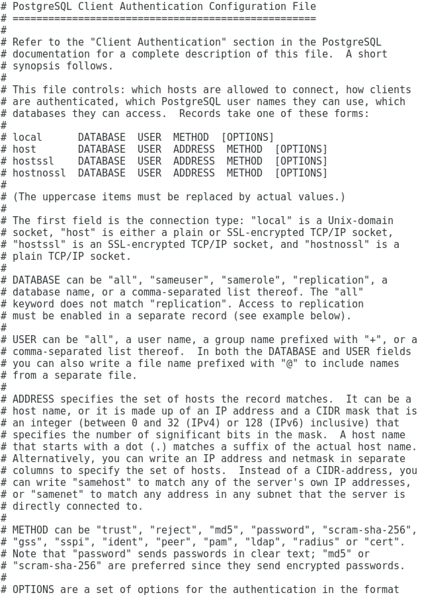

Unless otherwise noted, the commands and paths noted in the following section assume that you have performed an installation using the native packages.

## Starting and Stopping Advanced Server and Supporting Components

A service is a program that runs in the background and requires no user interaction (in fact, a service provides no user interface); a service can be configured to start at boot time, or manually on demand. Services are best controlled using the platform-specific operating system service control utility. Many of the Advanced Server supporting components are services.

The following table lists the names of the services that control Advanced Server and services that control Advanced Server supporting components:

| Advanced Server Component Name | Linux Service Name       | Debian Service Name        |
| ------------------------------ | ------------------------ | -------------------------- |
| Advanced Server                | edb-as-12                | edb-as12-main              |
| pgAgent                        | edb-pgagent-12           | edb-as12-pgagent           |
| PgBouncer                      | edb-pgbouncer-112        | edb-pgbouncer112           |
| pgPool-II                      | edb-pgpool-37            | edb-pgpool37               |
| Slony                          | edb-slony-replication-12 | edb-as12-slony-replication |
| EFM                            | efm-3.7                  | efm-3.7                    |

You can use the Linux command line to control Advanced Server's database server and the services of Advanced Server's supporting components. The commands that control the Advanced Server service on a Linux platform are host specific.

### Controlling a Service on CentOS or RHEL 7.x

If your installation of Advanced Server resides on version 7.x of RHEL and CentOS, you must use the `systemctl` command to control the Advanced Server service and supporting components.

The `systemctl` command must be in your search path and must be invoked with superuser privileges. To use the command, open a command line, and enter:

> `systemctl action service_name`

Where:

`service_name` specifies the name of the service.

`action` specifies the action taken by the service command. Specify:

> -   `start` to start the service.
> -   `stop` to stop the service.
> -   `restart` to stop and then start the service.
> -   `status` to discover the current status of the service.

### Controlling a Service on CentOS or RHEL 6.x

On version 6.x of RHEL or CentOS Linux, you can control a service at the command line with the `service` command. The `service` command can be used to manage an Advanced Server cluster, as well as the services of component software installed with Advanced Server.

Using the `service` command to change the status of a service allows the Linux service controller to keep track of the server status (the `pg_ctl` command does not alert the service controller to changes in the status of a server). The command must be in your search path and must be invoked with superuser privileges. Open a command line, and issue the command:

> `service service_name action`

The Linux `service` command invokes a script (with the same name as the service) that resides in `/etc/init.d.` If your Linux distribution does not support the `service` command, you can call the script directly by entering:

> `/etc/init.d/service_name action`

Where:

`service_name` specifies the name of the service.

`action` specifies the action taken by the service command. Specify:

> -   `start` to start the service.
> -   `stop` to stop the service.
> -   `condstop` to stop the service without displaying a notice if the server is already stopped.
> -   `restart` to stop and then start the service.
> -   `condrestart` to restart the service without displaying a notice if the server is already stopped.
> -   `try-restart` to restart the service without displaying a notice if the server is already stopped.
> -   `status` to discover the current status of the service.

### Controlling a Service on Debian 9x or Ubuntu 18.04

If your installation of Advanced Server resides on version 9x of Debian or 18.04 of Ubuntu, assume superuser privileges and invoke the following commands (using bundled scripts) to manage the service. Use the following commands to:

-   Discover the current status of a service:

    > `/usr/bin/epas_ctlcluster 12 main status`

-   Stop a service:

    > `/usr/bin/epas_ctlcluster 12 main stop`

-   Restart a service:

    > `/usr/bin/epas_ctlcluster 12 main restart`

-   Reload a service:

    > `/usr/bin/epas_ctlcluster 12 main reload`

-   Control the component services:

    > `systemctl restart edb-as@12-main`

### Using pg_ctl to Control Advanced Server

You can use the `pg_ctl` utility to control an Advanced Server service from the command line on any platform. `pg_ctl` allows you to start, stop, or restart the Advanced Server database server, reload the configuration parameters, or display the status of a running server. To invoke the utility, assume the identity of the cluster owner, navigate into the home directory of Advanced Server, and issue the command:

> `./bin/pg_ctl -D <data_directory action>`

`data_directory` is the location of the data controlled by the Advanced Server cluster.

`action` specifies the action taken by the `pg_ctl` utility. Specify:

-   `start` to start the service.
-   `stop` to stop the service.
-   `restart` to stop and then start the service.
-   `reload` sends the server a `SIGHUP` signal, reloading configuration parameters
-   `status` to discover the current status of the service.

For more information about using the `pg_ctl` utility, or the command line options available, please see the official PostgreSQL Core Documentation available at:

> `https://www.postgresql.org/docs/12/static/app-pg-ctl.html`

**Choosing Between pg_ctl and the service Command**

You can use the `pg_ctl` utility to manage the status of an Advanced Server cluster, but it is important to note that `pg_ctl` does not alert the operating system service controller to changes in the status of a server, so it is beneficial to use the service command whenever possible.

### Configuring Component Services to AutoStart at System Reboot

After installing, configuring, and starting the services of Advanced Server supporting components on a Linux system, you must manually configure your system to autostart the service when your system reboots. To configure a service to autostart on a Linux system, open a command line, assume superuser privileges, and enter the following command.

On a Redhat-compatible Linux system, enter:

> `/sbin/chkconfig *service_name* on`

Where `service_name` specifies the name of the service.

## Modifying the postgresql.conf File

Configuration parameters in the `postgresql.conf` file specify server behavior with regards to auditing, authentication, encryption, and other behaviors. On a RHEL or CentOS host, the `postgresql.conf` file resides in the `data` directory under your Advanced Server installation. On a Debian or Ubuntu host, server configuration files are located in the `/etc/edb-as/12/main` directory.

Parameters that are preceded by a pound sign (#) are set to their default value (as shown in the parameter setting). To change a parameter value, remove the pound sign and enter a new value. After setting or changing a parameter, you must either `reload` or `restart` the server for the new parameter value to take effect.

Within the `postgresql.conf` file, some parameters contain comments that indicate `change requires restart`. To view a list of the parameters that require a server restart, execute the following query at the psql command line:

> `SELECT name FROM pg_settings WHERE context = 'postmaster';`

## Modifying the pg_hba.conf File

Appropriate authentication methods provide protection and security. Entries in the `pg_hba.conf` file specify the authentication method or methods that the server will use when authenticating connecting clients. Before connecting to the server, you may be required to modify the authentication properties specified in the `pg_hba.conf` file.

When you invoke the `initdb` utility to create a cluster, `initdb` creates a `pg_hba.conf` file for that cluster that specifies the type of authentication required from connecting clients.

The default authentication configuration specified in the `pg_hba.conf` file is:

To modify the `pg_hba.conf` file, open the file with your choice of editor. After modifying the authentication settings in the `pg_hba.conf` file, use the Linux command line to restart the server and apply the changes.

For more information about authentication, and modifying the `pg_hba.conf` file, see the PostgreSQL Core Documentation at:

<https://www.postgresql.org/docs/12/static/auth-pg-hba-conf.html>

**Managing Authentication on a Debian or Ubuntu Host**

By default, the server is running with the peer or md5 permission on a Debian or Ubuntu host. You can change the authentication method by modifying the `pg_hba.conf` file, located in:

> `/etc/edb-as/12/main/pg_hba.conf`

For more information about modifying the `pg_hba.conf` file, please review [the PostgreSQL core documentation](https://www.postgresql.org/docs/current/auth-pg-hba-conf.html).

## Connecting to Advanced Server with psql

`psql` is a command line client application that allows you to execute SQL commands and view the results. To open the psql client, the client must be in your search path. The executable resides in the `bin` directory, under your Advanced Server installation.

Use the following command and options to start the psql client:

> `psql -d edb -U enterprisedb`

Where:

> `-d` specifies the database to which `psql` will connect;
>
> `-U` specifies the identity of the database user that will be used for the session.

For more information about using the command line client, please refer to the PostgreSQL Core Documentation at:

<https://www.postgresql.org/docs/12/static/app-psql.html>
