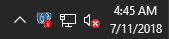
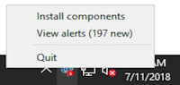
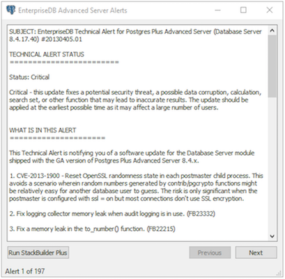

The Update Monitor utility polls the EnterpriseDB website and alerts you to security updates and enhancements for Windows hosts as they become available. Update Monitor is automatically installed by the graphical installer.

When Update Monitor is actively monitoring, the Postgres elephant icon is displayed in the system tray.

If you have installed more than one version of Advanced Server, Update Monitor watches for updates and alerts for all installed versions. When Update Monitor finds an update or alert, it displays an alert symbol to let you know that an update or alert is available for one of the Advanced Server installations.

Right click on the symbol to access the Update Monitor context menu.

Click `Install components` to open StackBuilder Plus, and check for component updates. See [Using StackBuilder Plus ](03_using_stackbuilder_plus/#using_stackbuilder_plus) for detailed information about the update process.

If one or more alerts are available for your Advanced Server installation, the context menu displays the alert count. Select `View alerts` to display the `EnterpriseDB Advanced Server Alerts` window.

The technical alert will provide information about updates and issues that might impact your installation.

-   Click `Run StackBuilder Plus` to open StackBuilder Plus and install relevant software updates.
-   Click `Next` to access each successive alert.

When you have reviewed all of the alerts, the icon no longer displays the alert symbol; use the X icon in the upper-right corner of the dialog to close Update Monitor.
