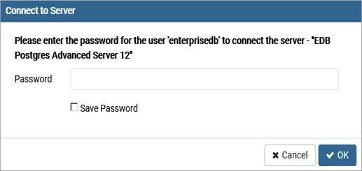
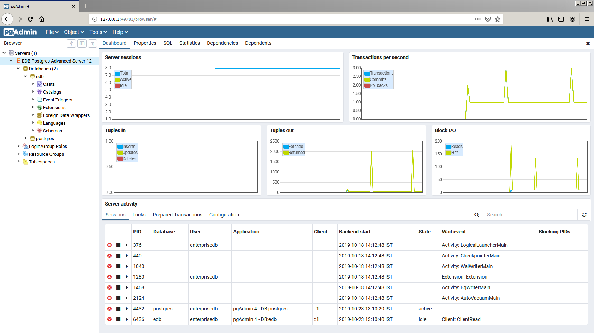

pgAdmin 4 provides an interactive graphical interface that you can use to manage your database and database objects. Easy-to-use dialogs and online help simplify tasks such as object creation, role management, and granting or revoking privileges. The tabbed browser panel provides quick access to information about the object currently selected in the pgAdmin tree control.

The client is distributed with the graphical installer. To open pgAdmin, select pgAdmin4 from the `EDB Postgres` menu. The client opens in your default browser.

To connect to the Advanced Server database server, expand the `Servers` node of the `Browser` tree control, and right click on the `EDB Postgres Advanced Server` node. When the context menu opens, select `Connect Server`. The `Connect to Server` dialog opens.

Provide the password associated with the database superuser in the `Password` field, and click `OK` to connect.

When the client connects, you can use the `Browser` tree control to retrieve information about existing database objects, or to create new objects. For more information about using the pgAdmin client, use the `Help` drop-down menu to access the online help files.
