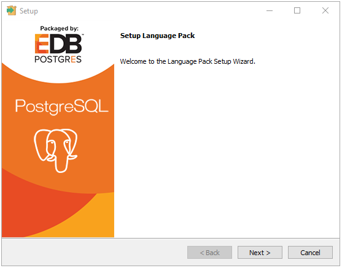
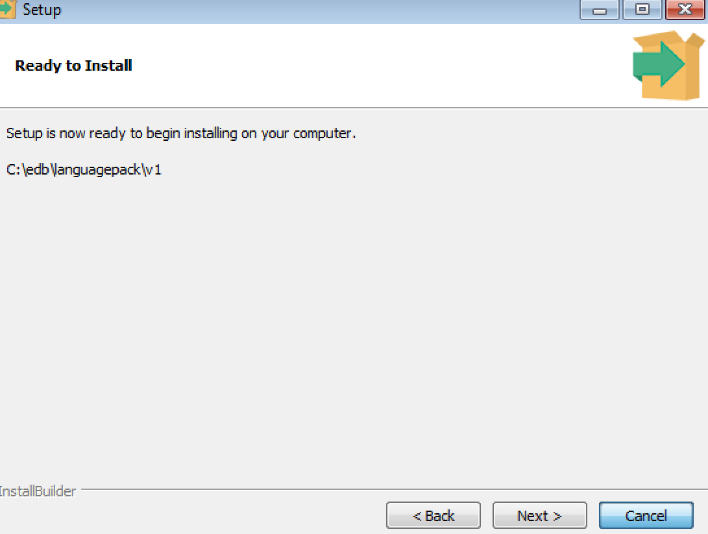
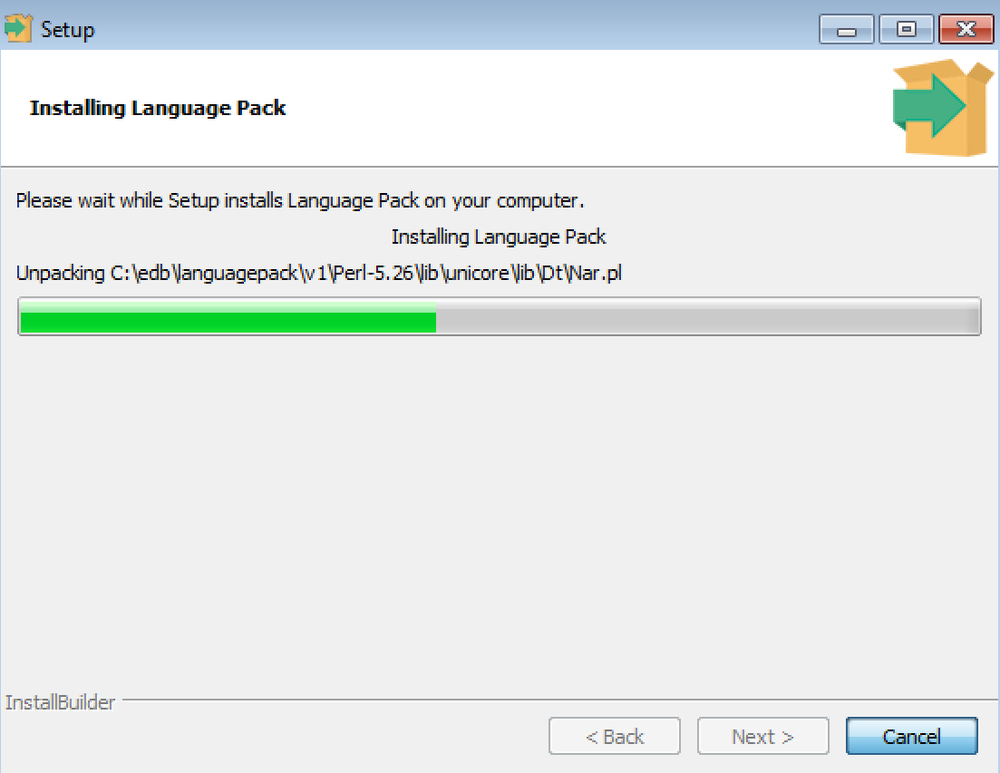
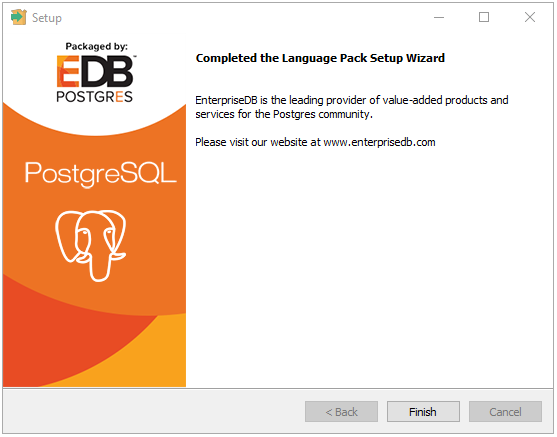
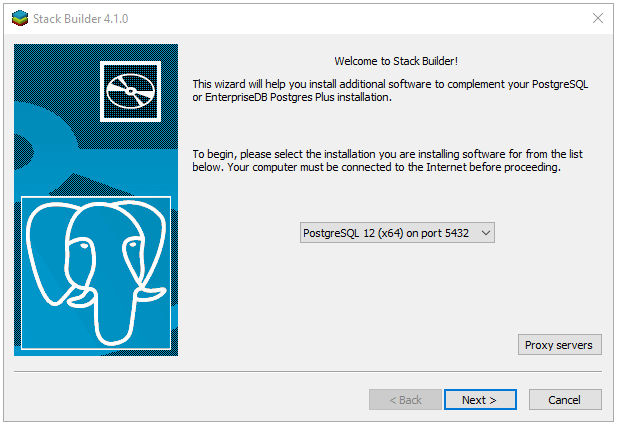

<div id="installing_language_pack" class="registered_link"></div>

The graphical installer is available from the EnterpriseDB website or via StackBuilder Plus.

<div id="invoking_the_graphical_installer" class="registered_link"></div>

## Invoking the Graphical Installer

Assume Administrator privileges, and double-click the installer icon; if prompted, provide the password associated with the Administrator account. When prompted, select an installation language, and click OK.

The installer `Welcome` window opens.



Click `Next` to continue.



The `Ready to Install` window displays the Language Pack installation directory:

> On Windows 64: `C:\edb\languagepack/v1`
>
> On OSX: `/Library/edb/languagepack/v1`

You cannot modify the installation directory. Click `Next` to continue.



A progress bar marks installation progress; click `Next` to continue.



The installer will inform you that the Language Pack installation has completed; click `Finish` to exit the installer.

## Installing Language Pack with StackBuilder Plus

You can use StackBuilder Plus to download and invoke the Language Pack graphical installer. To open StackBuilder Plus, select the StackBuilder Plus menu item from the version-specific EDB Postgres sub-menu.



Select your server from the drop-down menu on the StackBuilder Plus Welcome window and click Next to continue.

Expand the `Add-ons, tools and utilities` node of the `Categories` tree control, and check the box to the left of `EDB Language Pack`; click `Next` to continue.

StackBuilder Plus will confirm your package selection before downloading the installer. When the download completes, StackBuilder Plus will offer to invoke the installer for you, or will delay the installation until a more convenient time.

For details about using the graphical installer, see [Invoking the Graphical Installer ](02_installing_language_pack#invoking_the_graphical_installer).

## Configuring Language Pack on an Advanced Server Host

After installing Language Pack on an Advanced Server host, you must configure the installation.

### Configuring Language Pack on Windows

On Windows, the Language Pack installer places the languages in:

> `C:\edb\languagepack\v1`

After installing Language Pack, you must set the following variables:

> `set PYTHONHOME=C:\edb\languagepack\v1\Python-3.7`

Use the following commands to add Python, Perl and Tcl to your search path:

```text
set PATH=C:\edb\languagepack\v1\Python-3.7;
C:\edb\languagepack\v1\Perl-5.26\bin;
C:\edb\languagepack\v1\Tcl-8.6\bin;%PATH%
```

After performing the steps required to configure Language Pack on Windows, use the Windows `Services` applet to restart the Advanced Server database server.

### Configuring Language Pack on a PostgreSQL Host

After installing Language Pack on a PostgreSQL host, you must configure the installation.

**Configuring Language Pack on Windows**

After installing Language Pack, you must tell the Python interpreter where to find Python:

> `set PYTHONHOME=C:\edb\languagepack\v1\Python-3.7`

Then, use the following commands to add Language Pack to your search path:

```text
set PATH=C:\edb\languagepack\v1\Python-3.7;
C:\edb\languagepack\v1\Perl-5.26\bin;
C:\edb\languagepack\v1\Tcl-8.6\bin;%PATH%
```

After setting the system-specific steps required to configure Language Pack on Windows, restart the database server.

### Configuring Language Pack on OSX

To simplify setting the value of `PATH` or `LD_LIBRARY_PATH`, you can create environment variables that identify the installation location:

```text
PERLHOME=/Library/edb/languagepack/v1/Perl-5.26
PYTHONHOME=/Library/edb/languagepack/v1/Python-3.7
TCLHOME=/Library/edb/languagepack/v1/Tcl-8.6
```

Then, instruct the Python interpreter where to find Python:

> `export PYTHONHOME`

You can use the same environment variables when setting the value of `PATH`:

```text
export PATH=$PYTHONHOME/bin:
$PERLHOME/bin:
$TCLHOME/bin:$PATH
```

Lastly, use the variables to tell OSX where to find the shared libraries:

```text
export DYLD_LIBRARY_PATH=$PYTHONHOME/lib:
$PERLHOME/lib/CORE:$TCLHOME/lib:
$DYLD_LIBRARY_PATH
```
