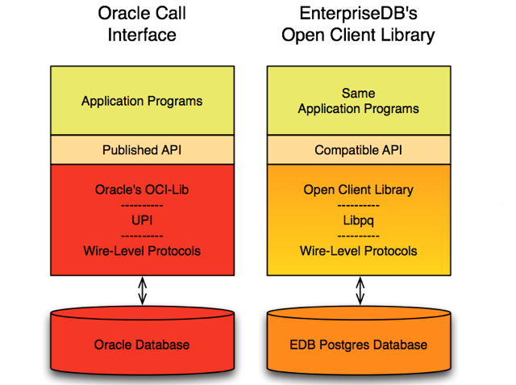

The Open Client Library provides application interoperability with the Oracle Call Interface – an application that was formerly “locked in” can now work with either an EDB Postgres Advanced Server or an Oracle database with minimal to no changes to the application code. The EnterpriseDB implementation of the Open Client Library is written in C.

The following diagram compares the Open Client Library and Oracle Call Interface application stacks.

For detailed usage information about the Open Client Library and the supported functions, see the *EDB Postgres Advanced Server OCL Connector Guide*:

<https://www.enterprisedb.com/docs>

!!! Note
    EnterpriseDB does not support use of the Open Client Library with Oracle Real Application Clusters (RAC) and Oracle Exadata; the aforementioned Oracle products have not been evaluated nor certified with this EnterpriseDB product.
